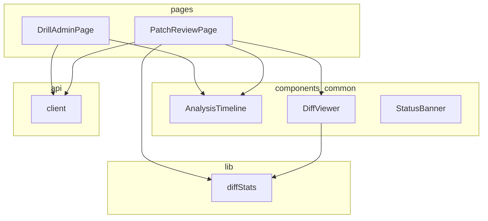
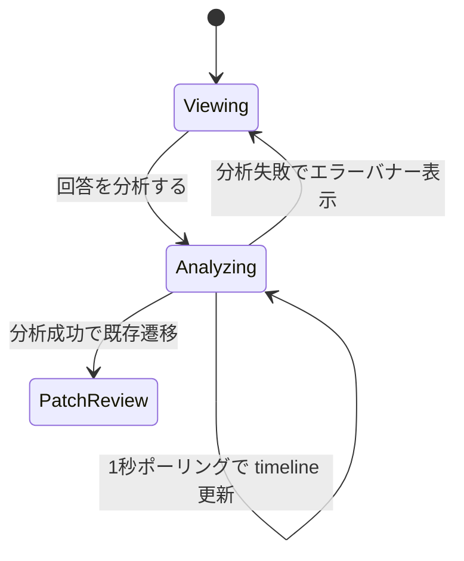

# Design Document — analysis-ui-declutter

## Overview

**Purpose**: ドリル確認(Drill Admin)とパッチレビュー(Patch Review)の情報過多を解消し、
ライフサイクル段階ごとの主役(配布 = 共有 URL、回答収集 = 採点状況、分析 = タイムライン、
レビュー = diff と判断ログ)が画面から読み取れる状態にする。

**Users**: 講座オーナー(およびハッカソン提出物として画面・動画を見る審査員)が、
配布 → 採点確認 → 分析 → パッチ適用のワークフローで利用する。

**Impact**: 既存の `DrillAdminPage` を 1 カラム縦積みから講座管理と同じ main + サイドの
2 カラム構成へ再構成し、`AnalysisTimeline` に実行状態表現を追加し、`PatchReviewPage` の
根拠表示を一元化する。backend / API / agent は一切変更しない。

### Goals
- ドリル確認を講座管理と同じ 2 カラム文法に揃え、重複情報と空状態バナーを解消する
- 分析タイムラインを「実行中・完了・未開始が一目でわかる実行ログ」として表示する
- パッチレビューで diff の対象バージョンと変更規模を見出しで示し、根拠の二度読みを解消する
- 既存のテスト・learner 境界・ポーリング機構・デザイントークンを維持する

### Non-Goals
- backend / API / agent の変更(検証チェックカードは API に根拠データがないため対象外)
- スコア推移カード(`score-progression-ui` spec が担当)
- パッチ見送り判断(no-patch 分岐)、初回ログインのデモシード、講座一覧のダッシュボード化
- 受講者向け画面の変更

## Boundary Commitments

### This Spec Owns
- `DrillAdminPage` のレイアウト構成と表示階層(2 カラム化、状態集約、空状態統合、分析中フォーカス)
- `AnalysisTimeline` コンポーネントの視覚表現(状態アイコン、所要時間、evidence 表示バリエーション)
- `PatchReviewPage` の表示階層(diff 見出しメタ情報、riskNotes 統合、生 ID 非表示)
- `DiffViewer` の見出し拡張(バージョン・行数表示)
- 上記に伴う `App.css` のクラス追加・削除と、対応する frontend テストの更新

### Out of Boundary
- API 契約・応答 shape の変更(`DocumentPatch` / `DrillAdmin` / timeline 応答は現状のまま)
- 分析の実行機構(同期 POST + 1 秒ポーリング)の変更
- 講座管理(`CourseEditorPage`)・講座一覧・更新履歴・受講者画面の変更
- タイムラインの step 構成や summary 文言の生成(backend `analysis_service` の責務)

### Allowed Dependencies
- `api/client` の既存メソッド(`getDrill` / `getDrillAnswers` / `getPatch` / `getCourse`)— 新規エンドポイント追加は不可
- `components/common` の既存部品(`AnalysisTimeline` / `DiffViewer` / `StatusBanner` / `Breadcrumbs` / `AppShell`)
- `App.css` / `index.css` の既存デザイントークンとクラス(`.editor-grid` / `.chip` / `.card` 等)
- frontend skill の依存方向規約: `pages -> api / components / lib`、`components -> lib`、`lib -> React 禁止`

### Revalidation Triggers
- timeline 応答の shape(status / summary / evidence / completedAt)が変わった場合
- 分析実行が同期 POST + ポーリングでなくなった場合(SSE 化等)
- パッチ応答に講座バージョンや検証結果フィールドが追加された場合(getCourse 並行取得と R5 の再設計)
- 講座管理のサイドカラム文法(`.editor-grid`)が変わった場合

## Architecture

### Existing Architecture Analysis
- frontend は浅い構造(`pages / components / api / lib`)で、page が API 呼び出しと page state を所有する
- `CourseEditorPage` は `.editor-grid`(main + サイド 320px、狭幅で 1 カラム化)を既に使用している。ただし既存 media query は 1 カラム化するだけで表示順を変えないため、R1.2(狭幅でサイド優先)は既存クラスの再利用だけでは満たせない。本 spec はドリル確認用に `grid-template-areas` ベースの `.drill-grid` を追加し、DOM 順で順序を保証する(下記 DrillAdminPage 参照)
- `AnalysisTimeline` は両画面で共用され、フェーズグループ化(入力確認 → つまずき分析 → 根拠レビュー → 修正判断)を内包する。この共用構造は維持する
- `DrillAdminPage` の 1 秒ポーリング(`analysisState.status === 'loading'` 中の `getDrill` 再取得)は変更しない

### Architecture Pattern & Boundary Map



**Architecture Integration**:
- Selected pattern: 既存の page-owns-orchestration 構造の内側での再構成(新しい層・状態管理は導入しない)
- Domain boundaries: page がレイアウトと表示階層を所有、`AnalysisTimeline` が実行状態表現を所有、`lib/diffStats` が diff 集計を所有
- Existing patterns preserved: 講座管理と同じ main + サイドの 2 カラム見た目(実装は `.drill-grid` を新設)、page state union、`<details>` による折りたたみ、ポーリング機構
- New components rationale: 新規は `lib/diffStats` のみ(分岐を持つ純粋処理を lib へ出す規約のため)。他はすべて既存ファイルの再構成
- Steering compliance: frontend skill の依存方向・テスト方針・learner 境界ルールに従う

### Technology Stack

| Layer | Choice / Version | Role in Feature | Notes |
|-------|------------------|-----------------|-------|
| Frontend | React 19 + Vite + TypeScript(既存) | 対象 2 ページ + 共通コンポーネントの再構成 | 新規ライブラリ追加なし |
| Styling | `App.css` の手書き CSS + デザイントークン(既存) | 2 カラム・状態アイコン・折りたたみの見た目 | `prefers-reduced-motion` 対応を含む |

## File Structure Plan

### Modified Files
- `frontend/src/pages/DrillAdminPage.tsx` — 2 カラム化(1.1-1.3)、状態サイドカード集約(1.4-1.6)、空状態統合(1.7)、設問 `<details>` 化(2.1-2.4)、分析中フォーカス(4.1-4.3)。`ScoreSummaryPanel` はサイド用に簡約(重複値の排除 1.5)
- `frontend/src/components/common/AnalysisTimeline.tsx` — 状態アイコン・スピナー・所要時間(3.1-3.6)、`evidenceDisplay` prop 追加(6.1-6.2)、reduced-motion 対応(3.7)
- `frontend/src/components/common/DiffViewer.tsx` — 見出しにバージョン表記と追加/削除行数の表示枠を追加(5.1-5.3)
- `frontend/src/pages/PatchReviewPage.tsx` — `getCourse` 並行取得(5.2-5.3)、evidence 折りたたみ指定(6.1)、riskNotes の FailureSignal カラム統合(6.4)、drillRunId 非表示・サンプル数維持(6.5-6.6)、検証チェック非表示の維持(5.4)
- `frontend/src/app/App.css` — `.stat-row` 系の削除、`.drill-grid`(`grid-template-areas`: 広幅 `"main side"`、狭幅は 1 カラム)・サイドカード用クラス・タイムライン状態アイコン用クラスの追加(7.3 のトークン範囲内)
- `frontend/src/pages/DrillAdminPage.test.tsx` / `frontend/src/pages/PatchReviewPage.test.tsx` / `frontend/src/components/common/AnalysisTimeline.test.tsx` — 変更 UI に合わせた assertion 更新と新規ケース追加
- `frontend/e2e/knowledge-drill.spec.ts` — `リスクノート` 可視性 assertion の更新(統合後の表示に合わせる)

### New Files
- `frontend/src/lib/diffStats.ts` — `countDiffLines(diffText)` 純粋関数(5.1)
- `frontend/src/lib/diffStats.test.ts` — 上記の単体テスト

> 依存方向: `pages -> api / components / lib`、`components -> lib` のみ。`AnalysisTimeline` / `DiffViewer` は data を props で受け取り、`api/` を import しない(既存規約の維持)。

## System Flows

分析実行中のドリル確認の表示モード遷移(4.1-4.3):



- `Viewing`: 2 カラム表示(主 = 設問 + 回答一覧、サイド = 共有 URL + 状態 + 採点状況)。設問・回答一覧セクションは開いた `<details>` として表示
- `Analyzing`: 分析開始時に設問・回答一覧の `<details>` を閉状態に切り替え、タイムラインを主カラム先頭の主要コンテンツにする。オーナーは折りたたみを手動で再展開できる(削除・非描画にはしない)
- 分析失敗時は設問・回答一覧の `<details>` を自動で開状態に戻す(4.2)。成功時の遷移先・エラーバナーは既存挙動を変更しない

## Requirements Traceability

| Requirement | Summary | Components | Interfaces |
|-------------|---------|------------|------------|
| 1.1 | 2 カラム並置 | DrillAdminPage | `.editor-grid` 文法 |
| 1.2 | 狭幅 1 カラム折り返し + サイド優先 | DrillAdminPage / App.css | DOM 順(side 先)+ grid-template-areas |
| 1.3 | 共有 URL がスクロール前に視認可能 | DrillAdminPage | サイド先頭カード |
| 1.4 | 状態の単一集約・stat 行廃止 | DrillAdminPage | DrillStatusCard(内部) |
| 1.5 | 同値の重複表示禁止 | DrillAdminPage | — |
| 1.6 | 分析可否はボタン活性のみ | DrillAdminPage | — |
| 1.7 | 空状態案内の 1 箇所集約 | DrillAdminPage | 共有 URL カード内ヒント |
| 1.8 | 生成失敗バナー維持 | DrillAdminPage | StatusBanner(既存) |
| 2.1-2.4 | 設問詳細の折りたたみ | DrillAdminPage | QuestionDetails(内部、`<details>`) |
| 3.1-3.5 | 実行状態アイコンと段階表示 | AnalysisTimeline | `AnalysisTimelineProps` |
| 3.6 | ステップ間所要時間 | AnalysisTimeline | completedAt 差分 |
| 3.7 | reduced-motion 対応 | AnalysisTimeline / App.css | media query |
| 4.1-4.3 | 分析中フォーカス | DrillAdminPage | セクション `<details>` の開閉制御 |
| 5.1 | 追加/削除行数 | DiffViewer / lib/diffStats | `countDiffLines` |
| 5.2-5.3 | バージョン表記と取得失敗時の省略 | PatchReviewPage / DiffViewer | `getCourse` 並行取得 |
| 5.4 | 検証チェック一覧を表示しない | PatchReviewPage | — |
| 6.1-6.2 | timeline evidence の折りたたみ | AnalysisTimeline / PatchReviewPage | `evidenceDisplay` prop |
| 6.3 | FailureSignal を根拠の正とする | PatchReviewPage | 既存カード維持 |
| 6.4 | riskNotes の統合 | PatchReviewPage | 根拠カラム末尾ブロック |
| 6.5-6.6 | 生 ID 非表示・サンプル数維持 | PatchReviewPage | meta-chips |
| 7.1-7.5 | learner 境界・API 不変・トークン・ポーリング・アクセシブルネーム維持 | 全対象ファイル | — |

## Components and Interfaces

| Component | Layer | Intent | Req Coverage | Key Dependencies | Contracts |
|-----------|-------|--------|--------------|------------------|-----------|
| DrillAdminPage | pages | 2 カラム再構成と分析中フォーカス | 1.*, 2.*, 4.*, 7.* | AnalysisTimeline (P0), api.getDrill/getDrillAnswers (P0) | State |
| AnalysisTimeline | components/common | 実行状態つきタイムライン表示 | 3.*, 6.1-6.2, 7.5 | props のみ | State(props) |
| PatchReviewPage | pages | diff メタ情報と根拠一元化 | 5.*, 6.*, 7.* | DiffViewer (P0), api.getPatch/getCourse (P0) | State |
| DiffViewer | components/common | diff 表示 + 見出しメタ | 5.1-5.3 | lib/diffStats (P1) | State(props) |
| lib/diffStats | lib | diff 行数集計(純粋関数) | 5.1 | なし | Service |

### pages

#### DrillAdminPage

| Field | Detail |
|-------|--------|
| Intent | ドリル確認を 2 カラム化し、段階ごとの主役を立てる |
| Requirements | 1.1-1.8, 2.1-2.4, 4.1-4.3, 7.1-7.5 |

**Responsibilities & Constraints**
- レイアウト構成: 主カラム(分析タイムライン → 設問一覧 → 回答一覧)、サイド(共有 URL → ドリルの状態 → 設問別採点状況)
- **DOM 順と 2 カラム配置(1.1-1.3)**: DOM 上はサイド(共有 URL・状態・採点状況)を主カラムより先に置く。広幅では `.drill-grid` の `grid-template-areas: "main side"` で main を左・side を右に配置し、狭幅の media query では 1 カラム(`"side" "main"` 相当)に折り返す。これにより狭幅と支援技術の読み順の両方でサイドが先になり、CSS `order` による視覚順と DOM 順の乖離を作らない。広幅時の視覚順(左 main)と DOM 順(side 先)の乖離は、共有 URL を先に読ませたい R1.3 の意図と一致するため許容する
- 「ドリルの状態」サイドカードに status chip・資料バージョン・回答数・採点済み数・平均点を集約する。stat 行(`.stat-row`)と meta 重複を削除する(1.4-1.5)
- 設問カードは `<details>`/`<summary>` で実装し、summary に設問 ID・設問文・出題意図を常時表示する(2.1-2.3)。`<summary>` はネイティブ要素のためキーボード操作(2.4)を追加実装なしで満たす
- 回答 0 件時の案内は共有 URL カード内ヒント 1 行のみとし、採点状況・回答一覧の空バナーを削除する(1.7)
- **分析中フォーカス(4.1-4.3)**: 設問一覧・回答一覧セクションは開閉を page state で制御する `<details>` として実装する。分析開始(`analysisState.status === 'loading'`)で両セクションを閉状態に切り替え、タイムラインを主カラム先頭で表示する。オーナーは分析中でも手動で再展開できる(非描画にはしない)。分析失敗時は両セクションを自動で開状態に戻す
- タイムラインは `evidenceDisplay="expanded"` で使用する(分析の見せ場、6.1 の対になる設定)

**Implementation Notes**
- Integration: `.drill-grid` を新設(`grid-template-areas` ベース)。カード・チップ等の部品クラスは既存を再利用する
- Validation: 狭幅でサイドが主内容より先に表示されること(1.2、DOM 順で担保)、分析開始で設問・回答一覧が閉じ再展開可能なこと(4.1)、分析失敗時に自動で開状態へ復元されること(4.2)、learner 画面への影響なし(7.1)
- Risks: サイド幅に採点状況の欠落タグが収まらない場合は折り返し表示(モバイル幅確認を完了前チェックに含める)

#### PatchReviewPage

| Field | Detail |
|-------|--------|
| Intent | PR レビューの構図(見出しメタ + 左根拠・右 diff)に整理する |
| Requirements | 5.1-5.4, 6.1-6.6, 7.1-7.5 |

**Responsibilities & Constraints**
- **非ブロッキングのバージョン取得(5.2-5.3)**: `getPatch` が解決した時点でページを即 ready 表示する(現行挙動を維持)。`getCourse(patch.courseId)` は patch 取得成功後に独立した state(例: `courseVersion: number | null`)で後追い取得し、解決したら proposed パッチの diff 見出しに `v{version} → v{version + 1}` を渡す。course 取得が未解決・失敗の間は `versionLabel` を undefined のままにし、diff 表示と適用・却下操作をブロックしない
- meta-chips から `ドリル {drillRunId}` を削除し、`回答サンプル N 件` は維持する(6.5-6.6)
- タイムラインは `evidenceDisplay="collapsed"` で使用し、summary 中心の判断ログとして表示する(6.1)
- riskNotes は根拠カラム(FailureSignal カード群)の末尾に「リスクと注意点」ブロックとして 1 回表示し、独立カードを廃止する。空配列時はブロック省略(6.4)
- 検証チェック一覧は追加しない(5.4)

**Implementation Notes**
- Integration: 既存の 2 カラム `.patch-grid` は維持。DiffViewer への props 追加のみ
- Validation: applied / rejected / stale の各状態でバージョン表記が誤解を生まないこと(proposed のみ表示)、course 取得が未解決でも diff とレビュー操作が表示されること(5.3)
- Risks: getCourse は後追い取得のためパッチ表示をブロックしない。バージョン表記が数百 ms 遅れて現れるが、補助情報のため許容する

### components/common

#### AnalysisTimeline

| Field | Detail |
|-------|--------|
| Intent | フェーズグループ化タイムラインに実行状態表現を追加する |
| Requirements | 3.1-3.7, 6.1-6.2, 7.5 |

**Contracts**: State(props) [x]

##### State Management(props 契約)
```typescript
type EvidenceDisplay = 'expanded' | 'collapsed'

type AnalysisTimelineProps = {
  title: string
  items: AnalysisTimelineItemView[]   // 既存型を変更しない
  evidenceDisplay?: EvidenceDisplay   // 省略時 'expanded'(ドリル確認の現行挙動)
}
```
- Preconditions: `items` は既存 API 応答から変換済みの `AnalysisTimelineItemView[]`
- Postconditions: status ごとに視覚表現を出し分ける — `running` = スピナー + summary、`completed` = チェックアイコン + summary + evidence、`pending` = 控えめなステップ名のみ、`failed` / `skipped` = 既存 chip 表現維持(3.1-3.4)
- 所要時間: 直前の `completed` ステップの `completedAt` と自ステップの `completedAt` が共に存在する場合のみ差分秒を表示する。先頭ステップ・欠損時は非表示(3.6)
- `evidenceDisplay === 'collapsed'` のとき evidence を `<details>` に格納し初期閉。展開でステップの evidence を表示(6.1-6.2)
- アクセシブルネーム(`aria-label={title}`)は現行を維持(7.5)
- Invariants: フェーズグループ化(`TIMELINE_PHASES`)・`items` の shape・ポーリングとの関係は変更しない

**Implementation Notes**
- Integration: スピナー・出現トランジションは CSS のみで実装し、`prefers-reduced-motion: reduce` で無効化する(3.7)
- Validation: ポーリング更新で `running → completed` に遷移した際に summary / evidence が追加表示されること(3.5)
- Risks: なし(表示のみの変更)

#### DiffViewer

| Field | Detail |
|-------|--------|
| Intent | diff 見出しにバージョンと変更規模を表示する |
| Requirements | 5.1-5.3 |

**Contracts**: State(props) [x]

```typescript
type DiffViewerProps = {
  title: string
  diffText: string
  versionLabel?: string   // 例: 'v1 → v2'。未指定時は非表示(5.3)
}
```
- 追加/削除行数は `countDiffLines(diffText)` で算出し、見出し右端に `+N −M` 形式で表示する(5.1)

### lib

#### diffStats

**Contracts**: Service [x]

```typescript
function countDiffLines(diffText: string): { added: number; removed: number }
```
- Preconditions: unified diff 形式の文字列(空文字列も許容)
- Postconditions: 行頭 `+` / `-` の行を集計する。ただし `+++` / `---` のファイルヘッダ行は除外する。空入力は `{ added: 0, removed: 0 }`
- Invariants: React / DOM に依存しない純粋関数(frontend skill の lib 規約)

## Error Handling

### Error Strategy
本 spec は表示整理のため、新たなエラー種別を導入しない。既存のエラー UI を維持した上で、追加取得の失敗を局所化する。

- **getCourse 取得失敗・未解決(PatchReviewPage)**: パッチ表示は getPatch のみで ready になるため、course 取得の失敗・遅延はバージョン表記の省略としてのみ現れ、diff・判断ログ・適用/却下操作は継続する(5.3)。エラーバナーは出さない(補助情報の欠落であり操作を妨げないため)
- **分析失敗(DrillAdminPage)**: 既存のエラーバナー表示を維持し、設問・回答一覧を復元する(1.8, 4.2)
- **ポーリング中の一時失敗**: 既存挙動(最後に成功した timeline 表示を維持)を変更しない
- **completedAt 欠損**: 所要時間を表示しない(誤った値を推測しない)

## Testing Strategy

### Unit Tests(lib)
- `diffStats.test.ts`: 追加/削除行の集計、`+++`/`---` ヘッダ行の除外、空文字列、追加のみ / 削除のみの diff(5.1)

### Component Tests(vitest + testing-library)
- `AnalysisTimeline.test.tsx`:
  - running ステップにスピナー表現、pending ステップに summary / evidence が出ないこと(3.1, 3.3)
  - completed ステップに summary と evidence が表示されること(3.2)
  - 連続する completedAt から所要時間が表示され、先頭ステップには出ないこと(3.6)
  - `evidenceDisplay="collapsed"` で evidence が初期非表示になり、展開で表示されること(6.1-6.2)
  - `aria-label` が維持されること(7.5)
- `DrillAdminPage.test.tsx`:
  - 共有 URL・ドリルの状態・採点状況がサイドに表示され、stat 行のラベル(`Status` 等の 4 分割表示)が存在しないこと(1.3-1.4)
  - サイド領域が DOM 上で主内容(設問一覧)より先に存在すること(1.2)
  - 回答数・平均点が単一箇所にのみ表示されること(1.5)
  - 設問詳細が初期非表示で、展開後に模範解答・根拠・ルーブリックが表示されること(2.2-2.3)
  - 回答 0 件時に案内が 1 箇所のみ表示されること(1.7)
  - 分析開始で設問・回答一覧の折りたたみが閉状態になり、手動で再展開できること(4.1)
  - 分析失敗後に設問・回答一覧が自動で開状態に復元されること(4.2)
- `PatchReviewPage.test.tsx`:
  - diff 見出しに `+N −M` と `v1 → v2`(proposed + getCourse 成功時)が表示されること(5.1-5.2)
  - getCourse が未解決のまま(pending)でも diff と適用・却下ボタンが表示されること(5.3)
  - getCourse 失敗時にバージョン表記なしでレビュー操作が継続できること(5.3)
  - `drill-1` 等の生 ID が表示されず、`回答サンプル N 件` が維持されること(6.5-6.6)
  - riskNotes が根拠カラムに統合表示され、独立カード見出しが存在しないこと(6.4)

### E2E Tests(Playwright)
- 既存 Scenario 3+4(分析 → proposed → Apply)の `リスクノート` assertion を統合後の表示(リスクと注意点ブロック)に更新する
- 設問詳細の展開操作を伴う既存フローがあれば `<summary>` クリックに更新する
- learner フロー(Scenario 2, 5)は変更なしで green を維持することを確認する(7.1)

### 完了前チェック(frontend skill 準拠)
- `npm run typecheck` / `npm run lint` / 対象テスト実行 / `npm run build`
- learner view に rubric / idealAnswer が出ないことの確認(7.1)
- モバイル幅で 2 カラムが 1 カラムに折り返し、サイドが先に表示されること(1.2)
