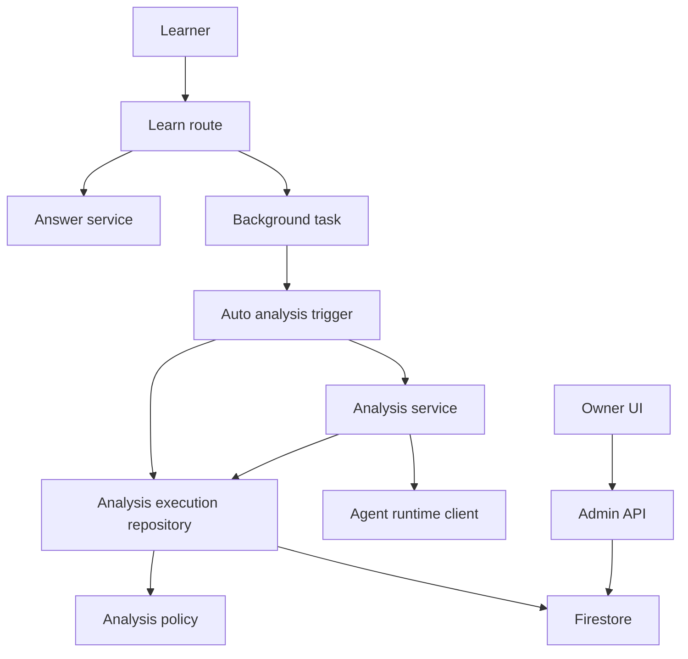
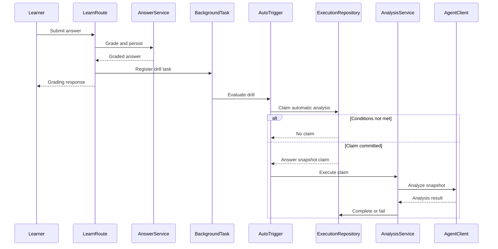
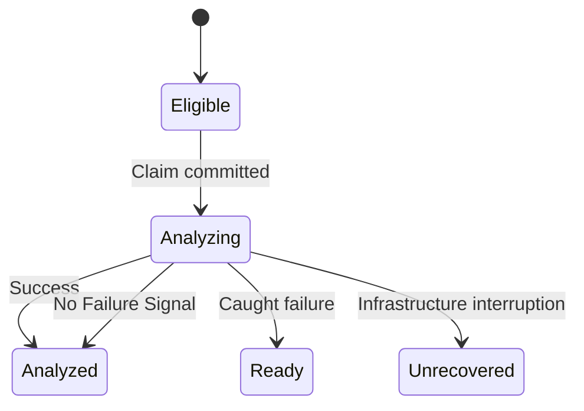

# Technical Design Document

## Overview

本機能は、回答の採点成功を契機として対象ドリルの未分析回答数と既存の要分析判定を評価し、条件成立時に
既存の回答分析を自動起動する。分析本体、Failure Signal判定、patch作成、apply/rejectは既存契約を再利用し、
自動起動の判定・同時開始予約・起動元表示だけを追加する。

受講者responseは分析完了を待たず、FastAPIのprocess-local background taskから分析を実行する。
同一drillのauto/auto・manual/auto競合と、`PROPOSED` patch存在中のauto開始はFirestore transactionで
原子的に抑止する。process停止や再deployにより終了状態を書けない実行の回収は本仕様の境界外である。

### Goals

- 採点成功時だけ、対象drillの未分析5件と既存`needsAnalysis`を評価して自動分析を開始する。
- manual/autoが共通のtransactional claimを使い、同一drillの分析を高々1件にする。
- 分析開始時の回答ID snapshotだけをAgentへ渡し、成功時にその件数だけを消化する。
- Agent入力件数と自動閾値用の確定スコアwatermarkを分離し、manual/autoを跨いでも未分析5件を正しく数える。
- timelineとpatchで「AI 自動分析」を表示し、教材変更は人間のapply/rejectに限定する。

### Non-Goals

- Cloud Tasks、scheduler、retry worker、AnalysisRun履歴entityの追加。
- process停止・instance終了・再deploy後の`ANALYZING`回収、heartbeat、lease、fencing。
- 異なるdrill間の分析同時実行禁止、course全体の実行lease。
- 既存`needsAnalysis`閾値、Agent prompt、Failure Signal、patch品質判定の変更。
- 自動apply/reject、利用者向け設定画面、講座別設定。

## Boundary Commitments

### This Spec Owns

- 採点成功後に一度だけ登録されるprocess-local自動分析task。
- 対象drillの未分析5件、current version、既存`needsAnalysis`、`PROPOSED`なしを検証するauto claim。
- manual/auto共通の同一drill transaction予約と、開始時answer ID snapshot。
- analysis成功・Failure Signal 0件・通常例外失敗のtransactional終端。
- 自動閾値専用`autoAnalyzedScoredAnswerCount`の保存と、originを跨ぐ単調非減少更新。
- `AnalysisOrigin`の永続化、API公開、timeline/patch表示。
- Cloud Runでresponse後CPUを利用するためのbilling mode変更。

### Out of Boundary

- infrastructure interruptionで終了状態を書けなかったanalysisの回収と自動復旧。
- durable delivery、定期再評価、失敗直後または定期的な自動retry。
- course-wide lease、旧revision drain、既存データmigration。
- patch review、教材version更新、owner認可、Agent workflowの意味変更。
- auto claim commit後に別drillのpatchが確定した場合、開始済みanalysisを取り消すこと。

### Allowed Dependencies

- `AnswerService`の採点成功結果と`AnswerSubmission.drill_run_id`。
- 既存`compute_needs_analysis`の閾値・平均スコア規則と、回答・drill・patch repository。
- `FirestoreClient.run_transaction`および同transactionを透過利用するCRUD。
- `AnalysisService`、`AgentRuntimeClient`、既存timeline/patch契約。
- FastAPI `BackgroundTasks`、Reactの既存page/component、Terraform管理のCloud Run service。

依存方向は次に固定する。

```text
schemas -> analysis policy -> repositories -> services -> routes -> main
schemas -> frontend api types -> pages -> components
terraform -> Cloud Run runtime configuration
```

routeは条件判定を持たず、repositoryはAgentやFastAPIへ依存しない。frontend componentはAPI clientを
直接参照しない。

### Revalidation Triggers

- `needsAnalysis`、`analyzedAnswerCount`、`autoAnalyzedScoredAnswerCount`の意味・集計単位が変わる。
- manual分析の対象状態、patch作成、course summary更新の契約が変わる。
- `analysisOrigin`の値、camelCase API field、timeline表示要件が変わる。
- durable queue、retry、stale recovery、course-wide排他を追加する。
- Cloud Runのbilling mode、scale-to-zero、request lifecycleを変更する。

## Architecture

### Existing Architecture Analysis

既存backendは薄いroute、service、repository、共有`FirestoreClient`で構成される。`AnalysisService`は
分析開始からpatch作成・失敗復帰までを同期実行し、manual APIから直接呼ばれる。`needsAnalysis`は
course current version全体を判定し、対象drillの未分析5件判定とは集計単位が異なる。

現行`start_analysis()`のstatus readと`ANALYZING` writeは一つのtransactional claimではない。また成功時の
patch、drill、course更新は一つのtransactionではない。本設計はこのanalysis lifecycleだけを局所的に
transactional repositoryへ寄せ、他のdomain repositoryを再設計しない。

### Architecture Pattern & Boundary Map



**Architecture Integration**

- Selected pattern: small trigger service + shared transactional lifecycle + existing analysis executor。
- Domain boundaries: triggerはauto条件、execution repositoryはclaim/終端、AnalysisServiceはAgent実行を所有する。
- Existing patterns preserved: FastAPI DI、Pydantic camelCase、repository経由のFirestore、page-level API state。
- New component rationale: auto条件を採点serviceへ混在させず、claim/終端のtransactionを一か所へ固定する。
- Steering compliance: `.kiro/steering/`は存在しないため、`backend-fastapi`と`frontend`規約を適用する。

### Technology Stack

| Layer | Choice / Version | Role in Feature | Notes |
|---|---|---|---|
| Frontend | React 19 / TypeScript | origin表示と自動分析中polling | 新dependencyなし |
| Backend | Python 3.11+ / FastAPI 0.138.1 | response後taskとservice orchestration | `BackgroundTasks`を利用 |
| Data | Firestore client 2.28.0 | claim、snapshot read、終端transaction | 新collection/indexなし |
| Agent | Existing `AgentRuntimeClient` | 分析とpatch候補生成 | 既存workflow不変 |
| Infrastructure | Terraform 1.10+ / Google provider 6.x / Cloud Run | response後CPU allocation | `cpu_idle=false`、min instances 0維持 |

## File Structure Plan

### New Files

```text
backend/app/services/auto_analysis.py       # auto条件評価とbackground task orchestration
backend/app/analysis_policy.py              # repository非依存のneeds-analysisと未分析件数計算
backend/tests/test_auto_analysis.py         # auto条件、no-op、通常失敗、snapshotのservice test
```

### Modified Files

**Backend**

- `backend/app/schemas.py` — `AnalysisOrigin`、2種類のsnapshot件数を持つ`AnalysisClaim`、
  `DrillRun.auto_analyzed_scored_answer_count`、`DrillRun` / `DocumentPatch` /
  `DrillAdminResponse.analysis_origin`とdrill固有の`latest_patch_id`を追加する。
- `backend/app/repositories/firestore_client.py` — InMemory transactionへcopy-on-write rollbackを追加し、
  全CRUDを同じ`RLock`で直列化する。
- `backend/app/services/needs_analysis.py` — repository読込を担う既存wrapperとしてpure policyを呼び出す。
- `backend/app/repositories/repositories.py` — `AnalysisExecutionRepository`を追加し、nested transactionを使わず
  claim、progress、complete、failをshared client上で実行する。
- `backend/app/services/analysis_service.py` — manual claimとAgent executionを分離し、既存manual routeは同期の
  `run_analysis` interfaceを維持する。
- `backend/app/routes/learn.py` — 現行/legacy回答routeへ`BackgroundTasks`を受け取り、採点成功後にtaskを1件登録する。
- `backend/app/services/drill_service.py` — `DrillAdminResponse.analysis_origin`とdrill固有の
  `latest_patch_id`を返す。
- `backend/app/main.py` — execution repository、AutoAnalysisTrigger、AnalysisServiceをshared clientから構築する。
- `backend/tests/test_analysis_service.py` — shared claim、2種類のsnapshot、transactional complete/fail、
  manual回帰とmanual→auto交差ケースを追加する。
- `backend/tests/test_firestore_client.py` — InMemory transactionのcommit、例外時rollback、CRUD直列化を検証する。
- `backend/tests/test_needs_analysis.py` — pure policy移動後も既存判定と対象drill件数を検証する。
- `backend/tests/test_answers_api.py` — task登録契約、採点失敗時の非登録、response/task順序を追加する。
- `backend/tests/test_drill_service.py` — drill固有`latest_patch_id`のresponse mappingを検証する。
- `backend/tests/test_drills_api.py` — Drill Admin APIの`latestPatchId`値とnull defaultを検証する。
- `backend/tests/test_schemas.py` — 新旧DrillRunのdefault、専用watermark、camelCase serializationを検証する。
- `backend/tests/test_repositories.py` — auto/auto、manual/auto、completion/claim競合、origin round-trip、
  2種類のwatermarkの単調更新を追加する。

**Frontend**

- `frontend/src/api/types.ts` — `AnalysisOrigin`、2 response型の`analysisOrigin`、
  `DrillAdmin.latestPatchId`を追加する。
- `frontend/src/components/common/AnalysisTimeline.tsx` — `isAutomatic?: boolean`でchipを条件表示する。
- `frontend/src/components/common/AnalysisTimeline.test.tsx` — automatic/manual表示を検証する。
- `frontend/src/pages/DrillAdminPage.tsx` — originをtimelineへ渡し、自動`analyzing`中だけ有限pollingし、
  drill固有patchへ遷移する。
- `frontend/src/pages/DrillAdminPage.test.tsx` — automatic success/no-patch/failure/timeout、manual表示、
  polling停止を検証する。
- `frontend/src/pages/PatchReviewPage.tsx` — patch originをtimelineへ渡す。
- `frontend/src/pages/PatchReviewPage.test.tsx` — automatic chipとmanual apply/reject回帰を検証する。
- `frontend/e2e/ux-audit.spec.ts` — 5件目投稿後のmanual clickをauto patch pollingへ変更する。
- `frontend/e2e/knowledge-drill.spec.ts` — 1件manual flowでautomatic chipがないことを確認する。

**Infrastructure**

- `terraform/main.tf` — backend containerの`cpu_idle`を`false`へ変更する。
- `terraform/README.md` — process-local best-effort、scale-to-zero、回収対象外を運用制約として記録する。

## System Flows

### Auto analysis sequence



The auto claim transaction commit is the linearization point for Requirements 1.2 and 3.7. The transaction reads the
course, target drill, current-version drills and answers, and course patches before any write. It then writes the target drill
and the same course document used by analysis completion. If patch completion commits first, Firestore retries the claim and
the re-read `PROPOSED` prevents start. If claim commits first, the analysis is already started and a later patch does not cancel it.

### Analysis lifecycle



`Unrecovered`は新しい永続statusではなく、`ANALYZING`が残り得る境界外ケースの説明である。

## Requirements Traceability

| Requirement | Summary | Components | Interfaces | Flows |
|---|---|---|---|---|
| 1.1 | 採点成功時評価 | Learn route, AutoTrigger | Background task | Auto sequence |
| 1.2 | 全auto条件 | AutoTrigger, AnalysisPolicy, ExecutionRepository | `claim_auto_analysis`, dedicated watermark | Auto sequence |
| 1.3 | 対象drill未分析件数 | AnalysisPolicy | `count_unanalyzed_answers`, `autoAnalyzedScoredAnswerCount` | Claim transaction |
| 1.4 | 未採点・スコア未確定除外 | AnalysisPolicy, AnalysisClaim | `is_scored_answer`, scored snapshot count | Claim transaction |
| 1.5 | 条件不成立no-op | AutoTrigger | optional claim | Auto sequence |
| 1.6 | 固定5件 | AnalysisPolicy | `AUTO_ANALYSIS_MIN_ANSWERS` | Claim transaction |
| 2.1 | response非阻害 | Learn route, Background task | `add_task` | Auto sequence |
| 2.2 | 開始時snapshot | ExecutionRepository | `AnalysisClaim.answer_ids` | Claim transaction |
| 2.3 | snapshotだけ消化 | AnalysisClaim, ExecutionRepository, InMemory transaction | dual snapshot counts, `complete_analysis` | Analysis lifecycle |
| 2.4 | 分析中追加回答を残す | AnalysisClaim | answer ID snapshot | Analysis lifecycle |
| 2.5 | Failure Signalなし | AnalysisService, ExecutionRepository, InMemory transaction | patch optional result | Analysis lifecycle |
| 2.6 | 通常失敗表示とmanual再実行 | ExecutionRepository, DrillAdminPage | `fail_analysis`, finite polling | Analysis lifecycle |
| 2.7 | 即時・定期retryなし | AutoTrigger | grading-only trigger | Auto sequence |
| 2.8 | 採点結果不変 | Learn route | response boundary | Auto sequence |
| 3.1 | 採点以外で起動しない | Learn route | registration boundary | Auto sequence |
| 3.2 | rollout時に既存5件を起動しない | Learn route | grading-only registration | Auto sequence |
| 3.3 | patch解消で起動しない | PatchService boundary | no trigger integration | Auto sequence |
| 3.4 | analyzing中no-op | ExecutionRepository | claim state guard | Claim transaction |
| 3.5 | auto/auto高々1件 | ExecutionRepository | transactional claim | Claim transaction |
| 3.6 | manual/auto高々1件 | AnalysisService, ExecutionRepository | shared claim | Claim transaction |
| 3.7 | PROPOSED中no-op | ExecutionRepository | patch query + course serialization | Claim transaction |
| 3.8 | no-op時状態不変 | ExecutionRepository | read-before-write | Claim transaction |
| 4.1 | 改善時patch作成 | AnalysisService, ExecutionRepository, InMemory transaction | `complete_analysis` | Analysis lifecycle |
| 4.2 | 自動apply/reject禁止 | PatchService boundary | existing owner API | Analysis lifecycle |
| 4.3 | owner apply/reject維持 | DrillAdminPage, PatchReviewPage | `latestPatchId`, existing API | Existing review flow |
| 4.4 | manual分析維持 | AnalysisService, AnalysisClaim | `run_analysis`, all-GRADED answer IDs | Shared claim |
| 4.5 | auto条件でmanualを制限しない | AnalysisService, AnalysisPolicy | manual policy, separate auto watermark | Shared claim |
| 5.1 | automatic origin記録 | ExecutionRepository | `AnalysisOrigin.AUTOMATIC` | Claim transaction |
| 5.2 | manual origin記録 | AnalysisService | `AnalysisOrigin.MANUAL` | Shared claim |
| 5.3 | timeline表示 | AnalysisTimeline | `isAutomatic` | Owner UI |
| 5.4 | patch表示 | DrillAdminPage, PatchReviewPage | `latestPatchId`, `analysisOrigin` | Owner UI |
| 5.5 | manual表示不変 | AnalysisTimeline | optional prop false | Owner UI |

## Components and Interfaces

| Component | Domain/Layer | Intent | Req Coverage | Key Dependencies | Contracts |
|---|---|---|---|---|---|
| AutoAnalysisTrigger | Backend service | auto条件評価と実行 | 1.1–1.6, 2.7, 3.1–3.3 | ExecutionRepository P0, AnalysisService P0 | Service |
| AnalysisPolicy | Backend policy | repository非依存の判定と専用watermark差分計算 | 1.2–1.4, 1.6, 2.3, 4.5 | schemas P0 | Service |
| AnalysisExecutionRepository | Data | claimとanalysis lifecycle transaction | 1.2–1.5, 2.2–2.6, 3.4–3.8, 4.4–4.5, 5.1–5.2 | FirestoreClient P0 | Service, State |
| InMemory transaction contract | Data runtime | local/testでも複数document更新を原子的にする | 2.3, 2.5–2.6, 4.1 | `RLock`, `deepcopy` P0 | State |
| AnalysisService extension | Backend service | shared claimと既存Agent execution | 2.3–2.7, 4.1, 4.4–4.5 | AgentRuntimeClient P0 | Service |
| Learn route hook | Backend route | 採点後task登録 | 1.1, 2.1, 2.8, 3.1 | BackgroundTasks P0 | Event |
| Origin UI | Frontend | automatic表示、有限polling、正確なpatch遷移、失敗確認 | 2.6, 4.3, 5.3–5.5 | API types P0 | State |
| Cloud Run runtime | Infrastructure | response後CPU allocation | 2.1 | Terraform P0 | State |

### Backend Services

#### AnalysisPolicy

| Field | Detail |
|---|---|
| Intent | repositoryに依存せずcourse snapshotと対象drillの起動条件を計算する |
| Requirements | 1.2–1.4, 1.6, 2.3, 4.5 |

**Responsibilities & Constraints**

- `schemas.py`のdomain modelだけへ依存し、repository、service、FastAPIをimportしない。
- 現行`compute_needs_analysis`の閾値、平均スコア、status別算入規則を変えず、
  `services/needs_analysis.py`はread wrapperとして維持する。ANALYZED runの差分計算だけは、専用fieldが
  ある場合に比較可能なscored watermarkを使う。
- 起動閾値の対象は、statusが`GRADED`で、`total_score`と`max_score`が存在し、`max_score > 0`の回答に限定する。
- 自動分析の未分析数、auto claimの`answer_ids`、claimの`snapshot_scored_answer_count`は必ず同じ
  確定スコア回答集合を使う。
- `is_scored_answer`は自動閾値母集団専用とし、手動分析の対象抽出には使用しない。
- 対象drillの未分析数は確定スコア回答総数から専用`auto_analyzed_scored_answer_count`を差し引き、
  0未満にしない。
- 専用field欠落または`None`時だけ、既存`analyzed_answer_count`があれば
  `min(analyzed_answer_count, current_scored_answer_count)`を暫定baselineとする。両field欠損時は
  resolverが`None`を返し、READYはbaseline 0、ANALYZEDは従来どおり未分析0件として扱う。
  legacy countから過去の確定スコア集合を完全復元できないため、このfallbackはmigrationなしで再計上を
  最小化する後方互換境界であり、次の分析成功後は使用しない。
- 同じeffective watermark解決を対象drillの5件判定と既存`compute_needs_analysis`の未分析件数へ共有する。
  legacy時の`scored - min(legacy, scored)`は現行`max(0, scored - legacy)`と同値で、既存結果を変えない。
- 既存`analyzed_answer_count`はAgent入力件数の後方互換fieldとして維持し、自動閾値計算には使用しない。
- 自動起動閾値5をこのpolicyで一元管理する。

**Contracts**: Service [x]

```python
AUTO_ANALYSIS_MIN_ANSWERS: int = 5

def is_scored_answer(answer: AnswerSubmission) -> bool: ...

def resolve_auto_analysis_watermark(
    drill_run: DrillRun,
    current_scored_answer_count: int,
) -> int | None: ...

def compute_needs_analysis(
    course_version: int,
    drill_runs: Sequence[DrillRun],
    answers_by_run: Mapping[str, Sequence[AnswerSubmission]],
) -> bool: ...

def count_unanalyzed_answers(
    drill_run: DrillRun,
    answers: Sequence[AnswerSubmission],
) -> int: ...
```

#### AutoAnalysisTrigger

| Field | Detail |
|---|---|
| Intent | grading eventからauto claimを試み、成功時だけ既存analysis executorを呼ぶ |
| Requirements | 1.1–1.6, 2.7, 3.1–3.3 |

**Responsibilities & Constraints**

- public interfaceは`maybe_run(drill_run_id)`一つに限定する。
- 条件不成立とclaim conflictは正常なno-opでありretryしない。
- task例外を受講者responseへ伝播させず、course/drill IDと失敗種別をloggingする。
- application startup、一覧polling、patch apply/rejectからは呼ばない。

**Dependencies**

- Inbound: Learn route background task — grading成功通知 (P0)
- Outbound: AnalysisExecutionRepository — auto claim (P0)
- Outbound: AnalysisService — claimed analysis execution (P0)

**Contracts**: Service [x]

```python
class AutoAnalysisTrigger:
    def maybe_run(self, drill_run_id: str) -> None: ...
```

- Preconditions: grading済みanswerが保存された後に呼ばれる。
- Postconditions: claimなしならwriteせず終了し、claimありならanalysisを一度実行する。
- Invariants: 自動retry、timer、durable enqueueを行わない。

#### AnalysisService extension

| Field | Detail |
|---|---|
| Intent | manual/auto claim後の既存Agent workflowをsnapshotに対して実行する |
| Requirements | 2.3–2.7, 4.1, 4.4–4.5 |

**Responsibilities & Constraints**

- manual `run_analysis(drill_run_id, owner_user_id)` APIは維持する。
- manualはmanual policyでclaimし、autoの5件・needsAnalysis・PROPOSED条件を適用しない。
- manual claimの対象は現行どおり`status == GRADED`の全回答とし、`total_score` / `max_score`の
  欠落や値によって除外しない。自動用`AnalysisPolicy.is_scored_answer`を流用しない。
- manual claimでも、閾値watermark更新用に同じclaim時点の回答から`is_scored_answer`件数を別途記録する。
  この件数はAgent入力を制限せず、manual成功後に同じ確定スコア回答を未分析件数へ再計上しないためだけに使う。
- executorはclaimのanswer IDsだけを読み、Agentへ渡す。後着answerを含めない。
- Agent呼出し、UUID、diff構築はtransaction外で行う。
- Failure Signal 0件はpatchなしでcompleteする。例外はfailed timelineを作りfail transactionへ渡す。

**Contracts**: Service [x]

```python
class AnalysisService:
    def run_analysis(self, drill_run_id: str, owner_user_id: str) -> DocumentPatch | None: ...
    def run_claimed_analysis(self, claim: AnalysisClaim) -> DocumentPatch | None: ...
```

### Data Layer

#### AnalysisExecutionRepository

| Field | Detail |
|---|---|
| Intent | analysis claim、snapshot、success/failure終端をtransactionalに確定する |
| Requirements | 1.2–1.5, 2.2–2.6, 3.4–3.8, 4.4–4.5, 5.1–5.2 |

**Responsibilities & Constraints**

- auto claimはcourse、target drill、current-version drills/answers、course patchesをすべてreadしてからwriteする。
- auto snapshotは`AnalysisPolicy.is_scored_answer`を満たす回答だけで構成し、IDsと総数を同じ集合から確定する。
- manual snapshotは現行契約どおり`status == GRADED`の全回答で構成する。
- `snapshot_agent_answer_count`はorigin固有のAgent入力集合の件数、`snapshot_scored_answer_count`はoriginに
  関係なく同じ`is_scored_answer`集合の件数とする。autoでは両者が同数、manualでは異なり得る。
- auto claimのcommitを`PROPOSED`判定と分析開始のlinearization pointとする。
- manual/auto claimは同じtarget drill documentをread/writeし、Firestore conflictで高々1件にする。
- claimとcomplete/failは必ずcourse documentもread/writeする。summary値が同じでもwriteを省略しない。
- `DrillRepository.update()`はnested transactionを開始するためcallback内から呼ばず、shared clientへ直接writeする。
- transaction callback内にAgent呼出し、logging、UUID/時刻生成などの副作用を置かない。
- completeはclaim時course versionとcurrent course versionを照合する。不一致時はpatchを作らずfailとして
  READYへ戻し、snapshotを消化しない。
- 成功時は既存`analyzed_answer_count`へ`max(current, snapshot_agent_answer_count)`、専用
  `auto_analyzed_scored_answer_count`へ`max(current or 0, snapshot_scored_answer_count)`を保存する。
  Failure Signal 0件も同じで、失敗時はどちらも更新しない。
- manual/autoいずれの成功も専用watermarkを確定スコアsnapshot件数まで進める。これによりmanualが
  score欠損回答を含んでも、その件数を自動閾値watermarkへ混入させない。
- claim時に`latest_patch_id`を`None`へ戻す。complete時は作成したpatch ID、patchなしなら`None`を
  target drillへ保存し、fail時も`None`を維持する。

**Dependencies**

- Inbound: AutoAnalysisTrigger / AnalysisService (P0)
- Outbound: FirestoreClient transaction and CRUD (P0)
- Outbound: AnalysisPolicy — needs-analysisと対象drill件数のpure computation (P0)

**Contracts**: Service [x] / State [x]

```python
class AnalysisExecutionRepository:
    def claim_auto_analysis(self, drill_run_id: str) -> AnalysisClaim | None: ...
    def claim_manual_analysis(
        self,
        drill_run_id: str,
        owner_user_id: str,
    ) -> AnalysisClaim: ...
    def update_progress(
        self,
        claim: AnalysisClaim,
        timeline: list[AnalysisTimelineItem],
    ) -> None: ...
    def complete_analysis(
        self,
        claim: AnalysisClaim,
        timeline: list[AnalysisTimelineItem],
        patch: DocumentPatch | None,
    ) -> DocumentPatch | None: ...
    def fail_analysis(
        self,
        claim: AnalysisClaim,
        timeline: list[AnalysisTimelineItem],
        error_message: str,
    ) -> None: ...
```

##### State Management

- claim read set: course、target drill、current-version drills、各drill answers、course patches。
- claim write set: target drill `ANALYZING` + origin + initial timeline + `latestPatchId=null`、course latest drill summary。
- complete read set: course、target drill。write set: optional patch、target drill `ANALYZED` + 2種類の
  watermark + drill固有`latestPatchId`、course summary。
- fail read set: course、target drill。write set: target drill `READY` + failed timeline +
  `latestPatchId=null`、course summary。
- PROPOSED queryとcourse writeにより、patch completionが先にlinearizeしたclaimはretry後no-opになる。
- claim後のinfrastructure interruptionでは`ANALYZING`が残り、repositoryは自動回収しない。

#### InMemory transaction contract

| Field | Detail |
|---|---|
| Intent | local/test既定storageでもFirestoreと同じall-or-nothing更新境界を提供する |
| Requirements | 2.3, 2.5–2.6, 4.1 |

- `run_transaction`は`RLock`取得後に`_collections`全体を`deepcopy`し、callback成功時だけ変更を残す。
- callbackが例外を送出した場合はsnapshotを`_collections`へ復元して同じ例外を再送出する。
- `create` / `set` / `get` / `update` / `delete` / `list` / field queryも同じ`RLock`を取得し、
  transaction外CRUDがcallback途中の状態を観測・変更できないようにする。再入可能lockなのでcallback内CRUDは許可する。
- この実装は原子性とprocess内isolationを模倣するが、Google Firestoreの競合検知・callback retryは模倣しない。

### Backend Route Event

#### Learn route hook

| Field | Detail |
|---|---|
| Intent | grading成功後にresponse後taskを一度登録する |
| Requirements | 1.1, 2.1, 2.8, 3.1 |

**Contracts**: Event [x]

- Trigger: current/legacy answer submit handlerの採点成功。
- Payload: `drill_run_id: str`のみ。learner payloadやauth tokenは渡さない。
- Delivery: FastAPI process-local background task、at-most-one registration per successful request、durabilityなし。
- Ordering: graded answer保存後に登録し、response body送信後にtaskを開始する。
- Error: registration前のgrading failureではtaskなし。task errorはresponseを変更しない。

### Frontend UI

#### Origin UI

| Field | Detail |
|---|---|
| Intent | timelineとpatchでautomatic originを表示し、有限pollingで分析結果へ到達させ、manual UIを変えない |
| Requirements | 2.6, 4.3, 5.3–5.5 |

- `AnalysisTimeline`は`isAutomatic?: boolean`を受け、true時だけ既存chip styleで「AI 自動分析」を表示する。
- `DrillAdminPage`と`PatchReviewPage`がtyped API responseをbooleanへ変換する。
- page-level stateには`polling(attempts)`、`noPatch`、`failed`、`timedOut`を明示し、既存manualの
  `loading` / `skipped` / `failed`とは起動契機を区別する。
- 初回GETまたは再取得結果が`analysisOrigin == automatic && status == analyzing`なら1秒間隔でpollingする。
  上限は180回（最大180秒）とし、component unmount時もtimerを解除する。
- `status == analyzed && latestPatchId != null`ではpollingを止め、既存`/patches/{latestPatchId}`へ遷移する。
- `status == analyzed && latestPatchId == null`ではpollingを止め、この画面でpatch見送り完了を表示する。
- `status == ready`かつ最新timelineがfailedならpollingを止め、既存failed timelineと有効なmanual buttonを表示する。
- 上限到達時はpollingを止め、表示済みtimelineを保持したまま「状態確認がタイムアウトしました」と再読込操作を
  表示する。通信の一時失敗は上限まで最後の表示を保持し、無限pollingにはしない。
- course summaryの`latestPatchId`は別drillのpatchを指し得るため遷移判定に使わず、必ず
  `DrillAdminResponse.latestPatchId`を使う。

### Infrastructure

#### Cloud Run runtime

| Field | Detail |
|---|---|
| Intent | response送信後のprocess-local analysisへCPUを割り当てる |
| Requirements | 2.1 |

- backend containerの`cpu_idle`をfalseへ変更する。
- `min_instance_count=0`を維持するため、idle instance終了とtask喪失は可能である。
- queue、scheduler、new IAM、new endpointは追加しない。
- Terraform planでbackend CPU設定以外のresource replacementがないことを確認する。

## Data Models

### Domain Model

```python
class AnalysisOrigin(StrEnum):
    MANUAL = "manual"
    AUTOMATIC = "automatic"

class AnalysisClaim(ApiModel):
    course_id: str
    drill_run_id: str
    owner_user_id: str
    course_version: int
    answer_ids: tuple[str, ...]
    snapshot_agent_answer_count: int
    snapshot_scored_answer_count: int
    origin: AnalysisOrigin

class DrillRun(ApiModel):
    analyzed_answer_count: int | None = None
    auto_analyzed_scored_answer_count: int | None = Field(default=None, ge=0)
    analysis_origin: AnalysisOrigin = AnalysisOrigin.MANUAL
    latest_patch_id: str | None = None

class DocumentPatch(ApiModel):
    analysis_origin: AnalysisOrigin = AnalysisOrigin.MANUAL

class DrillAdminResponse(ApiModel):
    analysis_origin: AnalysisOrigin = AnalysisOrigin.MANUAL
    latest_patch_id: str | None = None
```

`AnalysisClaim`はprocess-local immutable contextであり永続化しない。`answer_ids`はclaim時にAgent対象として
固定した回答のID、`snapshot_agent_answer_count`はその集合の件数で既存`analyzedAnswerCount`を進める値である。
`snapshot_scored_answer_count`は常にclaim時点の`is_scored_answer`総数で、専用
`autoAnalyzedScoredAnswerCount`を進める。二つのwatermarkはそれぞれ同じ母集団内でのみ比較し、混用しない。

### Logical and Physical Data Model

- `drill_runs/{drill_run_id}.analysisOrigin`: `manual | automatic`。field欠落はPydantic defaultでmanual。
- `drill_runs/{drill_run_id}.analyzedAnswerCount`: 既存のAgent入力件数watermark。意味と既存readerを変更しない。
- `drill_runs/{drill_run_id}.autoAnalyzedScoredAnswerCount`: 自動閾値専用の確定スコア回答watermark。
  成功したmanual/auto分析だけが単調非減少で更新する。field欠落またはnullでは既存
  `analyzedAnswerCount`と現在の確定スコア件数によるfallbackを使う。
- `drill_runs/{drill_run_id}.latestPatchId`: このdrillの直近分析が作成したpatch ID。claim、patchなし完了、
  failureではnull。field欠落はnull。
- `patches/{patch_id}.analysisOrigin`: `manual | automatic`。field欠落はmanual。
- 新collection、新index、backfillは不要。
- API JSONは既存alias規則により`analysisOrigin`を常に返す。
- Drill Admin APIは`latestPatchId`を返し、frontendが自動分析の正確な遷移先に使用する。

### Consistency & Integrity

- 同一drill claimはdrill documentをtransaction conflict pointとする。
- auto claimとanalysis completionはcourse documentを共通conflict pointとする。
- patch create、drill終端、course summaryは同じcomplete transactionで確定する。
- no-signal completeもdrill終端とcourse summaryを同じtransactionで確定する。
- failは2種類のsnapshot watermarkを更新しない。
- 自動未分析数は`scored answer総数 - effective auto scored watermark`で計算する。専用fieldが存在すれば
  それだけを使い、欠損時だけ後方互換fallbackの入力として`analyzedAnswerCount`を参照する。
- effective watermarkが`None`なら、READYでは0を使い、ANALYZEDでは未分析0件としてauto claimをno-opにする。
  ANALYZED legacy runへの次の回答保存前には既存lazy初期化がlegacy countを確定するため、採点成功後の
  通常auto評価では追加回答だけが差分に残る。
- `compute_needs_analysis`も専用fieldが存在するrunでは同じ差分を使い、既存の1件閾値・70%未満・status規則は
  維持する。専用field欠損runのfallback結果は現行計算と同値とする。
- GoogleFirestoreClientはFirestore transactionへ委譲し、InMemoryFirestoreClientはcopy-on-write rollbackと
  全CRUD共通lockにより同じall-or-nothing契約を満たす。

## Error Handling

### Error Categories and Responses

| Category | Handling | User-visible result |
|---|---|---|
| Auto condition false | no-op + reasonをdebug/info log | 採点response不変 |
| Auto claim contention | claim retry、最終失敗はno-op + warning | 重複分析なし |
| Manual claim conflict | existing 409 mapping | 既存manual error表示 |
| Agent / analysis exception | failed timeline + READYをfail transactionで保存 | Drill Adminで失敗、manual再実行可 |
| Course version changed | stale input failureとしてREADY、watermark不変 | failed timeline、manual再確認 |
| Completion persistence failure | critical log、成功を返さない | Google/InMemoryともtransaction commit前の状態を維持 |
| Infrastructure interruption | 自動処理なし | `ANALYZING`残留の可能性、境界外 |
| Admin polling timeout | 180秒で停止、明示的な再読込を提供 | 最後のtimelineとtimeout表示、無限待機なし |

### Monitoring

- `auto_analysis_skipped`にdrill/courseとcondition reasonを記録する。
- `auto_analysis_started/completed/failed`にoriginとsnapshot countを記録する。
- learner回答本文、Failure Signal詳細、owner feedbackをlogへ含めない。
- background taskの最上位例外を必ずwarning/exception logへ記録する。

## Testing Strategy

### Unit Tests

1. 対象drillの未分析4件/5件、専用watermark、非graded、旧versionをpure helperで検証する。
   `GRADED + total_score=None`、`GRADED + max_score=None`、`GRADED + max_score<=0`もauto閾値、auto `answer_ids`、
   scored snapshot、専用watermarkから除外する（1.2–1.6）。
2. AutoAnalysisTriggerがclaimなしでexecutorを呼ばず、claimありで一度だけ呼び、例外をresponse境界へ返さない
   （1.5, 2.7, 3.8）。
3. Failure Signal 0件でpatchなし、2種類のsnapshot watermark更新、automatic origin維持を検証する
   （2.3, 2.5, 5.1）。
4. Agent例外でREADY、failed timeline、両watermark不変、manual再実行可能を検証する（2.6–2.8）。
5. AnalysisTimelineがautomaticだけchipを表示し、manual/未指定でDOMを追加しない（5.3–5.5）。
6. manual claimは`status == GRADED`ならscore field欠落・`max_score<=0`でも対象に含め、auto claimだけが
   `is_scored_answer`で除外することを回帰検証する（4.4–4.5）。
7. manual claimの`answer_ids` / `snapshot_agent_answer_count`は全GRADED、`snapshot_scored_answer_count`は
   確定スコア回答だけとなり、集合を混同しない（1.4, 4.4–4.5）。

### Repository and Integration Tests

1. auto/auto、manual/autoを同時claimし成功が1件であることを検証する（3.4–3.6）。
2. patch completionとauto claimを競合させ、completion先行ではclaim retry後no-op、claim先行では開始成功となる
   linearization contractを検証する（1.2, 3.7–3.8）。
3. claim後の追加answerが`answer_ids`と2種類のsnapshot watermarkに含まれない（2.2–2.4）。
4. optional patch + drill ANALYZED + course summary、およびfail + READY + course summaryが同じtransactionに
   参加し、nested transactionを開始しない（2.3, 2.5–2.6, 4.1）。
5. field欠落旧documentをmanualかつ`latestPatchId=null`として読み、Drill Serviceがdrill固有IDをmappingし、
   APIは`analysisOrigin` / `latestPatchId`をcamelCaseで返す（4.3, 5.1–5.2, 5.4）。
6. current/legacy answer routeがgrading成功時だけtaskを1件登録し、ASGI response body送信後にfake taskが
   開始される（1.1, 2.1, 2.8, 3.1）。
7. InMemory transactionでpatch作成後にdrillまたはcourse更新を故意に失敗させ、全collectionがcallback前へ
   rollbackされること、およびtransaction中に別threadのCRUDが割り込まないことを検証する（2.3, 2.5–2.6, 4.1）。
8. manualが「確定スコア4件＋score欠損1件」を成功分析した後、確定スコア回答を5件追加すると、
   `analyzedAnswerCount=5`ではなく専用watermark 4を差し引いて未分析5件となりauto claimが成功する
   （1.2–1.4, 2.3, 4.4–4.5）。
9. 専用field欠落旧documentは`min(analyzedAnswerCount, current scored count)`をbaselineとする。
   READYで両field欠落なら0、ANALYZEDで両field欠落の読み取りは未分析0件とする。後者への新回答受付では、
   保存前の既存lazy初期化後のlegacy countを採点成功後のauto評価に使い、追加回答だけを差分に残す。
   rollout・一覧表示・patch解消だけでは起動せず、次の分析成功で専用fieldを確定する
   （1.1–1.4, 3.1–3.3）。
10. score欠損回答を多数含むmanual成功後も、`compute_needs_analysis`と対象drillの5件判定が同じ専用
    watermarkを使い、新しい確定スコア回答を過少計上しない。専用field欠損legacy fixtureでは従来の
    `needsAnalysis`結果が変わらないことも検証する（1.2–1.4, 4.4–4.5）。
11. auto snapshotに確定スコア5件とscore欠損GRADED 1件がある場合、閾値と`answer_ids`は5件、
    `snapshot_agent_answer_count` / `snapshot_scored_answer_count`も5となり、manual snapshotでは同じ回答集合の
    Agent入力が6件、scored件数が5件になることを検証する（1.4, 2.2–2.3, 4.4–4.5）。

### Frontend and E2E Tests

1. automatic failed timelineでchip、failed step、enabled manual buttonを表示する（2.6, 5.3）。
2. automatic patchでchipを表示し、apply/rejectは既存どおり動く（4.2–4.3, 5.4）。
3. 4回答済みdemoへ5件目を投稿し、manual clickなしでpatchをpollして「AI 自動分析」を確認する
   （1.1–1.2, 4.1, 5.1, 5.4）。
4. 1回答の既存manual E2Eはautomatic chipなしで成功する（4.4–4.5, 5.2, 5.5）。
5. 自動分析の`analyzed + latestPatchId`で正しいpatchへ遷移し、`analyzed + null`、failed、180回上限では
   pollingを停止する。fake timerで無限pollingがないことも検証する（2.6, 4.3, 5.4）。

### Infrastructure Validation

1. `terraform fmt` / `validate` / `plan`で`cpu_idle: true -> false`だけが本機能由来のruntime差分であり、
   service replacement、new IAM、queue、schedulerがないことを確認する。
2. backend test、ruff、mypy、frontend test、typecheck、lint、buildを実行する。

## Security Considerations

- 新しいpublic/internal endpointを追加しない。
- background payloadはdrill IDだけとし、learner回答やcredentialを渡さない。
- auto claimはcourseに保存されたowner IDをclaimへ取り込み、既存AnalysisServiceのowner境界を維持する。
- analysis originは監査表示用であり、認可判断に使用しない。

## Performance and Scalability

- 判定はgrading成功時だけ実行し、一覧pollingやpatch解消では実行しない。
- auto claimはcurrent courseのdrills/answers/patchesを読む。既存needsAnalysisと同じ小規模course前提を維持する。
- Agent処理はtransaction外で行い、Firestore contention時間を短くする。
- `cpu_idle=false`によりidle instance存続中の課金は増えるが、`min_instance_count=0`は維持する。

## Migration and Rollout

- `analysisOrigin`はdefault manual、`autoAnalyzedScoredAnswerCount`はoptionalな後方互換fieldとし、
  backfillしない。欠損時は既存watermarkから暫定baselineを解決する。両field欠損のANALYZED runは読み取り時に
  未分析0件を維持し、field欠落だけでは起動せず、次の採点成功時に通常条件を評価する。
- legacyの`ANALYZED` runで既存`analyzedAnswerCount`も欠損している場合は、現行AnswerServiceが新回答保存前に
  既存全GRADED件数をlazy初期化する契約を維持し、採点成功後のauto claimはその値からfallbackを解決する。
- deploymentで新backend/frontend/schemaを同時にrolloutする。旧frontendは追加fieldを無視できる。
- TerraformでCloud Run CPU設定を適用し、backend deploy後に5件目auto E2Eを確認する。
- rollbackは旧backend imageへ戻し、必要なら`cpu_idle=true`へ戻す。新fieldは旧readerが無視する。
- rollback時に残る`ANALYZING`の自動回収は行わず、運用上の既知制約として扱う。
