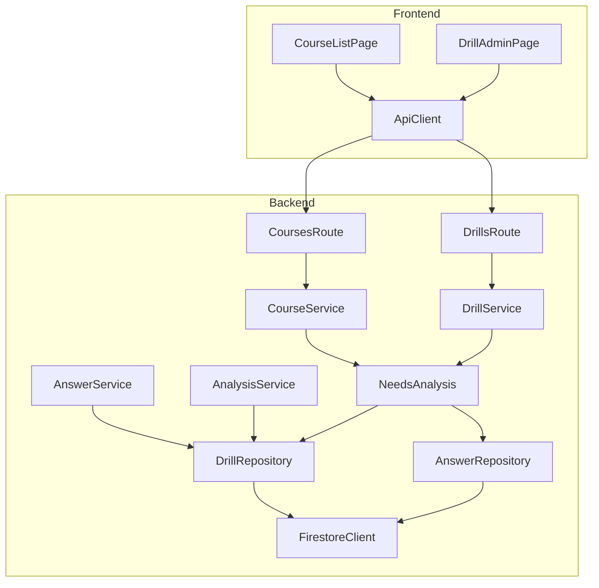
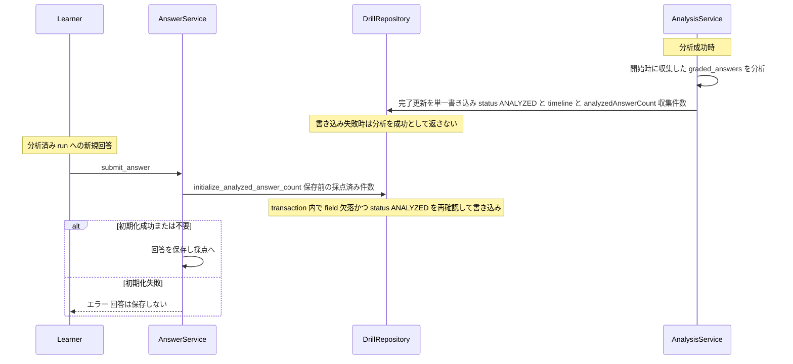
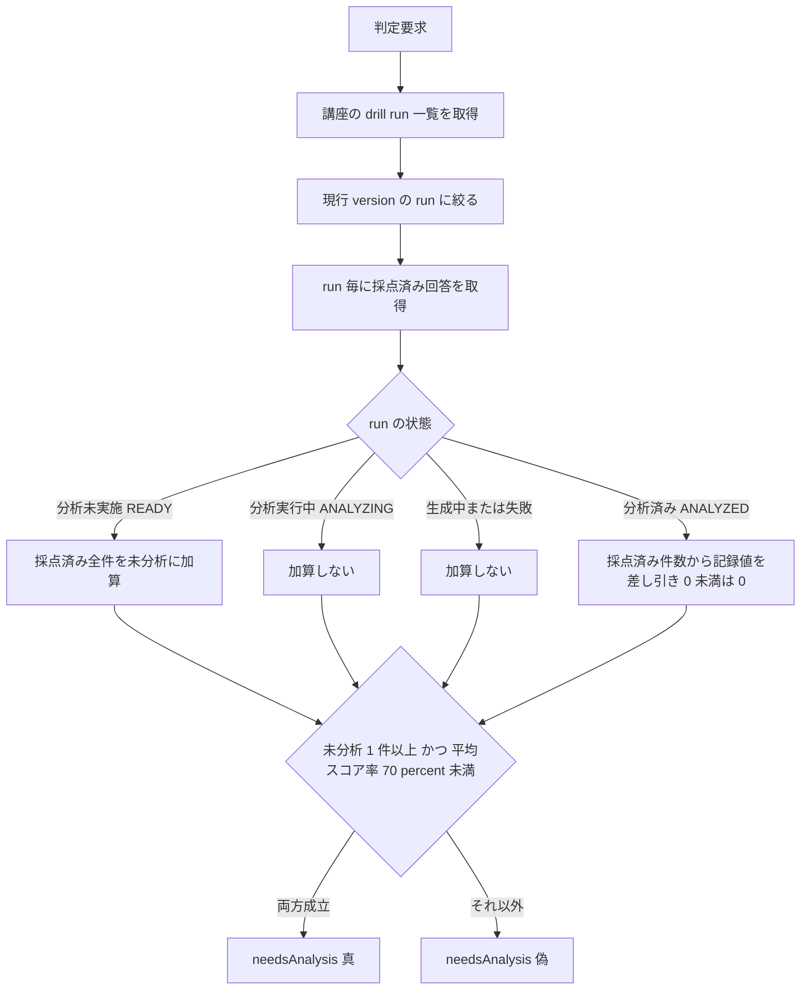

# Technical Design: course-needs-analysis-badge

## Overview

**Purpose**: 本機能は、未分析の低スコア回答が閾値を超えた講座を「要分析」と自動判定し、講座一覧の講座カードと
ドリル管理画面の分析実行導線付近にアラートとして表示する。講座オーナーは講座一覧を開いた瞬間に
「健康な講座」と「悲鳴を上げている講座」を対比でき、monitoring → alerting → human triage → human gate の
改善ループが画面上で成立する。

**Users**: 講座オーナーが講座一覧・ドリル管理画面で分析の要否を検知するために利用する。デモ実施者・審査員は
シードデータ投入直後の点灯/消灯対比を通じて alerting の物語を確認する。

**Impact**: 既存の講座一覧・ドリル管理レスポンスに computed な要分析判定を追加し、`DrillRun` に分析済み回答件数
（watermark）を新設する。分析パイプラインの判断内容・エージェント・シードデータは変更しない。

### Goals

- 要分析判定（未分析回答 1 件以上 かつ 平均スコア率 70% 未満）を backend の単一モジュールで所有し、講座一覧とドリル管理の両画面へ同一判定を提供する
- 分析済み回答件数を単調非減少の watermark として記録し、分析完了後に届いた新規誤答も検知可能にする
- シードデータ無変更で「ハッカソン参加ガイド = 点灯 / 経費精算 = 消灯」の対比を成立させる
- docs/blog.md の DevOps 対応表・「次の周回」を画面の実態に合わせて更新する

### Non-Goals

- 通知チャネル（メール / Slack 等）、分析の自動実行（起動の自動化）
- 分析エージェント（ADK / プロンプト / 分析内容）の変更
- needsAnalysis および集計値の事前計算・永続化、キャッシュ基盤
- SSE / WebSocket / Firestore Listener によるリアルタイム更新
- DrillAdminPage の常時ポーリング（既存の分析実行中 1 秒ポーリングは維持）と回答一覧の自動更新
- タブ可視性・ウィンドウフォーカスに連動したポーリングの停止/再開制御、背景更新失敗の明示表示（失敗時は既存一覧を静かに維持する）
- ポーリング間隔を設定画面から変更する機能、API レスポンス形式の追加変更、新規エンドポイント、共通ポーリング hook・キャッシュ基盤
- 講座詳細画面（CourseEditorPage / CourseDetailResponse）へのバッジ追加
- シードデータの変更、既存分析済みドリルへの一括バックフィル

## Boundary Commitments

### This Spec Owns

- 要分析判定ルールとその閾値定数（`backend/app/services/needs_analysis.py` に集約）
- `DrillRun.analyzed_answer_count` field のライフサイクル（分析成功時の記録、回答受付時の lazy 初期化、単調非減少の不変条件）
- 講座一覧レスポンス（`CourseSummary`）とドリル管理レスポンス（`DrillAdminResponse`）への `needsAnalysis` field の追加
- 講座カードのアラートチップ（点灯時の「分析できます」置換を含む）と DrillAdmin のアラートバナー表示
- 講座一覧の定期更新（15 秒ポーリングと重複取得防止・アンマウント時停止のページ状態制御）
- docs/blog.md の対応表・「次の周回」の更新

### Out of Boundary

- 分析パイプラインの判断内容・タイムライン構造（`failure-analysis-review-loop` の所有。本 spec が触るのは完了時の件数記録の追記のみ）
- シードデータの定義（`demo-course-seed` の所有。本 spec は読み取りと整合テスト追加のみ）
- 「分析できます」チップの表示条件そのもの（非点灯時は現状維持。点灯時の置換のみ本 spec が所有）
- 分析実行可否（`canAnalyze`）の算出と表現（`analysis-ui-declutter` の所有）
- `CourseDetailResponse` / CourseEditorPage の拡張

### Allowed Dependencies

- `CourseRepository` / `DrillRepository` / `AnswerRepository` と `FirestoreClient` 抽象（`run_transaction` を含む）
- 既存スキーマ（`Course.version`、`DrillRun.course_version` / `status`、`AnswerSubmission.status` / `total_score` / `max_score`）
- 既存 UI パターン（`statusChips` の chip 生成、warning トーンの CSS、StatusBanner 相当のバナー様式）
- 依存方向の制約: schemas → repositories → services → routes、frontend は types → api client → pages。判定ロジックは `needs_analysis.py` のみが所有し、CourseService / DrillService は評価関数を呼ぶだけ（判定の重複実装は境界違反）

### Revalidation Triggers

- `CourseSummary` / `DrillAdminResponse` の契約形状変更（`score-progression-ui` / `analysis-ui-declutter` の隣接 spec に影響）
- `DrillRun` スキーマの変更（特に `analyzed_answer_count` の意味論・単調性の変更）
- 判定閾値の意味論変更（件数・スコア率の定義変更はシード整合テストとブログ記述の再検証が必要）
- `DrillRunStatus` の状態遷移や回答受付ポリシー（`DISTRIBUTABLE_DRILL_STATUSES`）の変更

## Architecture

### Existing Architecture Analysis

- backend は routes → services → repositories → FirestoreClient（Protocol、InMemory / Google の2実装）の層構造。computed フィールドは `CourseService._summarize` / `DrillService.get_admin_drill` で組み立てる先行例（`drillStatus`、`canAnalyze`）がある
- FirestoreClient に field 単位の条件付き更新プリミティブはない。`run_transaction` は Google 実装のみ実トランザクション（詳細は research.md）
- frontend は pages が `api/client.ts` 経由で型付きレスポンス（`api/types.ts`）を取得し、真偽値/enum からチップを条件生成する

### Architecture Pattern & Boundary Map



**Architecture Integration**:
- Selected pattern: 既存レイヤ構造への Extension。判定は新設の共有モジュール `needs_analysis`（service 層）に集約し、書き込みは `DrillRepository` の用途特化メソッドに閉じる
- Domain boundaries: 判定 = `needs_analysis` のみ、watermark 書き込み = `DrillRepository` のみ、表示 = 各ページ。判定・記録・表示の3責務を分離
- Existing patterns preserved: computed フィールドの組み立て位置（`_summarize` / `get_admin_drill`）、chip 条件生成、モジュール定数による閾値管理
- New components rationale: `needs_analysis.py` は「両画面で同一判定」（3.2）を単一所有者で保証するため。`DrillRepository` の条件付き更新メソッドは CAS プリミティブ不在を repository 層で吸収するため
- Steering compliance: steering 未整備のため、既存コード規約（backend-fastapi / frontend skill）に準拠

### Technology Stack

| Layer | Choice / Version | Role in Feature | Notes |
|-------|------------------|-----------------|-------|
| Frontend | React + TypeScript + Vite（既存） | チップ / バナー表示、型追加 | 新規依存なし |
| Backend | FastAPI + Pydantic v2（既存） | computed field、判定モジュール、watermark 記録 | 新規依存なし |
| Data | Firestore / InMemory（既存 FirestoreClient 抽象） | `DrillRun.analyzedAnswerCount` の部分更新 | `run_transaction` を条件付き更新に利用 |

## File Structure Plan

### New Files

```
backend/app/services/needs_analysis.py    # 判定の単一所有者: 閾値定数 + 純粋ルール関数 + 評価関数
backend/tests/test_needs_analysis.py      # ルール関数の単体テスト（閾値境界・run 状態別・欠落 field）
```

### Modified Files

- `backend/app/schemas.py` — `DrillRun.analyzed_answer_count: int | None`、`CourseSummary.needs_analysis: bool`、`DrillAdminResponse.needs_analysis: bool` を追加（camelCase alias は既存 `to_camel` が自動適用）
- `backend/app/repositories/firestore_client.py` — `InMemoryFirestoreClient.run_transaction` を `threading.RLock` で直列化（FastAPI 同期エンドポイントは threadpool で並行実行されるため、callback 全体の排他が必要）
- `backend/app/repositories/repositories.py` — `DrillRepository` に `initialize_analyzed_answer_count` を追加（transaction 内で「field 欠落 かつ status が ANALYZED」を再確認して書き込む CAS。`analyzedAnswerCount` のみの部分更新）
- `backend/app/services/analysis_service.py` — 分析成功時の既存完了更新（`model_copy` → `update()`）に `analyzed_answer_count = len(graded_answers)` を含め、status・timeline・watermark を単一書き込みで確定する。`graded_answers` は `collect_answers` 時点の収集結果。書き込み失敗時は既存のエラー経路に乗り、分析を成功として返さない
- `backend/app/services/answer_service.py` — `submit_answer` で回答保存前に lazy 初期化（対象: `status == ANALYZED` かつ field 欠落の run）。初期化失敗時は回答を保存せず例外を伝播
- `backend/app/services/course_service.py` — `_summarize` で `evaluate_course_needs_analysis` を呼び `CourseSummary.needs_analysis` を設定
- `backend/app/services/drill_service.py` — `get_admin_drill` で表示 run が現行 version の場合のみ評価関数を呼び、それ以外は `False` を設定
- `frontend/src/api/types.ts` — `CourseSummary.needsAnalysis: boolean`、`DrillAdmin.needsAnalysis: boolean` を追加
- `frontend/src/pages/CourseListPage.tsx` — `statusChips` に要分析チップ（warning）を追加し、点灯時は「分析できます」チップを生成しない。加えて既存 `useEffect` 内に 15 秒ポーリング（`setInterval` + fetching ガード + active フラグ、アンマウント時解除）を実装。共通 hook・新規ライブラリは作らない
- `frontend/src/pages/DrillAdminPage.tsx` — 「回答を分析する」ボタン付近に warning バナー（チップ形式ではない注記）を条件表示
- `docs/blog.md` — DevOps 対応表への「アラート」行追加、「次の周回」の更新
- テスト: `backend/tests/test_courses_api.py`（シード整合・一覧 field）、`backend/tests/test_answer_service.py`（lazy 初期化・失敗時非保存）、`backend/tests/test_analysis_service.py`（完了更新への記録・失敗時不変）、`backend/tests/test_repositories.py`（実並行 CAS・watermark 順序組み合わせ）、`backend/tests/test_drills_api.py`（admin field・過去 version）、`frontend/src/pages/CourseListPage.test.tsx` / `DrillAdminPage.test.tsx`（表示・置換・非表示）

## System Flows

### 分析済み回答件数のライフサイクル



- 記録値は完了時の再集計ではなく分析開始時の収集件数（2.1、分析中に届いた回答を分析済み扱いしない: 2.3）。status・timeline・watermark は既存の完了更新 1 回で同時に確定するため、「成功したのに未記録」という状態は生じない（2.1、2.9）
- **単調性の保証**（2.5、2.6）: watermark の書き手は (a) 完了更新（値 = 収集時点の採点済み全件数）と (b) lazy 初期化（transaction 内で「field 欠落 かつ status ANALYZED」を再確認して書き込む CAS）の 2 経路のみ。回答は削除されないため採点済み件数は単調増加であり、(a) の値は過去のいかなる記録値・baseline 以上になる。(b) は再確認により「記録済み」「分析実行中（ANALYZING）」のどちらでも書き込まない。したがってどの interleaving でも値は後退しない。InMemory 実装は `run_transaction` の RLock 直列化、Google 実装は実トランザクションで read-check-write の原子性を担保する

### 要分析判定の計算



- 平均スコア率は現行 version の採点済み回答全体（分析済み含む）の `total_score / max_score` の平均（1.4）。採点済み回答 0 件・算出不能時は偽（1.5）
- ANALYZED で field 欠落の run は未分析 0 件（1.10）。lazy 初期化によりデプロイ後に回答が届いた run は必ず field を持つ

### 講座一覧のポーリング制御

シンプルな `setInterval` 方式（図は不要な規模）。マウント時に即時取得し、以降 15 秒毎に同じ `GET /api/courses` を再取得する。

- 重複防止: `fetching` フラグにより、前回の取得が完了するまで次の取得を開始しない（通信が 15 秒を超えてもリクエストが重ならない: 4.7）
- 失敗時の挙動: 初回失敗は既存の一覧取得失敗表示。一度成功した後の更新失敗は現在の一覧を静かに維持し、次の 15 秒周期で自動再試行する（4.5、4.6）
- 停止: アンマウント時に `clearInterval` し、`active` フラグにより完了済みリクエストから state を更新しない（4.8）
- タブ可視性・フォーカス連動の制御は行わない（Non-Goals。デモ・MVP 規模の簡素化判断）

## Requirements Traceability

| Requirement | Summary | Components | Interfaces | Flows |
|-------------|---------|------------|------------|-------|
| 1.1 | 両条件成立時のみ要分析 | NeedsAnalysis | `compute_needs_analysis` | 判定フロー |
| 1.2 | 初期閾値 1 件 / 70% | NeedsAnalysis | モジュール定数 | 判定フロー |
| 1.3 | 採点済みのみ集計 | NeedsAnalysis | `compute_needs_analysis` | 判定フロー |
| 1.4 | 平均は採点済み全体 | NeedsAnalysis | `compute_needs_analysis` | 判定フロー |
| 1.5 | 0 件・算出不能は偽 | NeedsAnalysis | `compute_needs_analysis` | 判定フロー |
| 1.6 | 分析実行中は非算入 | NeedsAnalysis | `compute_needs_analysis` | 判定フロー |
| 1.7 | 生成中・失敗は非算入 | NeedsAnalysis | `compute_needs_analysis` | 判定フロー |
| 1.8 | 分析未実施は全件算入 | NeedsAnalysis | `compute_needs_analysis` | 判定フロー |
| 1.9 | 分析済みは差分算入 | NeedsAnalysis | `compute_needs_analysis` | 判定フロー |
| 1.10 | 未記録は 0 件扱い | NeedsAnalysis | `compute_needs_analysis` | 判定フロー |
| 1.11 | リード時の最新判定 | CourseService, DrillService | `evaluate_course_needs_analysis` | 判定フロー |
| 2.1 | 成功時に収集件数を記録 | AnalysisService | 完了更新に件数を含む単一書き込み | ライフサイクル |
| 2.2 | 失敗時は更新しない | AnalysisService | 既存の失敗経路（完了更新に到達しない） | ライフサイクル |
| 2.3 | 分析中の回答は未分析維持 | AnalysisService | 記録値 = 開始時収集件数 | ライフサイクル |
| 2.4 | 保存前に一度だけ初期化 | AnswerService, DrillRepository | `initialize_analyzed_answer_count` | ライフサイクル |
| 2.5 | 並行時に記録値を失わない | DrillRepository, FirestoreClient | transaction 内 CAS + InMemory の RLock 直列化 | ライフサイクル |
| 2.6 | 単調非減少 | AnalysisService, DrillRepository | 収集件数の単調性 + CAS の status 再確認 | ライフサイクル |
| 2.7 | 初期化失敗時は回答非保存 | AnswerService | 例外伝播（保存前に初期化） | ライフサイクル |
| 2.8 | 初期化は他状態を変更しない | DrillRepository | field 単位の部分更新 | ライフサイクル |
| 2.9 | 記録は既存遷移を維持 | AnalysisService | 既存完了更新への field 追加のみ | ライフサイクル |
| 3.1 | 一覧に判定を含める | CourseService, スキーマ契約 | `CourseSummary.needsAnalysis` | — |
| 3.2 | 現行 version admin は同一判定 | DrillService, NeedsAnalysis | `evaluate_course_needs_analysis` 共有 | — |
| 3.3 | 過去 version は要分析にしない | DrillService | version 比較で `False` 固定 | — |
| 4.1 | カードに警告チップ | CourseListPage | `statusChips` | — |
| 4.2 | 点灯時は「分析できます」置換 | CourseListPage | `statusChips` の条件分岐 | — |
| 4.3 | 非点灯時は表示不変 | CourseListPage | `statusChips`（既存分岐維持） | — |
| 4.4 | 表示中は 15 秒間隔で再取得 | CourseListPage | `setInterval` ポーリング | ポーリング制御 |
| 4.5 | 再取得中も現在の一覧を維持 | CourseListPage | `ready` 状態の維持 | ポーリング制御 |
| 4.6 | 失敗時は最後に成功した一覧を維持 | CourseListPage | 更新失敗時の state 据え置き | ポーリング制御 |
| 4.7 | 取得の重複禁止 | CourseListPage | `fetching` ガード | ポーリング制御 |
| 4.8 | ページ離脱で停止 | CourseListPage | `clearInterval` + `active` フラグ | ポーリング制御 |
| 5.1 | 分析ボタン付近にアラート | DrillAdminPage | warning バナー | — |
| 5.2 | 過去 version は非表示 | DrillService, DrillAdminPage | `needsAnalysis=false` を表示に反映 | — |
| 5.3 | 実行可否表現から独立 | DrillAdminPage | `canAnalyze` と無関係な表示条件 | — |
| 5.4 | 非点灯時は表示不変 | DrillAdminPage | 条件表示 | — |
| 6.1 | ハッカソン講座点灯 | シード整合テスト | `test_courses_api.py` | — |
| 6.2 | 経費精算講座消灯 | シード整合テスト | `test_courses_api.py` | — |
| 6.3 | シード無変更 | シード整合テスト | seed 定義に差分なし | — |
| 6.4 | 未記録 run への追加で点灯 | AnswerService, NeedsAnalysis | lazy 初期化 + 判定 | ライフサイクル |
| 7.1 | 対応表にアラート行 | docs/blog.md | — | — |
| 7.2 | 「次の周回」更新 | docs/blog.md | — | — |

## Components and Interfaces

| Component | Domain/Layer | Intent | Req Coverage | Key Dependencies | Contracts |
|-----------|--------------|--------|--------------|------------------|-----------|
| NeedsAnalysis | Backend / Service | 要分析判定の単一所有者 | 1.1–1.11, 3.2 | DrillRepository (P0), AnswerRepository (P0) | Service |
| DrillRepository 拡張 | Backend / Repository | watermark の条件付き初期化 | 2.4–2.6, 2.8 | FirestoreClient (P0) | Service, State |
| FirestoreClient 変更 | Backend / Repository | InMemory transaction の直列化 | 2.5, 2.6 | threading.RLock | Service |
| AnalysisService 変更 | Backend / Service | 完了更新への件数一体書き込み | 2.1–2.3, 2.6, 2.9 | DrillRepository (P0) | Service |
| AnswerService 変更 | Backend / Service | 回答受付時の lazy 初期化 | 2.4, 2.7, 6.4 | DrillRepository (P0) | Service |
| CourseService 変更 | Backend / Service | 一覧への判定設定 | 1.11, 3.1 | NeedsAnalysis (P0) | API |
| DrillService 変更 | Backend / Service | admin への判定設定と version ガード | 1.11, 3.2, 3.3 | NeedsAnalysis (P0), CourseRepository (P0) | API |
| CourseListPage 変更 | Frontend / UI | カードのチップ表示・置換と 15 秒ポーリング | 4.1–4.8 | api/types (P0) | State |
| DrillAdminPage 変更 | Frontend / UI | バナー表示 | 5.1–5.4 | api/types (P0) | State |
| blog.md 更新 | Docs | 対応表・次の周回 | 7.1, 7.2 | — | — |

### Backend / Service

#### NeedsAnalysis（`backend/app/services/needs_analysis.py`）

| Field | Detail |
|-------|--------|
| Intent | 要分析判定ルール・閾値の単一所有者 |
| Requirements | 1.1–1.11, 3.2 |

**Responsibilities & Constraints**
- 判定ルール（閾値・run 状態別の未分析算入・平均スコア率）を本モジュール以外に実装しない
- 純粋ルール関数は I/O を持たず、評価関数だけが repository を読む。書き込みは一切行わない

**Dependencies**
- Outbound: DrillRepository — 講座の run 一覧取得（P0）
- Outbound: AnswerRepository — run 毎の回答取得（P0）

**Contracts**: Service [x]

##### Service Interface

```python
NEEDS_ANALYSIS_MIN_UNANALYZED: int = 1
NEEDS_ANALYSIS_SCORE_RATE_THRESHOLD: float = 0.7

def compute_needs_analysis(
    course_version: int,
    drill_runs: Sequence[DrillRun],
    answers_by_run: Mapping[str, Sequence[AnswerSubmission]],
) -> bool:
    """純粋関数。現行 version の run と回答から要分析を判定する。"""

def evaluate_course_needs_analysis(
    course: Course,
    drill_repository: DrillRepository,
    answer_repository: AnswerRepository,
) -> bool:
    """run 一覧と回答を読み込み compute_needs_analysis に委譲する。"""
```

- Preconditions: `course.version >= 1`。repository は読み取り可能であること
- Postconditions: 真を返すのは「現行 version の未分析回答 >= 1 かつ 平均スコア率 < 0.7」の場合のみ。集計対象は `AnswerStatus.GRADED` のみ。未分析算入は READY = 全件 / ANALYZING・GENERATING・FAILED = 0 件 / ANALYZED = `max(0, graded - analyzed_answer_count)`（field 欠落は 0 件）。採点済み 0 件または `max_score` 合計 0 は偽
- Invariants: 同一入力に対して決定的。副作用なし

**Implementation Notes**
- Integration: CourseService `_summarize` と DrillService `get_admin_drill` の 2 箇所のみが評価関数を呼ぶ
- Validation: 単体テストで閾値境界（0 件 / 1 件、69% / 70%）と run 状態の全分岐を固定
- Risks: 一覧取得毎の読み取り増（research.md の Risks 参照。デモ規模で許容）

#### DrillRepository 拡張 + InMemory transaction 直列化（`backend/app/repositories/repositories.py`、`backend/app/repositories/firestore_client.py`）

| Field | Detail |
|-------|--------|
| Intent | `analyzedAnswerCount` の条件付き初期化を repository 層で原子的に保証する |
| Requirements | 2.4–2.6, 2.8 |

**Responsibilities & Constraints**
- 書き込みは `analyzedAnswerCount` field のみ（`update_document` による部分更新）。`update()`（全体 set）を流用しない
- 条件判定と書き込みを `FirestoreClient.run_transaction` 内の read-check-write で行う。**原子性の担保**: Google 実装は `@firestore.transactional`（read-write 競合時はリトライ）。InMemory 実装は現状 lock なしで callback を呼ぶだけのため、`threading.RLock` で `run_transaction` の callback 実行全体を直列化する（FastAPI 同期エンドポイントは threadpool で並行実行されるため必須）
- transaction 内で「field 欠落 かつ status が ANALYZED」を**再確認**してから書き込む。呼び出し前の判定（stale read）に依存しない

**Dependencies**
- External: FirestoreClient — `run_transaction` / `get_document` / `update_document`（P0）、threading.RLock（InMemory のみ、P0）

**Contracts**: Service [x] / State [x]

##### Service Interface

```python
class DrillRepository:
    def initialize_analyzed_answer_count(self, drill_run_id: str, baseline: int) -> None:
        """transaction 内で再確認し、analyzedAnswerCount が未記録かつ status が
        ANALYZED の場合のみ baseline を書き込む。それ以外は no-op。"""
```

- Preconditions: 対象 drill run ドキュメントが存在すること（欠落時は `DocumentNotFound` を伝播）。`baseline >= 0`
- Postconditions: 呼び出し後の値は「元の記録値（記録済みだった場合）」または baseline（未記録かつ ANALYZED だった場合）または未記録のまま（status が ANALYZED 以外だった場合）
- Invariants: `analyzedAnswerCount` は単調非減少（初期化は欠落時のみ書き込むため既存値を変更しない）。他 field は一切変更されない

##### State Management
- State model: `DrillRun.analyzedAnswerCount: int | None`（None = 未記録）
- Persistence & consistency: 初期化は field 単位の部分更新のみ。完了更新（AnalysisService）は既存の全体更新に field を含める（後述の単調性議論を参照）
- Concurrency strategy: transaction 内 read-check-write（Google = 実トランザクション、InMemory = RLock 直列化）。System Flows の単調性の保証を正とする

**Implementation Notes**
- Integration: initialize は AnswerService のみが呼ぶ。InMemory の RLock は `run_transaction` を使う全 repository 操作に共通で効く
- Validation: 実並行テスト（ThreadPoolExecutor で同一 run への initialize を多重実行 → 書き込みは 1 回のみ）と、initialize → 完了更新 / 完了更新 → initialize の順序組み合わせで watermark が後退しないことをテスト（要件 2.5、2.6）
- Risks: RLock は InMemory 実装全体の transaction を直列化するが、memory モードはデモ・テスト用途のため性能影響は無視できる

#### AnalysisService 変更（`backend/app/services/analysis_service.py`）

| Field | Detail |
|-------|--------|
| Intent | 分析成功時の完了更新に watermark を一体で含めて確定する |
| Requirements | 2.1–2.3, 2.6, 2.9 |

**Responsibilities & Constraints**
- 記録値は `collect_answers` ステップで収集した `graded_answers` の件数（完了時の再集計をしない: 2.1、2.3）
- 既存の完了更新（`model_copy` で ANALYZED 遷移 + タイムライン → `update()`）に `analyzed_answer_count` を含め、status・timeline・watermark を**単一書き込みで同時に確定**する。書き込みが失敗した場合は既存のエラー経路に乗り、分析は成功として返らない（「成功したのに未記録」は構造的に生じない: 2.1）
- 既存の失敗処理（READY 戻し）は変更せず、失敗経路では `analyzed_answer_count` を更新しない（stale オブジェクトの元の値を維持: 2.2）
- 単調性: 完了更新の値は収集時点の採点済み全件数であり、過去のいかなる記録値・baseline 以上（System Flows の単調性の保証を参照: 2.6）

**Contracts**: Service [x]（外部契約は不変。完了更新の内容に field が 1 つ増えるのみ）

**Implementation Notes**
- Integration: `_generate_patch_proposal_with_timeline` が収集件数を完了処理へ引き渡す（戻り値またはローカル変数の受け渡しで実現）
- Validation: 成功時に記録されること、失敗時（例外経路）に更新されないこと、分析中に追加された回答が記録値に含まれないこと、既存の完了・失敗テストが変更なしで通ることをテスト
- Risks: 完了更新は stale な drill_run オブジェクトからの全体更新（既存挙動）。lazy 初期化が ANALYZING 中に書き込まない再確認条件により、本 field が完了更新に巻き戻されることはない

#### AnswerService 変更（`backend/app/services/answer_service.py`）

| Field | Detail |
|-------|--------|
| Intent | 分析済み run への回答受付時に watermark を lazy 初期化する |
| Requirements | 2.4, 2.7, 6.4 |

**Responsibilities & Constraints**
- `submit_answer` で share token 解決・validation の後、回答保存（`create_submission`）の**前**に実行する
- 呼び出し条件（fast-path）: `drill_run.status == DrillRunStatus.ANALYZED` かつ `drill_run.analyzed_answer_count is None`。権威ある判定は repository が transaction 内で再確認する（stale read に依存しない）
- baseline = その時点の当該 run の採点済み（GRADED）回答件数
- 初期化の例外は握りつぶさず伝播し、回答を保存しない（2.7）

**Contracts**: Service [x]（外部 API 契約は不変）

**Implementation Notes**
- Integration: 既存の `increment_answer_count` 呼び出しと同じ層に並ぶ副作用として追加
- Validation: 初期化が一度だけ行われること（2 回目の回答で no-op）、初期化失敗時に回答が保存されないこと、初期化後に低スコア回答が閾値を超えると判定が点灯すること（6.4）をテスト
- Risks: 回答受付のレイテンシに読み取り 1 回 + 書き込み最大 1 回が加算される（対象は legacy run への初回回答のみ）

#### CourseService / DrillService 変更

| Field | Detail |
|-------|--------|
| Intent | 両画面のレスポンスへ判定結果を設定する |
| Requirements | 1.11, 3.1–3.3 |

**Responsibilities & Constraints**
- CourseService `_summarize`: `evaluate_course_needs_analysis` を呼び `CourseSummary.needs_analysis` に設定。判定結果は永続化しない（`update_summary` に含めない）
- DrillService `get_admin_drill`: Course を読み、`drill_run.course_version == course.version` の場合のみ評価関数を呼ぶ。過去 version は `False` 固定（3.3）
- 判定ロジックを両サービスに直接書かない（境界違反）

**Contracts**: API [x]

##### API Contract

| Method | Endpoint | Request | Response 変更点 | Errors |
|--------|----------|---------|------------------|--------|
| GET | /api/courses | 変更なし | `courses[].needsAnalysis: boolean` を追加 | 既存どおり |
| GET | /api/courses/{courseId}/drill-runs/{drillRunId} | 変更なし | `needsAnalysis: boolean` を追加 | 既存どおり |

- serialization は既存の `to_camel` alias（camelCase）に従う。両 field とも default `False` で後方互換（古いクライアントは無視できる追加 field）
- `DrillAdminResponse` は共通モデルのため、同モデルを返す他のエンドポイントにも `needsAnalysis` が現れる（default `False`）。値を設定するのは `DrillService.get_admin_drill` を通る上記経路のみであり、frontend が参照するのも同経路（`api.getDrill`）に限る — 意図された追加 field である

### Frontend / UI

#### CourseListPage 変更（`frontend/src/pages/CourseListPage.tsx`）

| Field | Detail |
|-------|--------|
| Intent | アラートチップ表示と、監視画面としての 15 秒ポーリング |
| Requirements | 4.1–4.8 |

**Responsibilities & Constraints**
- `statusChips(course)` に分岐を追加: `course.needsAnalysis` が真なら warning トーンの chip（文言: 「低スコア回答が蓄積 — 分析推奨」）を追加し、「分析できます」chip は生成しない（4.1、4.2）。偽なら既存分岐をそのまま通す（4.3）
- ポーリングは既存 `useEffect` 内のページ local state で実装する。API クライアント（`api/client.ts`）・グローバル状態管理・共通 hook は変更／新設しない
- 講座一覧を監視・検知面、ドリル管理画面を分析実行面として扱う（DrillAdminPage に新規ポーリングは追加しない）

**Contracts**: State [x]

##### State Management

```typescript
const COURSE_LIST_POLL_INTERVAL_MS = 15_000
```

- State model: 既存のページ状態（`loading` / `ready { courses }` / `failed { message }`）を変更しない。初回失敗のみ `failed`、一度 `ready` になった後の更新失敗は state を据え置く（4.5、4.6）
- Persistence & consistency: 永続化なし。表示は最後に成功した取得結果を正とする
- Concurrency strategy: `setInterval`（15 秒）+ `fetching` フラグで同時リクエストを 1 本に制限（4.7）。cleanup で `clearInterval` + `active` フラグにより unmount 後の setState を防止（4.8）。System Flows のポーリング制御を正とする

**Implementation Notes**
- Integration: マウント時に即時 `load()` → `setInterval` で 15 秒毎に同じ `load()` を呼ぶ。`load()` は `fetching` 中なら即 return。成功時は `active` 確認後に `ready` へ置換
- 失敗時の state 判定は **functional update に固定**する。`useEffect([])` 内のクロージャから state を直接参照すると初期値を掴んだままになるため、必ず現在値を引数で受けて判定する:

  ```typescript
  setState((current) =>
    current.status === 'ready'
      ? current
      : { status: 'failed', message: errorMessage(error) },
  )
  ```

- Validation: 更新失敗の明示表示は行わない（次周期で自動再試行）。バッジの点灯/消灯は再取得結果で自然に更新される
- Risks: 既存 `.chip--warning` スタイルを流用し新規 CSS 不要。ポーリングによる Firestore 読み取り増は Performance & Scalability を参照

#### DrillAdminPage 変更（summary-only）

- `drill.needsAnalysis` が真の場合のみ、「回答を分析する」ボタンの直前に warning トーンのバナー（チップではない注記様式、文言例: 「低スコア回答が蓄積しています — 分析を推奨」）を表示（5.1）
- 表示条件は `needsAnalysis` のみで `canAnalyze` を参照しない（5.3）。backend が過去 version で `False` を返すため、画面側の version 判定は不要（5.2）
- 偽の場合は既存表示に差分なし（5.4）。分析完了後の既存 refetch でバナーは自然に消える
- Implementation Note: `analysis-ui-declutter` Req 1-6（実行可否チップ禁止）と区別するため、chip クラスではなくバナー/注記の様式を使う

### Docs

#### blog.md 更新（summary-only）

- DevOps 対応表（`docs/blog.md` の対応表）に「アラート | 誤答閾値超過バッジ」の行を追加（7.1）
- 「次の周回」節を「検知は自動化した。次は起動（分析の自動実行）の自動化」の趣旨に更新（7.2）

## Data Models

### Domain Model

- `DrillRun` に `analyzed_answer_count: int | None = None` を追加。意味論は「このドリルで分析済みとして扱う採点済み回答件数の watermark（単調非減少）」。None は「未記録（デプロイ後に回答が届いていない legacy run または分析未実施）」
- 要分析判定はエンティティに保存しない computed 値（判定式は NeedsAnalysis の Postconditions を正とする）

### Physical Data Model（Document Store）

- `drill_runs` コレクションに `analyzedAnswerCount`（number、optional）を追加。インデックス不要（ID 直接参照のみ）
- 既存ドキュメントへのマイグレーションなし。field 欠落は判定で 0 件扱い + lazy 初期化で自己修復

### Data Contracts & Integration

- `CourseSummary.needsAnalysis: boolean`（default false）、`DrillAdminResponse.needsAnalysis: boolean`（default false）
- 追加 field のみで既存 field の削除・変更なし（後方互換）。frontend `api/types.ts` の `CourseSummary` / `DrillAdmin` に同名 field を追加

## Error Handling

- **lazy 初期化失敗**（repository 例外）: `submit_answer` は回答を保存せず例外を伝播（既存のエラーハンドリング経路で 5xx）。「初期化されないまま回答が増える」状態を作らない（2.7）
- **完了更新の失敗**: watermark は完了更新に含まれるため、書き込み失敗 = 分析失敗（既存のエラー経路）。「分析は成功したが件数が未記録」という状態は構造的に生じない（2.1）。失敗した分析は従来どおり READY へ戻り、回答は未分析のまま（2.2）
- **判定時の読み取り失敗**: `_summarize` / `get_admin_drill` の既存エラー経路に従う（新たな握りつぶしを追加しない）
- **Monitoring**: lazy 初期化の失敗は warning ログ（drill_run_id 付き）で観測可能にする

## Testing Strategy

### Unit Tests（`backend/tests/test_needs_analysis.py`）

1. 閾値境界: 未分析 0 件（偽）/ 1 件（真）、平均スコア率 70%（偽）/ 69%台（真）— 1.1、1.2
2. GRADED のみ集計: GRADING / FAILED の回答が件数・平均に影響しない — 1.3
3. run 状態別の未分析算入: READY 全件 / ANALYZING 0 件 / GENERATING・FAILED 0 件 / ANALYZED 差分（負値クランプ含む）— 1.6–1.9
4. field 欠落の ANALYZED run は 0 件扱い — 1.10
5. 採点済み 0 件・max_score 合計 0 で偽 — 1.5
6. 過去 version の run・回答が判定に混入しない — 1.1（現行 version 限定）

### Integration Tests（backend）

1. `test_analysis_service.py`: 分析成功の完了更新に収集件数が含まれて記録される / 分析中に回答を追加しても記録値は開始時件数のまま / 失敗（例外）経路では更新されない / 既存の ANALYZED 遷移・タイムラインが従来テストのまま通る — 2.1–2.3、2.9
2. `test_answer_service.py`: ANALYZED + 欠落 run への初回回答で baseline 初期化・2 回目は no-op / 初期化例外で回答が保存されない — 2.4、2.7
3. `test_repositories.py`: **実並行テスト** — ThreadPoolExecutor で同一 run への `initialize_analyzed_answer_count` を多重実行し書き込みが 1 回のみであること / ANALYZING 状態の run には書き込まないこと / initialize と完了更新の順序組み合わせ（初期化→完了、完了→初期化）で watermark が後退しないこと — 2.5、2.6
4. `test_courses_api.py`: シード投入直後の一覧でハッカソン講座 `needsAnalysis=true`・経費精算講座 `false`（シード定義に差分なし）— 3.1、6.1–6.3
5. `test_drills_api.py`: 現行 version run の admin レスポンスに一覧と同じ判定 / 過去 version run は `false` — 3.2、3.3
6. legacy ANALYZED run へ低スコア 1 件追加 → 一覧が点灯（平均閾値も割る設定で）— 6.4

### UI Tests（frontend）

1. `CourseListPage.test.tsx`（チップ）: `needsAnalysis=true` で警告チップ表示・「分析できます」非表示 / `false` で既存チップ表示のまま — 4.1–4.3
2. `CourseListPage.test.tsx`（ポーリング、Vitest fake timer + `advanceTimersByTimeAsync` を使用）:
   - マウント時に即時取得される — 4.4
   - 15 秒経過後に再取得され、再取得結果によってアラートバッジが更新される — 4.4
   - 背景更新失敗時も既存一覧が消えない — 4.5、4.6
   - 未完了の取得がある場合は重複取得しない — 4.7
   - アンマウント後は再取得されない — 4.8
3. `DrillAdminPage.test.tsx`: `needsAnalysis=true` でバナー表示（`canAnalyze=false` でも表示される独立性）/ `false` で非表示 — 5.1、5.3、5.4

### E2E（optional）

1. 既存 `knowledge-drill.spec.ts` に、シード投入後の講座一覧で 2 講座の点灯/消灯対比を確認するアサーションを追加 — 6.1、6.2

## Performance & Scalability

- 一覧取得は講座毎に「run 一覧 1 回 + 現行 version run 毎の回答取得」が追加される。読み取り量は概ね `講座数 + drill run 数 + 現行 version の対象回答数` に比例する
- 15 秒ポーリングにより、**開いているタブ 1 つにつき毎分 4 回**一覧 API が呼ばれる。デモ・ハッカソン規模（講座 ~数件、回答 ~数件/run、同時利用者 ~数名）では Firestore 読み取り数・料金・応答時間とも許容範囲
- 負荷抑制の設計判断: (a) 間隔は 1 秒ではなく 15 秒を MVP 上の妥協点とする、(b) 今回は backend の集計方式を変更しない（回答を読み取って判定する現在の方式を維持）
- **将来の最適化（今回は実装しない）**: データ増加時は、回答採点・分析完了時に集計値と needsAnalysis を更新し、講座一覧では講座ドキュメントのみを読む方式へ移行する（判定が NeedsAnalysis モジュールに閉じているため移行可能）。なお SSE 等へ移行しても、毎回回答全件を再計算する限り根本的な負荷改善にはならない
