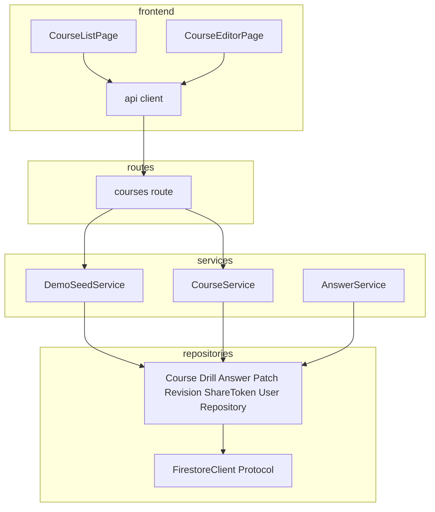
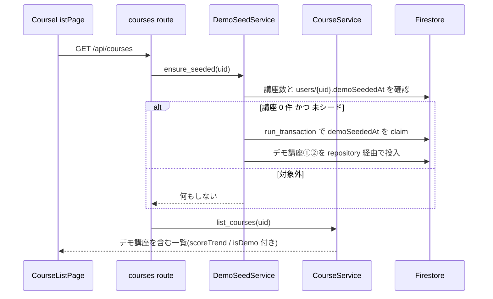

# Design Document — demo-course-seed

## Overview

**Purpose**: 講座を 1 件も持たないオーナー(ハッカソン審査員を含む)の初回アクセス時に、
デモ講座 2 つを自動投入し、講座一覧を改善ループの状態が読めるダッシュボードにする。
審査員が「開く → 分析を眺める → 適用 → スコア改善を見る」を入力なしで体験できる状態を作る。

**Users**: 新規オーナー(審査員)が初回体験に、既存オーナーが講座一覧の改善状況把握と
不要講座の削除に利用する。

**Impact**: backend にデモ投入サービス・講座削除 API・一覧応答のスコア要約
(`scoreTrend` / `isDemo`)を追加し、frontend の講座一覧をスパークライン・バッジ・
案内バナー付きに拡張する。分析・採点・パッチ生成のロジックは変更しない。

### Goals
- 初回アクセスで講座一覧が空にならず、体験用①(即分析可)と結果閲覧用②(改善 3 周済み)が揃っている
- デモ講座①の分析は実 agent で動き、審査員が熟知した題材(ハッカソン概要)で妥当性を検証できる
- 講座一覧の行から各講座の改善状況(スコア推移・分析可否)が読める
- デモ講座を含む任意の自分の講座を削除できる

### Non-Goals
- 分析・採点・パッチ生成ロジックと agent の変更
- ドリル確認・パッチレビュー画面の変更(`analysis-ui-declutter` が担当)
- 講座管理のスコア推移カードの変更(実装済み。デモ講座②はデータ側で表示条件を満たす)
- 既に講座を持つオーナーへの遡及シード、デモ講座の再投入機能

## Boundary Commitments

### This Spec Owns
- デモ投入の判定・実行(`DemoSeedService`)と固定デモデータの定義
- `users/{uid}` ドキュメントへのシード済みフラグ(`demoSeededAt`)の追加
- 講座削除(API・サービス・repository・`FirestoreClient.delete_document` の新設)と削除 UI
- course ドキュメントの `scoreTrend` / `isDemo` フィールドと、その更新点(採点完了時・シード時・バックフィル)
- 講座一覧応答(`CourseSummary`)への後方互換なフィールド追加と、講座一覧画面の行表示・案内バナー

### Out of Boundary
- 分析実行機構(`AnalysisService` / agent invoker)— デモ講座①の分析は既存のまま動く
- metrics API(`GET /api/courses/{id}/metrics`)の契約
- ドリル生成・共有 URL 解決・パッチ適用の各フロー(シードは既存 repository 経由で書くだけ)
- learner 画面(表示規則は既存のまま。デモ講座も通常講座として扱われる)

### Allowed Dependencies
- 既存 Repository 群と Pydantic モデル(シードデータはモデル経由で書き込み、schema 検証と整合させる)
- `require_current_user` による uid 供給(auth_mode none / firebase の両方で動く)
- `build_unified_diff`(デモ講座②の適用済みパッチの diffText 生成)
- frontend: `api/client` の既存+新規メソッド、既存デザイントークン。依存方向は `pages -> api / components / lib` を維持

### Revalidation Triggers
- course ドキュメントの要約フィールド構成や `_summarize` のバックフィルパターンが変わった場合
- 認可規則(ownerUserId 起点の 404 扱い)が変わった場合
- `FirestoreClient` Protocol の変更(delete_document は本 spec が新設する契約)
- デモ教材①の題材変更(ハッカソン概要の内容改訂)

## Architecture

### Existing Architecture Analysis
- 層構造は routes → services → repositories → FirestoreClient(Protocol、InMemory / Google の 2 実装)。DI は `main.py:create_app` で配線
- 講座一覧は course ドキュメントの非正規化要約フィールドのみで構成され、欠損時だけ読み取り+書き戻しするバックフィル前例がある(`_summarize`)。`scoreTrend` はこのパターンに載せる
- revisions は `CourseRepository.create/update` が自動記録する全文スナップショット。シードが repository 経由で書く根拠
- 削除機構はコードベースに存在しないため、`FirestoreClient` Protocol から新設する

### Architecture Pattern & Boundary Map



**Architecture Integration**:
- Selected pattern: 既存の routes → services → repositories 構造に、シード専用サービスを 1 つ追加する(CourseService に混ぜない — 講座 CRUD とデモ投入は変更理由が異なる)
- Domain boundaries: `DemoSeedService` がシード判定+固定データ投入を所有、`CourseService` が削除と一覧(バックフィル含む)を所有、`AnswerService` が採点完了時の scoreTrend 更新を所有
- Existing patterns preserved: 非正規化要約+バックフィル、owner 404 認可、モデル経由の書き込み、`run_transaction` による原子的更新
- New components rationale: `FirestoreClient.delete_document` は削除要件(R5)の最小前提。`DemoSeedService` は冪等判定と投入の単一責務
- Steering compliance: backend skill の層構造・frontend skill の依存方向に従う

### Technology Stack

| Layer | Choice / Version | Role in Feature | Notes |
|-------|------------------|-----------------|-------|
| Backend | FastAPI + Pydantic v2(既存) | シード投入・削除 API・一覧応答拡張 | 新規依存なし |
| Data | Firestore(既存 Protocol 抽象) | デモデータ書き込み・削除・シード済みフラグ | `delete_document` を Protocol に追加 |
| Frontend | React + Vite + TypeScript(既存) | 講座一覧の行表示・バナー・削除 UI | 新規ライブラリなし |

## File Structure Plan

### New Files
- `backend/app/services/demo_seed_service.py` — シード判定(claim)と投入の実行(1.1-1.6)
- `backend/app/services/demo_seed_data.py` — デモ 2 講座の固定データ定義(教材 Markdown・設問・回答・パッチ・タイムライン)(2.1-2.5, 3.1-3.5)。ロジックを持たない定数モジュール
- `backend/tests/test_demo_seed.py` — シードの冪等性・内容・失敗時挙動のテスト
- `backend/tests/test_course_delete.py` — 削除 API のカスケード・認可・冪等のテスト

### Modified Files
- `backend/app/repositories/firestore_client.py` — Protocol・InMemory・Google の 3 箇所に `delete_document(collection, document_id)` を追加(5.1)
- `backend/app/repositories/repositories.py` — 削除カスケードに必要な契約を追加(5.1): 各 Repository の `delete`、**`PatchRepository.list_by_course(course_id)`(現状存在しない列挙の新設)**、`ShareTokenRepository.delete(token)`、`CourseRevisionRepository` の courseId 列挙(既存 `list_documents_by_field` を利用)。`UserRepository` にシード済みフラグの claim 用**部分更新**(既存フィールドを壊さない update)を追加(1.2)
- `backend/app/services/user_service.py` — `upsert_current_user` が既存 user ドキュメントの `demo_seeded_at` を**保持**するよう修正(現状はドキュメントを丸ごと作り直すため、`/api/me` アクセスで claim が消え、削除後の再投入(1.3 違反)が起きる)(1.2, 1.3)
- `backend/app/services/course_service.py` — `delete_course`(子→親カスケード、owner 404)、`_summarize` への `scoreTrend` / `isDemo` 反映とバックフィル(4.7, 5.1, 5.4)
- `backend/app/services/answer_service.py` — 採点完了時に該当 run の平均点を course の `scoreTrend` に反映(4.7)
- `backend/app/routes/courses.py` — 一覧取得時のシード呼び出し、`DELETE /{course_id}` の追加(1.1, 5.1)
- `backend/app/schemas.py` — `Course.score_trend` / `Course.is_demo`、`CourseSummary` への同フィールド追加、`UserProfile.demo_seeded_at`(4.7, 4.4, 1.2)
- `backend/app/main.py` — `DemoSeedService` の DI 配線
- `frontend/src/api/types.ts` / `frontend/src/api/client.ts` — `CourseSummary` 拡張と `deleteCourse` の追加(4.7, 5.1)
- `frontend/src/pages/CourseListPage.tsx` — ミニ折れ線(ページローカル SVG)・デモ表記・誘導バッジ・案内バナー(4.1-4.6, 4.8)
- `frontend/src/pages/CourseEditorPage.tsx` — サイドに 2 段階確認つき削除ボタンを追加、成功時は一覧へ遷移(5.3)
- `frontend/src/pages/CourseListPage.test.tsx` / `CourseEditorPage.test.tsx` — 新表示・削除フローのテスト
- `frontend/e2e/knowledge-drill.spec.ts` — 削除後の共有 URL 無効シナリオを追加(5.2)

> 依存方向: シードは services → repositories のみ(routes からの呼び出し)。frontend は既存規約(`pages -> api / components / lib`)を維持。

## System Flows



- claim が失敗(既に他リクエストが確保)した場合は投入せず一覧取得へ進む(二重投入防止)
- 投入中の例外は警告ログを出して握りつぶし、一覧取得は継続する(1.6)

## Requirements Traceability

| Requirement | Summary | Components | Interfaces |
|-------------|---------|------------|------------|
| 1.1 | 一覧取得時の投入と同応答反映 | DemoSeedService / courses route | `ensure_seeded(uid)` |
| 1.2-1.3 | 冪等・削除後の再投入なし | DemoSeedService / UserRepository | `demoSeededAt` claim |
| 1.4 | 講座ありオーナーは対象外 | DemoSeedService | 講座数チェック |
| 1.5 | agent 呼び出しなし・固定データ | demo_seed_data | 定数モジュール |
| 1.6 | 投入失敗でも一覧成功 | courses route / DemoSeedService | 例外の局所化 |
| 2.1-2.5 | デモ講座①の内容 | demo_seed_data / DemoSeedService | Course / DrillRun / AnswerSubmission モデル |
| 2.6 | 分析ボタン活性 | 既存 DrillService(変更なし) | graded answers > 0 由来 |
| 2.7 | 実 agent で分析 | 既存 AnalysisService(変更なし) | — |
| 3.1-3.5 | デモ講座②の内容 | demo_seed_data / DemoSeedService | create→update×2 / 3 runs / applied patch |
| 4.1-4.3 | 一覧のミニ折れ線と代替ラベル | CourseListPage | scoreTrend |
| 4.4 | デモ表記 | CourseListPage / schemas | isDemo |
| 4.5 | 分析誘導バッジ | CourseListPage | drillStatus + answerCount(既存項目から導出) |
| 4.6 | 初回案内バナー | CourseListPage | isDemo 存在判定 |
| 4.7 | 一覧応答へのスコア要約 | CourseService / AnswerService / schemas | scoreTrend の非正規化+バックフィル |
| 4.8 | 要約欠損時の graceful 表示 | CourseListPage | optional フィールド |
| 5.1 | 削除カスケード | CourseService / repositories / FirestoreClient | DELETE /api/courses/{id} |
| 5.2 | 共有 URL の無効化 | CourseService(share_tokens 削除) | 既存 invalidToken 表示 |
| 5.3 | 削除の確認ステップ | CourseEditorPage | 2 段階クリック |
| 5.4 | 他オーナー講座は 404 | CourseService | `_get_owned_course_or_404` 再利用 |
| 6.1 | 投入データの所有権 | DemoSeedService | ownerUserId = リクエスト uid |
| 6.2 | learner 表示規則の維持 | 既存(変更なし)+ e2e | — |
| 6.3 | API 後方互換 | schemas | 追加フィールドのみ |
| 6.4 | 既存 schema 検証との整合 | demo_seed_data + テスト | sourceEvidence 実在検証 |

## Components and Interfaces

| Component | Layer | Intent | Req Coverage | Key Dependencies | Contracts |
|-----------|-------|--------|--------------|------------------|-----------|
| DemoSeedService | services | 冪等なデモ投入 | 1.*, 2.1-2.5, 3.*, 6.1 | 各 Repository (P0) | Service |
| demo_seed_data | services(定数) | 固定デモデータ定義 | 2.1-2.5, 3.1-3.5, 6.4 | schemas (P0) | — |
| FirestoreClient.delete_document | repositories | ドキュメント削除の抽象 | 5.1 | — | Service |
| CourseService(拡張) | services | 削除カスケード・一覧拡張 | 4.7, 5.1, 5.4 | Repository 群 (P0) | Service / API |
| AnswerService(拡張) | services | 採点完了時の scoreTrend 更新 | 4.7 | CourseRepository (P0) | Service |
| CourseListPage(拡張) | pages | 一覧のダッシュボード化 | 4.1-4.6, 4.8 | api client (P0) | State |
| CourseEditorPage(拡張) | pages | 削除 UI | 5.3 | api client (P0) | State |

### services

#### DemoSeedService

| Field | Detail |
|-------|--------|
| Intent | 講座 0 件かつ未シードのオーナーへ、デモ講座 2 つを 1 回だけ投入する |
| Requirements | 1.1-1.6, 2.1-2.5, 3.1-3.5, 6.1 |

**Contracts**: Service [x]

##### Service Interface
```python
class DemoSeedService:
    def ensure_seeded(self, owner_user_id: str) -> None:
        """講座一覧取得の前段で呼ばれる。対象外なら何もしない。"""
```
- Preconditions: 認証済み uid が渡される
- Postconditions: 対象オーナーの場合、courses×2・course_revisions(①1 件+②3 件)・drill_runs(①1 件+②3 件)・share_tokens・answers(① 2 件+② 各 run 分)・patches(② applied 1 件)が投入され、`users/{uid}.demoSeededAt` が設定される
- Invariants: 同一 uid への投入は最大 1 回(claim による)。LLM / agent は呼ばない。投入データの `ownerUserId` は必ずリクエスト uid

**Implementation Notes**
- Integration: claim は `run_transaction` で「`demoSeededAt` 未設定なら現在時刻を設定して True」を返す。False なら投入しない。users ドキュメント不在時は作成する
- Validation: 投入後のデモ講座①で `can_analyze == true`(採点済み 2 件由来)、次の回答で自動分析の3件閾値へ到達すること、②でスコア推移カードの表示条件(scored run ≥ 2)を満たすことをテストで確認
- Risks: 投入途中の失敗で部分データが残る(claim 方式の trade-off)。警告ログ + 講座削除でリカバリ

#### demo_seed_data(定数モジュール)

- デモ講座①「DevOps × AI Agent Hackathon 2026 参加ガイド(デモ)」: ハッカソン概要(テーマ・審査基準 5 項目・必須技術・提出物)を**独自の文章で要約した** Markdown v1。意図的な記載不足を 1 箇所含める(例: 提出物の要件は列挙するが「デプロイ URL が認証を要する場合の扱い」を書かない)。通常生成と同じ設問 3 問・各4点(各設問の `sourceEvidence.excerpt` は教材本文と文字列一致)、採点済み回答 2 件(誤答の過半数は記載不足箇所に関連するつまずき、平均 6 点 / 12 点)
- デモ講座②「経費精算の判断基準(デモ・改善 3 周済み)」: v1→v2→v3 の教材 3 版(差分が改善として読める内容)、通常生成と同じ設問3問・各4点のバージョン別 drill_run 3 件+採点済み回答(平均 5.4 → 8.7 → 10.8 / 12 点)、v2→v3 に対応する applied パッチ 1 件(failure_signals・完了済み analysis_timeline・diff_text は `build_unified_diff` で生成)
- 公式ページの文章は転載しない(独自要約であることをレビューで確認)

### repositories

#### FirestoreClient.delete_document

**Contracts**: Service [x]

```python
def delete_document(self, collection: str, document_id: str) -> None: ...
```
- Postconditions: ドキュメントが存在すれば削除、存在しなければ no-op(冪等。カスケード再試行を成立させるための repository レベルの性質)
- InMemory / Google の両実装に追加し、Google 実装はトランザクション外の直接削除とする(削除カスケードは逐次実行)

#### 削除カスケードの列挙・削除契約(Repository 層)

削除対象を列挙できなければカスケードは実装できないため、以下を契約として明記する:

| Repository | 追加契約 | 用途 |
|---|---|---|
| PatchRepository | `list_by_course(course_id)`(新設) | 講座配下の全パッチ列挙 |
| ShareTokenRepository | `delete(token)`(新設) | drill_run.share_token からの逆引き削除 |
| DrillRepository | `delete(drill_run_id)`(新設。列挙は既存 `list_by_course`) | run 削除 |
| AnswerRepository | `delete(answer_id)`(新設。列挙は既存 `list_by_drill_run`) | 回答削除 |
| CourseRevisionRepository | courseId での列挙(既存 `list_documents_by_field`)+ `delete("{course_id}:{version}")` | 履歴削除 |
| CourseRepository | `delete(course_id)`(新設) | 最後に親を削除 |

### services(拡張)

#### CourseService.delete_course

```python
def delete_course(self, course_id: str, owner_user_id: str) -> None
```
- `_get_owned_course_or_404` で認可(他オーナーは 404、5.4)
- 削除順: share_tokens → answers → drill_runs → patches → course_revisions → course(子→親。途中失敗時は講座が残り再試行可能)
- Postconditions: 一覧・講座配下画面から取得不可(5.1)、共有 URL は既存の無効トークン扱い(5.2)
- **二重削除の API 意味論**: 削除成功後に同じ講座へ再度 DELETE すると **404**(`_get_owned_course_or_404` の既存規則に従う)。「冪等」は repository レベルの delete(存在しない文書の削除 = no-op)にのみ適用し、カスケード再試行(講座がまだ残っている場合)を成立させるための性質とする

#### scoreTrend の非正規化(CourseService / AnswerService)

- `Course.score_trend: list[CourseScoreTrendPoint] | None`(`{courseVersion, averageScore, maxScore}`、courseVersion 昇順)
- **スケールの定義**: 各エントリの値は既存 metrics(`_build_metrics_run`)と**同一の計算規則**とする — `averageScore` = その run の GRADED かつ totalScore 非 null の回答の totalScore 平均(raw 値)、`maxScore` = drill_run.questions の maxScore 合計(0 なら graded answer の maxScore フォールバック)。デモ講座②の 5.4 → 8.7 → 10.8 は通常生成と同じ3問・各4点、満点12のスケール上の値であり、シードの回答スコアはこの平均になるよう定義する。同一 courseVersion に複数 run がある場合は metrics と同じ `(courseVersion, id)` 昇順で後の run を採用する
- 更新点: (a) AnswerService が回答の採点完了時に該当 drill_run の graded answers から上記規則で再計算し、その run の courseVersion のエントリを更新 (b) シード時に同じスケールの固定値を書く (c) `_summarize` で `answerCount > 0` かつ `score_trend` 欠損の場合のみ metrics と同じ集計で書き戻す(既存バックフィル前例と同条件)
- **一致の担保**: `GET /metrics` の runs と `CourseSummary.scoreTrend` が同一データで一致することをテストで検証する
- `CourseSummary` に `scoreTrend` / `isDemo` を追加(欠損時は null。既存クライアントへは追加フィールドのみで後方互換、6.3)

### pages

#### CourseListPage(拡張)

- `scoreTrend` の要素(scored run)が 2 件以上の行にミニ折れ線(ページローカル SVG、`role="img"` + 平均点推移の代替ラベル)と「平均 X.X → Y.Y」要約を表示。要素 1 件以下・欠損時は非表示(平均点の値ではなく要素数による条件、4.1-4.3, 4.8)
- `isDemo` の行に「デモ」チップを表示(4.4)
- `drillStatus === 'ready' && answerCount > 0` の行に分析誘導バッジを表示(既存応答項目から導出、4.5)
- 一覧に `isDemo` 講座が存在する場合、上部に最初の一歩を案内するバナーを表示(4.6)

#### CourseEditorPage(拡張)

- サイドに危険色の削除ボタンを追加。1 回目のクリックで「本当に削除する」表示に変わる 2 段階確認(5.3)。確定で `deleteCourse` を呼び、成功時は講座一覧へ遷移
- 削除失敗時は既存のエラーバナー表現で表示する

## Data Models

### 変更のあるドキュメントフィールド

| Collection | Field | Type | 説明 |
|---|---|---|---|
| courses | `scoreTrend` | `[{courseVersion, averageScore, maxScore}]` / null | 一覧スパークライン用の非正規化要約 |
| courses | `isDemo` | bool(default false) | デモ講座表記(4.4)。シード時のみ true |
| users | `demoSeededAt` | ISO 文字列 / null | シード済み claim(1.2) |

- いずれも追加フィールドのみで、既存ドキュメントは欠損(null)として後方互換に読む(6.3)

## Error Handling

- **シード投入失敗(1.6)**: `ensure_seeded` 内で捕捉して警告ログ。講座一覧取得は継続。claim 済みのため自動再試行はしない(リカバリは講座削除+手動)
- **削除カスケードの途中失敗**: course が最後なので一覧に残る。再実行で残りが消える(冪等 delete)。frontend はエラーバナーを表示し再試行可能
- **他オーナーの講座削除**: 既存認可規則と同じ 404(5.4)
- **scoreTrend 欠損**: frontend はミニ折れ線を省略するだけで行表示を維持(4.8)

## Testing Strategy

### Backend(pytest + InMemory)
- `test_demo_seed.py`:
  - 講座 0 件の初回一覧取得でデモ講座 2 件が同じ応答に含まれる(1.1)
  - 2 回目の一覧取得で重複投入されない(1.2)
  - デモ講座削除後の一覧取得で再投入されない(1.3)
  - 講座を持つオーナーには投入されない(1.4)
  - **seed → `GET /api/me` → デモ講座削除 → 一覧再取得、の順でも再投入されない**(`upsert_current_user` が `demo_seeded_at` を保持すること)(1.2, 1.3)
  - 投入処理を失敗させても一覧取得が 200 を返す(1.6)
  - デモ講座①: 設問の `sourceEvidence.excerpt` が教材本文に文字列一致し(6.4)、採点済み回答 2 件で `canAnalyze` が true、次の回答で自動分析の3件閾値へ到達する(2.4-2.6)
  - デモ講座②: revisions が v1-v3 で diff 取得可能(3.1)、metrics が 3 run 分の上昇する平均点を返す(3.3)、applied パッチが取得できる(3.5)
  - 投入データの `ownerUserId` がリクエスト uid で、他オーナーの一覧に出ない(6.1)
- `test_course_delete.py`:
  - 削除後: 一覧に出ない・course/drill/patch 取得 404(5.1)、share token 解決が無効(5.2)、他オーナーからの削除は 404(5.4)、削除済み講座への再 DELETE は 404
- `test_courses_api.py`(更新):
  - 採点完了で `scoreTrend` が更新され一覧応答に含まれる(4.7)
  - **同一講座で `GET /metrics` の runs と `CourseSummary.scoreTrend` の値(averageScore / maxScore / courseVersion)が一致する**(4.7)
  - `scoreTrend` 欠損講座のバックフィルが answerCount>0 のときだけ走る(既存 N+1 回避テストの維持)

### Frontend(vitest)
- `CourseListPage.test.tsx`: scoreTrend の要素 2 件以上でミニ折れ線+要約表示 / 要素 1 件以下・欠損で非表示(平均点の値ではなく要素数で判定。4.1-4.2, 4.8)、代替ラベル(4.3)、デモチップ(4.4)、誘導バッジの表示条件(4.5)、デモ講座ありでバナー表示(4.6)
- `CourseEditorPage.test.tsx`: 削除の 2 段階確認、確定後に deleteCourse が呼ばれ一覧へ遷移、失敗時エラーバナー(5.3)

### E2E(Playwright)
- 削除した講座の共有 URL を開くと無効な共有 URL 表示になる(5.2)
- learner 画面にデモ講座でも rubric / idealAnswer が出ない(6.2、既存 assertion の対象拡大)

### 完了前チェック
- backend: `uv run --frozen pytest / ruff / mypy`
- frontend: `npm run typecheck / lint / test / build`
- デモ講座①で実際に分析を 1 回実行し、教材ギャップ(記載不足箇所)に言及するパッチが提案されることを目視確認(2.7 の歩留まり確認。agent 出力は非決定的なためテストではなく手動確認)
