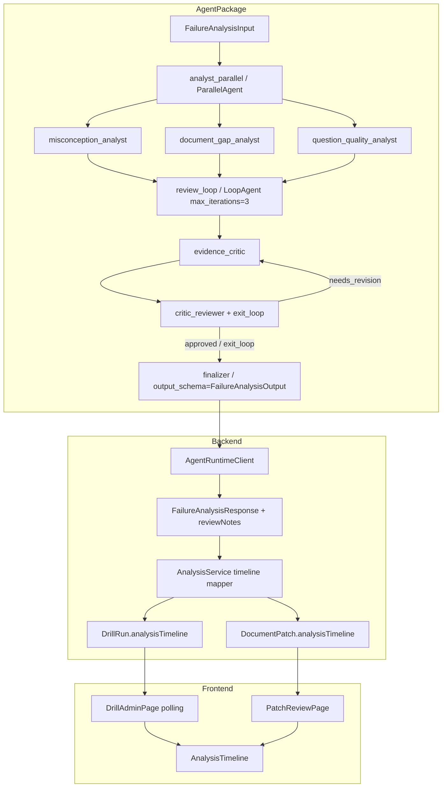
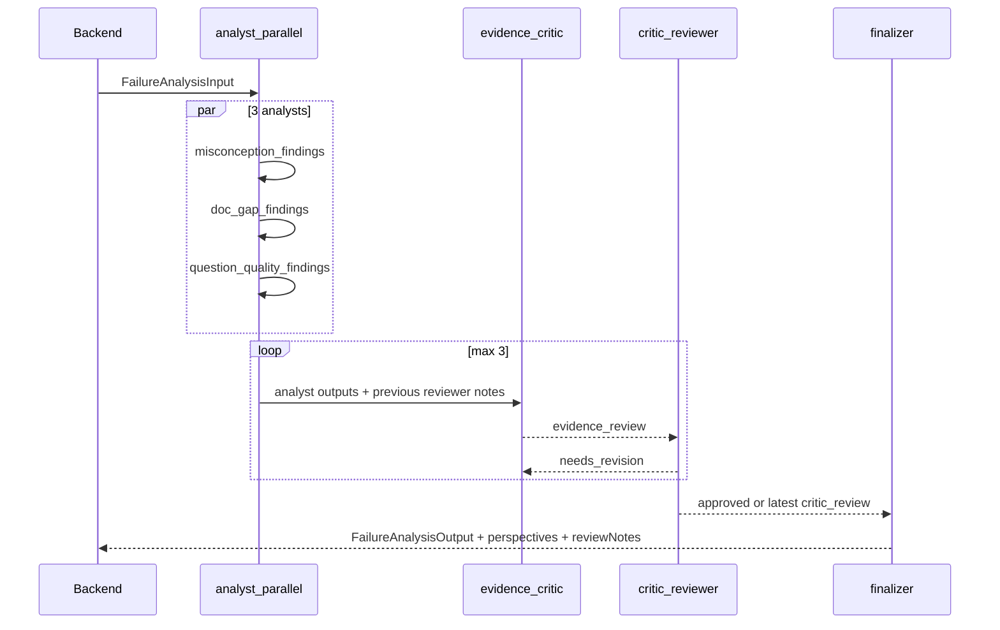
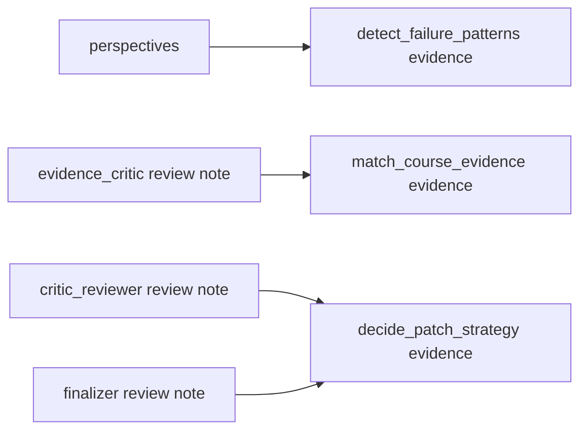

# Technical Design Document

## Overview

**Purpose**: Failure Analysis Review Loop は、誤答分析 Agent を「並列分析だけ」から「並列分析 + 根拠評価 + 評価レビュー + 最終化」に拡張し、review 結果を既存タイムライン UI に表示する。

**Users**: 講座オーナーと審査員は Drill Admin / Patch Review で、Failure Signal がどの観点から出て、どの根拠評価を通って patch に使われたかを確認する。

**Impact**: Agent package の workflow / schema / prompt、Backend schema と `AnalysisService` の timeline 変換、Frontend の timeline 表示テストを変更する。新しいインフラ、event streaming、専用 viewer は導入しない。

### Goals

- `analyst_parallel -> review_loop -> finalizer` の agent workflow を実装する
- `reviewNotes` を optional field として追加し、既存 response contract を壊さない
- review 結果を既存 `analysisTimeline` に保存し、Drill Admin / Patch Review に表示する
- server 起動による demo smoke で挙動確認できる状態にする

### Non-Goals

- ADK event stream を UI に直接流す
- SSE / WebSocket / background worker を導入する
- Chain-of-thought や prompt 本文を保存・表示する
- 既存 5 step timeline を workflow graph UI に置き換える
- patch review 専用 agent を追加する

## Boundary Commitments

### This Spec Owns

- `failure_analysis_agent` の review loop workflow
- `FailureAnalysisOutput.reviewNotes` / Backend `FailureAnalysisResponse.reviewNotes`
- `AnalysisService` による review note -> `AnalysisTimelineItem.evidence` 変換
- review loop の prompt、sample output、contract tests
- server smoke で確認する手順と観測項目

### Out of Boundary

- Course / Drill / Patch の永続化モデル全体の再設計
- 受講者向け画面・API への管理情報露出
- 認証・owner check・Firestore infrastructure
- metrics API / Before After 表示の仕様変更

### Allowed Dependencies

- `hackathon-feedback-loop` spec で追加済みの `analysisTimeline`、`perspectives`、`AnalysisTimeline` component
- `AgentRuntimeClient` / `AdkAgentInvoker` / `LocalAgentInvoker`
- Google ADK の `SequentialAgent` / `ParallelAgent` / `LoopAgent` / `output_key` / `exit_loop`

### Revalidation Triggers

- `FailureAnalysisOutput.failureSignals` の必須契約を変える場合
- `AnalysisTimelineItem` の形を変える場合
- ADK event streaming を API contract に入れる場合
- `KNOWLEDGE_DRILL_AGENT_ANALYSIS_MODE` の意味を変える場合

## Architecture

### Existing Architecture Analysis

- 現行の composed failure analysis は `ParallelAgent(3 lenses) -> synthesis_agent` で、`synthesis_agent` だけが `FailureAnalysisOutput` を返す。
- Backend は `FailureAnalysisResponse.perspectives` を `detect_failure_patterns` の evidence に変換している。
- Frontend は既存 `AnalysisTimeline` component を Drill Admin / Patch Review で表示している。
- したがって UI を増やすより、Agent 最終 JSON と Backend timeline 変換を拡張するのが最小変更になる。

### Architecture Pattern & Boundary Map



**Architecture Integration**:
- Selected pattern: ADK session state を workflow 内の中間データ bus とし、finalizer が stable JSON を返す
- Domain boundaries: Agent は分析結果と review note を返す。Backend は timeline 表示形式に変換する。Frontend は timeline を表示するだけにする
- Existing patterns preserved: synchronous analyze API、camelCase Pydantic schema、factory based agent creation、existing polling UI
- New components rationale: `reviewNotes` は `perspectives` と review 判断を混ぜないために追加する。Backend の step 振り分けは `id` ではなく `timelineStep` で固定する

### Technology Stack

| Layer | Choice / Version | Role in Feature | Notes |
|-------|------------------|-----------------|-------|
| Agent | Google ADK（既存） | Parallel / Loop / Sequential orchestration | 新規依存なし |
| Backend | FastAPI + Pydantic v2（既存） | response validation と timeline mapping | optional field 追加のみ |
| Frontend | React + TypeScript（既存） | 既存 timeline 表示 | 新規依存なし |
| Runtime | local / adk mode（既存） | local smoke と実 agent 実行 | single mode fallback 維持 |

## File Structure Plan

### Modified Files

- `agent/knowledge_drill_agent/schemas.py` — `AnalysisReviewNote`、必要なら中間出力用 model、`FailureAnalysisOutput.review_notes`
- `agent/knowledge_drill_agent/agent.py` — review loop 付き composed agent factory
- `agent/knowledge_drill_agent/prompts/*.md` — analyst / evidence critic / critic reviewer / finalizer prompt
- `agent/knowledge_drill_agent/sample_outputs/failure_analysis.json` — `reviewNotes` を含む sample
- `agent/tests/test_analysis_patch_agent_contract.py` — workflow 構造と schema 契約
- `backend/app/schemas.py` — `FailureAnalysisResponse.review_notes`
- `backend/app/services/analysis_service.py` — review note から timeline evidence への変換
- `backend/app/clients/local_agent_invoker.py` — local smoke 用の optional `reviewNotes`
- `backend/tests/test_schemas.py` / `backend/tests/test_analysis_service.py` / `backend/tests/test_agent_contract_compatibility.py` — schema 互換と timeline mapping
- `frontend/src/api/types.ts` — API contract に raw failure analysis 型を持つ場合のみ `reviewNotes` を追加
- `frontend/src/components/common/AnalysisTimeline.test.tsx` / page tests — review note 由来の evidence 表示

### New Files

- `agent/knowledge_drill_agent/prompts/failure_analysis_evidence_critic.md`
- `agent/knowledge_drill_agent/prompts/failure_analysis_critic_reviewer.md`
- `agent/knowledge_drill_agent/prompts/failure_analysis_finalizer.md`

## System Flows

### Failure analysis review loop



### Timeline mapping



## Requirements Traceability

| Requirement | Summary | Components | Interfaces | Flows |
|-------------|---------|------------|------------|-------|
| 1.1-1.9 | review loop workflow | agent.py, prompts | ADK state / output_key | Failure analysis review loop |
| 2.1-2.7 | stable response contract | agent schemas, backend schemas | FailureAnalysisOutput / FailureAnalysisResponse | Timeline mapping |
| 3.1-3.8 | timeline mapping | AnalysisService | AnalysisTimelineItem | Timeline mapping |
| 4.1-4.5 | existing UI display and smoke | DrillAdminPage, PatchReviewPage, AnalysisTimeline | analysisTimeline | Timeline mapping |
| 5.1-5.5 | regression and fallback | config, tests, local invoker | analysis mode env | Failure analysis review loop |

## Components and Interfaces

| Component | Domain/Layer | Intent | Req Coverage | Key Dependencies | Contracts |
|-----------|--------------|--------|--------------|------------------|-----------|
| failure analysis review workflow | agent | 並列分析結果を critic/reviewer loop で検証して finalizer に渡す | 1, 5 | Google ADK | Service, State |
| review notes schema | agent/backend | review 判断を stable JSON で運ぶ | 2, 3 | Pydantic | API |
| timeline mapper | backend service | review notes を既存 5 step timeline に変換する | 3 | AnalysisService | State |
| AnalysisTimeline display | frontend component | timeline evidence を表示する | 4 | props only | State |

### Agent Package

#### failure analysis review workflow

| Field | Detail |
|-------|--------|
| Intent | analyst outputs を根拠評価とレビューで絞り、最終 `FailureAnalysisOutput` を作る |
| Requirements | 1.1-1.9, 5.1-5.2 |

**Responsibilities & Constraints**
- analyst agent は raw findings を `output_key` に保存する
- `evidence_critic` は failure signal を直接確定せず、`EvidenceReviewOutput` として採用/棄却/リスク/finalizer guidance を返す
- `critic_reviewer` は critic の評価品質をレビューし、`CriticReviewOutput.verdict` が `approved` なら `exit_loop`
- `finalizer` は analyst outputs、latest evidence review、latest critic review を読んで最終 JSON を返す
- `finalizer` は `criticReview.approvedFindingIds` に含まれない finding を Failure Signal の根拠として使わない
- review loop が max iteration に到達して `verdict=needs_revision` のままでも、`approvedFindingIds` が非空ならその finding だけを partial 採用する。`approvedFindingIds` が空なら未承認 finding を採用せず、有効な `FailureAnalysisOutput` を作らない
- finalizer 以外の中間出力は backend API contract に直接出さない

**State Keys**

| Key | Producer | Consumer |
|-----|----------|----------|
| `misconception_findings` | misconception analyst | evidence_critic, finalizer |
| `doc_gap_findings` | document gap analyst | evidence_critic, finalizer |
| `question_quality_findings` | question quality analyst | evidence_critic, finalizer |
| `evidence_review` | evidence_critic | critic_reviewer, finalizer, next evidence_critic |
| `critic_review` | critic_reviewer | evidence_critic, finalizer |

**Intermediate Output Contracts**

```python
class ReviewedFinding(AgentModel):
    finding_id: str
    source: Literal[
        "misconception_analyst",
        "document_gap_analyst",
        "question_quality_analyst",
    ]
    summary: str
    rationale: str
    evidence: list[str] = Field(default_factory=list)

class EvidenceReviewOutput(AgentModel):
    accepted_findings: list[ReviewedFinding] = Field(default_factory=list)
    rejected_findings: list[ReviewedFinding] = Field(default_factory=list)
    finalizer_guidance: list[str] = Field(default_factory=list)
    risks: list[str] = Field(default_factory=list)
    revision_notes: list[str] = Field(default_factory=list)

class CriticReviewOutput(AgentModel):
    verdict: Literal["approved", "needs_revision"]
    issues: list[str] = Field(default_factory=list)
    revision_instructions: list[str] = Field(default_factory=list)
    approved_finding_ids: list[str] = Field(default_factory=list)
    risk_notes: list[str] = Field(default_factory=list)
```

- `evidence_critic` は前回の `critic_review.revisionInstructions` と `issues` を読み、`revision_notes` に何を修正したかを残す
- `critic_reviewer` は `verdict=approved` のときだけ `exit_loop` を呼ぶ
- `approved_finding_ids` は finalizer が採用してよい finding の allowlist であり、`verdict` の自由文や `summary` から推測してはならない
- `approved_finding_ids` が空の場合、finalizer は未承認 finding から Failure Signal を作らず、schema validation failure による分析失敗を許容する
- max iteration 到達時に `verdict=needs_revision` でも `approved_finding_ids` が非空なら、その ID だけを採用し、未解決の `issues` / `revision_instructions` は `reviewNotes` に残す。`approved_finding_ids` が空なら分析失敗に倒す

### Backend

#### review notes schema

```python
class AnalysisReviewSource(str, Enum):
    EVIDENCE_CRITIC = "evidence_critic"
    CRITIC_REVIEWER = "critic_reviewer"
    FINALIZER = "finalizer"

class AnalysisTimelineStepId(str, Enum):
    DETECT_FAILURE_PATTERNS = "detect_failure_patterns"
    MATCH_COURSE_EVIDENCE = "match_course_evidence"
    DECIDE_PATCH_STRATEGY = "decide_patch_strategy"

class AnalysisReviewNote(ApiModel):
    id: str
    source: AnalysisReviewSource
    timeline_step: AnalysisTimelineStepId
    title: str
    summary: str
    evidence: list[str] = Field(default_factory=list)

class FailureAnalysisResponse(ApiModel):
    failure_signals: list[FailureSignal]
    perspectives: list[AnalysisPerspective] = Field(default_factory=list)
    review_notes: list[AnalysisReviewNote] = Field(default_factory=list)
```

**Compatibility**
- `reviewNotes` is optional and defaults to `[]`
- existing sample / local responses without `reviewNotes` remain valid
- frontend does not need to consume raw `FailureAnalysisResponse` unless a debug API is added
- `id` はログの安定識別子であり、Backend の step mapping には使わない
- `timelineStep` は `AnalysisTimelineItem.id` と同じ文字列を使い、Backend はこの field だけで振り分ける

#### timeline mapper

| Source | Timeline step | Evidence format |
|--------|---------------|-----------------|
| `perspectives` | `detect_failure_patterns` | `{title}: {summary}` |
| `reviewNotes` with `timelineStep=match_course_evidence` | `match_course_evidence` | `{title}: {summary}` + first evidence |
| `reviewNotes` with `timelineStep=decide_patch_strategy` | `decide_patch_strategy` | `{title}: {summary}` + first evidence |
| `reviewNotes` with `timelineStep=detect_failure_patterns` | `detect_failure_patterns` | `{title}: {summary}` + first evidence |

**Merge Order**

Backend は各 step の evidence を次の順で作る。

1. review note 由来 evidence を `timelineStep` ごとに抽出し、入力順を維持して先頭に置く
2. 既存 evidence を後ろに追加する
   - `detect_failure_patterns`: perspectives 由来 evidence、fallback として failure signal title
   - `match_course_evidence`: target section
   - `decide_patch_strategy`: recommended change
3. 空文字と重複を除外する
4. 各 step 最大 3 件に切る

この順序により、review note が存在する場合は UI の 3 件制限で reviewer 判断が隠れない。review note が存在しない場合は既存 evidence の順序と内容を維持する。

#### Timeout Budget

- backend local default は `KNOWLEDGE_DRILLS_AGENT_TIMEOUT_SECONDS=60` 秒相当。
- production Terraform の backend Cloud Run env は現状 `backend_agent_timeout_seconds = "120"`。
- review loop は LLM call 数が増えるため、実装時の local/adk smoke で所要時間を計測する。
- 既存値で足りない場合は、手動 smoke では `KNOWLEDGE_DRILLS_AGENT_TIMEOUT_SECONDS` を明示的に上げる。production 反映が必要なら `terraform/locals.tf` の `backend_agent_timeout_seconds` 変更を同じ PR に含める。

## Risks and Mitigations

| Risk | Impact | Mitigation |
|------|--------|------------|
| review loop が出力を不安定にする | patch 生成失敗 | finalizer のみ `output_schema`、中間は state に閉じる |
| UI に情報を出しすぎる | demo で読みにくい | 既存 timeline に要約と最大 3 evidence で表示 |
| ADK loop が長くなる | latency 増加・timeout | `max_iterations=3`、timeout smoke、single mode fallback |
| reviewer が approve しない | final output が止まる | `approvedFindingIds` が非空ならその ID だけ partial 採用、空なら分析失敗。未承認 finding は採用しない |
