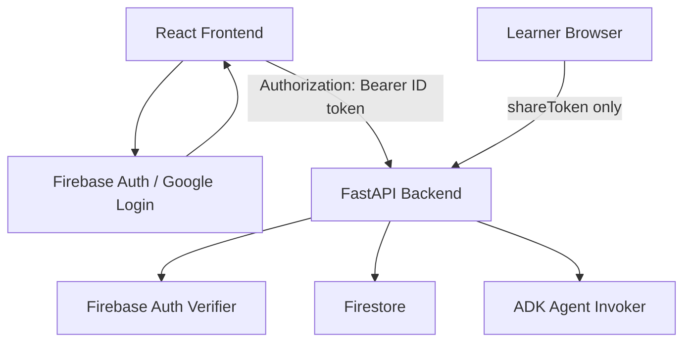
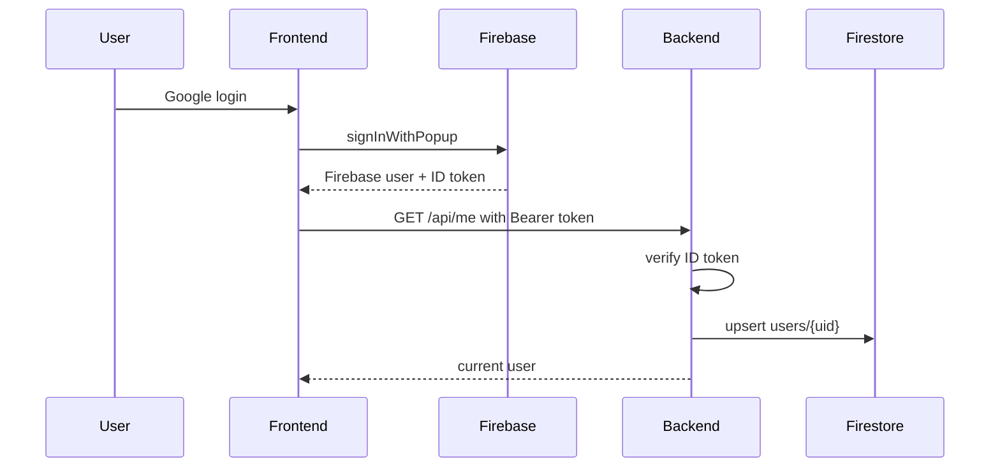
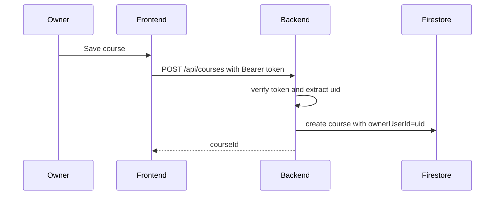
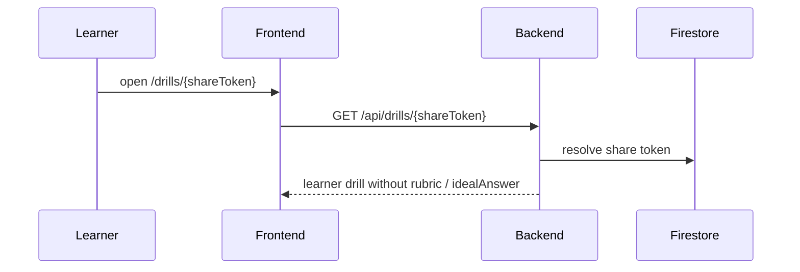

# Design Document

## Overview

Google Login Owner Scope は、Knowledge Drills の管理操作に Google ログインと Course 所有権を追加する。Firebase Authentication を Google ログイン基盤として使い、frontend は Firebase ID token を backend API に送る。backend は ID token を検証し、検証済み `uid` を `courses.ownerUserId` として保存・照合する。

受講者向け share URL は既存仕様どおりログイン不要とする。`shareToken` はドリル回答のアクセス境界であり、管理操作の認証境界とは分ける。

### Goals
- 審査員が Google ログイン後、自分の講座を作成・編集・ドリル生成・分析・Patch Apply / Reject できる。
- 複数利用者が同じ公開デモ URL を触っても、互いの講座や管理データを変更できない。
- 既存の受講者 share URL 体験を壊さない。
- local / CI では外部 Firebase 接続なしでテストを維持する。

### Non-Goals
- workspace、team、role、invite、講座共有は実装しない。
- 受講者アカウント、受講者ごとの履歴管理は実装しない。
- Firestore security rules で browser から直接 DB を操作する構成にはしない。
- 悪意ある Google アカウントによる利用量制御は本設計の主目的にしない。必要なら別途 rate limit / quota guard を追加する。

## Architecture

### Selected Pattern

選択する構成は Firebase Auth + backend owner check である。



frontend は Firebase SDK でログイン状態と ID token を取得する。backend は token 検証結果から `AuthenticatedUser` を作る。Course、Drill、Patch の所有権判定は backend service 境界で実施する。

### Trust Boundaries

| Boundary | Trust rule |
|----------|------------|
| Frontend auth state | UI 表示のためだけに使う。認可判断の根拠にしない |
| Firebase ID token | backend が検証した場合だけ信頼する |
| `ownerUserId` request body | 受け付けない。backend が現在ユーザーから設定する |
| Course owner check | 管理 API の認可境界 |
| share token | 受講者 API の限定公開境界 |
| Firestore | backend 経由でのみアクセスする |

## Backend Design

### Dependencies

`backend/pyproject.toml` に Firebase token 検証用 dependency を追加する。

```toml
dependencies = [
  "firebase-admin>=6.0.0",
]
```

`google-auth` で Google ID token を直接検証する選択肢もあるが、frontend を Firebase Auth に寄せるため backend も Firebase Admin SDK で ID token を検証する。

### Settings

`backend/app/config.py` に次を追加する。

```python
auth_mode: Literal["none", "firebase"] = "none"
firebase_project_id: str | None = None
local_auth_user_id: str = "local-owner"
local_auth_email: str = "local-owner@example.test"
```

環境変数名は `pydantic-settings` の既存 prefix に従う。

```text
KNOWLEDGE_DRILLS_AUTH_MODE=firebase
KNOWLEDGE_DRILLS_FIREBASE_PROJECT_ID=...
KNOWLEDGE_DRILLS_LOCAL_AUTH_USER_ID=local-owner
KNOWLEDGE_DRILLS_LOCAL_AUTH_EMAIL=local-owner@example.test
```

production / deploy 環境では `auth_mode=firebase` を設定する。local / CI では `auth_mode=none` を既定にして既存テストの外部依存を避ける。

`auth_mode=firebase` では `firebase_project_id` を必須とする。未設定の場合は `create_auth_client(settings)` が `MisconfiguredAuthClient` を返し、管理 API 呼び出し時に `500 auth_not_configured` を返す。CD / Terraform validation ではこの状態を deploy 前に検出する。

### New Backend Modules

最小構成として次を追加する。

```text
backend/app/auth.py
backend/app/clients/firebase_auth_client.py
backend/app/services/user_service.py
```

#### `auth.py`

FastAPI dependency と認証済みユーザー型を持つ。

```python
class AuthenticatedUser(ApiModel):
    uid: str
    email: str | None = None
    display_name: str | None = None
    photo_url: str | None = None

def require_current_user(request: Request) -> AuthenticatedUser: ...
```

`require_current_user` は `request.app.state.auth_client.verify_authorization_header(...)` を呼び、失敗時に `AppError` を投げる。

#### `firebase_auth_client.py`

外部 SDK 境界を閉じ込める。

```python
class AuthClient(Protocol):
    def verify_authorization_header(self, authorization: str | None) -> AuthenticatedUser: ...

class FirebaseAuthClient:
    def verify_authorization_header(self, authorization: str | None) -> AuthenticatedUser: ...

class LocalAuthClient:
    def verify_authorization_header(self, authorization: str | None) -> AuthenticatedUser: ...

class MisconfiguredAuthClient:
    def verify_authorization_header(self, authorization: str | None) -> AuthenticatedUser: ...
```

`FirebaseAuthClient` は `Bearer ` prefix を検証し、Firebase Admin SDK の `verify_id_token` を使う。`LocalAuthClient` は token 欠落を許可し、settings の local user を返す。

#### Auth client factory

`backend/app/main.py` は settings から auth client を生成し、`app.state.auth_client` に保存する。

```python
def create_auth_client(settings: Settings) -> AuthClient:
    if settings.auth_mode == "firebase":
        if not settings.firebase_project_id:
            return MisconfiguredAuthClient("firebase project id is required")
        return FirebaseAuthClient(project_id=settings.firebase_project_id)
    return LocalAuthClient(
        uid=settings.local_auth_user_id,
        email=settings.local_auth_email,
    )
```

`MisconfiguredAuthClient.verify_authorization_header(...)` は必ず `AppError("auth_not_configured", ..., status_code=500)` を投げる。これにより設定不足が API error code としてテスト可能になる。

`FirebaseAuthClient` は Firebase Admin app を singleton として初期化する。Cloud Run では backend service account の Application Default Credentials を使うため、service account key file は使わない。

```python
_FIREBASE_APP_NAME = "knowledge-drills"
_firebase_app: firebase_admin.App | None = None

class FirebaseAuthClient:
    def __init__(self, project_id: str) -> None:
        self._project_id = project_id

    def verify_authorization_header(self, authorization: str | None) -> AuthenticatedUser:
        app = _get_or_initialize_firebase_app(self._project_id)
        ...
```

`_get_or_initialize_firebase_app(project_id)` は同一 process 内で `initialize_app(options={"projectId": project_id}, name=_FIREBASE_APP_NAME)` を一度だけ呼ぶ。すでに初期化済みの場合は既存 app を再利用する。別 project id で再初期化しようとした場合、または Admin app 初期化に失敗した場合は `AppError("auth_not_configured", ..., status_code=500)` に変換する。

#### Auth exception mapping

認証境界では Firebase SDK 例外をそのまま route に漏らさず、`AppError` に変換する。

| Source | API status | API code |
|--------|------------|----------|
| `Authorization` header 欠落 | 401 | `authentication_required` |
| `Authorization` が `Bearer ` 形式ではない | 401 | `authentication_required` |
| `verify_id_token` が期限切れ token を検出 | 401 | `invalid_auth_token` |
| `verify_id_token` が不正 token / audience mismatch / issuer mismatch を検出 | 401 | `invalid_auth_token` |
| decoded token に `uid` / `sub` がない | 401 | `invalid_auth_token` |
| Firebase app 初期化設定不足 | 500 | `auth_not_configured` |

Python 実装では Firebase Admin SDK の token verification 系例外、`ValueError`、certificate fetch failure をすべて上表へ閉じ込める。ログには error class と request id を出し、ID token 本体、講座本文、回答本文は出力しない。

### User Profile

`users/{uid}` は account profile として最小保存する。認可判断の根拠は token の `uid` であり、`users` document の存在ではない。

```text
users/{uid}
  uid: string
  email: string | null
  displayName: string | null
  photoUrl: string | null
  createdAt: string
  lastLoginAt: string
```

追加する repository / service:

```text
UserRepository
UserService.upsert_current_user(user: AuthenticatedUser) -> UserProfile
```

追加 API:

| Method | Path | Auth | Response | Purpose |
|--------|------|------|----------|---------|
| GET | `/api/me` | required | `CurrentUserResponse` | ログイン確認と `users/{uid}` upsert |

frontend はログイン直後、または管理画面初期表示時に `/api/me` を呼ぶ。

### Course Schema Changes

`Course` に `owner_user_id` を追加する。JSON alias は `ownerUserId` になる。

```python
class Course(ApiModel):
    id: str
    owner_user_id: str | None = None
    title: str
    markdown: str
    version: int = 1
    updated_at: str | None = None
    latest_drill_run_id: str | None = None
    latest_patch_id: str | None = None
```

API request では `ownerUserId` を受け取らない。`CourseCreateRequest` と `CourseUpdateRequest` は現状どおり `title` と `markdown` のみとする。

新規作成される Course は必ず `owner_user_id` に現在ユーザーの `uid` を入れる。一方で既存 Firestore document には `ownerUserId` が存在しない可能性があるため、内部 schema は互換性のため nullable にする。ownerless Course は管理 API では現在ユーザーの所有講座ではないものとして 404 にする。

`CourseDetailResponse` と `CourseSummary` に `ownerUserId` を返す必要はない。UI 表示で使わないため、返さない方針にする。現状の `CourseDetailResponse(Course)` 継承を維持すると `ownerUserId` も response に含まれるため、実装時は `CourseDetailResponse` を `Course` 継承から分離し、公開 fields を明示する。必要になった時点で response に追加する。

`CourseRevision` は owner check 後に `courseId` で参照されるため、認可判断には `Course.ownerUserId` を使う。移行や debugging のために revision へ `ownerUserId` を複製してもよいが、MVP 必須ではない。

### Repository Changes

`CourseRepository` に owner-scoped query を追加する。

```python
def list_by_owner(self, owner_user_id: str) -> list[Course]: ...
```

Firestore では `courses.ownerUserId == uid` の single-field query を使う。既存の `list_all()` は local seed / admin maintenance 用に残してよいが、管理 API からは呼ばない。

`CourseRepository.get(...)` は `ownerUserId` がない document でも `Course(owner_user_id=None)` として validate できる必要がある。これにより owner check 前の `ValidationError` による 500 を避ける。`CourseRepository.list_by_owner(...)` は Firestore query の性質上 ownerless document を返さない。

`DrillRun`、`AnswerSubmission`、`DocumentPatch` には owner id を複製しない。すべて `courseId -> Course.ownerUserId` で認可する。

### Service Changes

サービスに現在ユーザーまたは owner id を明示的に渡す。service は FastAPI `Request` に依存しない。

```python
CourseService.create_course(request, owner_user_id: str)
CourseService.list_courses(owner_user_id: str)
CourseService.get_course(course_id: str, owner_user_id: str)
CourseService.update_course(course_id: str, request, owner_user_id: str)
CourseService.list_revisions(course_id: str, owner_user_id: str)
CourseService.diff_revisions(course_id: str, from_version: int, to_version: int, owner_user_id: str)

DrillService.generate_drill(course_id: str, owner_user_id: str)
DrillService.get_admin_drill(drill_run_id: str, owner_user_id: str)
DrillService.list_answers(drill_run_id: str, owner_user_id: str)

AnalysisService.run_analysis(drill_run_id: str, owner_user_id: str)

PatchService.get_patch(patch_id: str, owner_user_id: str)
PatchService.apply_patch(patch_id: str, owner_user_id: str, owner_feedback: str | None)
PatchService.reject_patch(patch_id: str, owner_user_id: str, owner_feedback: str | None)
```

owner check helper は service 内に置く。

```python
def _get_owned_course_or_404(course_id: str, owner_user_id: str) -> Course:
    course = self._course_repository.get(course_id)
    if course is None or course.owner_user_id is None or course.owner_user_id != owner_user_id:
        raise AppError("course_not_found", "Course was not found.", status_code=404)
    return course
```

Drill / Patch は course を辿る。

```python
drill_run = _get_drill_or_404(drill_run_id)
course = _get_owned_course_or_404(drill_run.course_id, owner_user_id)
```

他人の resource は 403 ではなく 404 に寄せる。resource existence を漏らさないためである。token 欠落や token 不正は 401 とする。

### Route Changes

管理 route に `Depends(require_current_user)` を追加する。

| Route group | Auth | Owner check |
|-------------|------|-------------|
| `/api/me` | required | none |
| `/api/courses` | required | Course owner |
| `/api/courses/{courseId}/...` | required | Course owner |
| `/api/drill-runs/{drillRunId}` | required | DrillRun -> Course owner |
| `/api/drill-runs/{drillRunId}/analysis` | required | DrillRun -> Course owner |
| `/api/patches/{patchId}` | required | Patch -> Course owner |
| `/api/patches/{patchId}/apply` | required | Patch -> Course owner |
| `/api/patches/{patchId}/reject` | required | Patch -> Course owner |
| `/api/drills/{shareToken}` | none | share token |
| `/api/drills/{shareToken}/answers` | none | share token |
| `/api/learn/{shareToken}` | none | share token |
| `/health` | none | none |

既存 frontend は course-scoped routes を主に使うが、legacy の `/api/drill-runs/{drillRunId}` も保護対象にする。

### Error Codes

| Case | Status | Code |
|------|--------|------|
| 管理 API token 欠落 | 401 | `authentication_required` |
| 管理 API token 不正・期限切れ | 401 | `invalid_auth_token` |
| auth mode 設定不備 | 500 | `auth_not_configured` |
| 他人の course | 404 | `course_not_found` |
| 他人の drill run | 404 | `drill_run_not_found` |
| 他人の patch | 404 | `patch_not_found` |
| share token 不正 | 404 | `invalid_share_token` |

## Frontend Design

### Dependencies

`frontend/package.json` に Firebase client SDK を追加する。

```json
{
  "dependencies": {
    "firebase": "^12.0.0"
  }
}
```

バージョンは実装時に lockfile と registry availability に合わせて pin する。

### Environment Variables

Vite の env として次を使う。

```text
VITE_FIREBASE_API_KEY=...
VITE_FIREBASE_AUTH_DOMAIN=...
VITE_FIREBASE_PROJECT_ID=...
VITE_FIREBASE_APP_ID=...
VITE_API_BASE_URL=...
```

Firebase web API key は public config であり secret として扱わない。backend の service account や Firebase Admin SDK credentials は frontend に置かない。

実装時は `frontend/Dockerfile` に build args を追加し、Vite build に渡す。

```dockerfile
ARG VITE_FIREBASE_API_KEY
ARG VITE_FIREBASE_AUTH_DOMAIN
ARG VITE_FIREBASE_PROJECT_ID
ARG VITE_FIREBASE_APP_ID
```

### File Structure

既存の浅い構造を維持し、global state library は追加しない。

```text
frontend/src/
  app/
    AuthProvider.tsx
    router.tsx
  api/
    client.ts
    types.ts
  lib/
    authToken.ts
  pages/
    LoginPage.tsx
```

`lib/authToken.ts` は React に依存しない token provider を持つ。

```ts
type AuthTokenProvider = () => Promise<string | null>

export function setAuthTokenProvider(provider: AuthTokenProvider): void
export async function getAuthToken(): Promise<string | null>
```

`api/client.ts` は `getAuthToken()` を呼び、token があれば `Authorization: Bearer <token>` を付与する。`api` から React component や page は import しない。

### Auth Provider

`AuthProvider` は Firebase auth state を購読する。

Page state は明示的に持つ。

```text
checking
signedOut
signedIn
failed
```

`signedIn` になったら `/api/me` を呼び、backend 側に user profile を upsert する。`/api/me` 失敗時は管理画面を表示せず、retry 可能な error state にする。

### Routing

`/drills/:shareToken` は public route として AuthProvider の signed-in requirement から外す。

管理 route は `RequireAuth` で保護する。

```text
/courses
/courses/new
/courses/:courseId
/courses/:courseId/history
/courses/:courseId/drill-runs/:drillRunId
/courses/:courseId/drill-runs/:drillRunId/analysis
/patches/:patchId
```

未ログイン時は full page の login screen を表示する。審査員が触る導線を短くするため、ログイン画面には Google ログインボタンだけを置き、メールフォームやパスワード導線は置かない。

### API Client Behavior

`requestJson` は token provider が返した token を headers に追加する。

```ts
const token = await getAuthToken()
const headers = {
  'content-type': 'application/json',
  ...(token ? { authorization: `Bearer ${token}` } : {}),
  ...(init?.headers ?? {}),
}
```

learner API にも token が付く可能性はあるが、backend は learner route で token を要求しない。ログイン済み owner が自分の share URL を開いても回答フォームは正常に動く。

401 を受け取った管理 page は `invalidToken` または `signedOut` 相当の状態として扱い、再ログインを促す。

## Data Model

### Firestore Collections

```text
users/{uid}
  uid
  email
  displayName
  photoUrl
  createdAt
  lastLoginAt

courses/{courseId}
  ownerUserId  # new documents require this; existing documents may be absent
  title
  markdown
  version
  updatedAt
  latestDrillRunId
  latestPatchId

course_revisions/{courseId}:{version}
  courseId
  version
  title
  markdown
  updatedAt

drill_runs/{drillRunId}
  courseId
  courseVersion
  status
  questions
  shareToken
  errorMessage

share_tokens/{shareToken}
  token
  drillRunId

answers/{answerId}
  courseId
  drillRunId
  learnerName
  status
  answers
  gradingResults
  totalScore
  maxScore
  errorMessage

patches/{patchId}
  courseId
  drillRunId
  status
  baseMarkdown
  patchedMarkdown
  patchSummary
  riskNotes
  diffText
  failureSignals
  ownerFeedback
```

`ownerUserId` は `courses` の authority とする。Drill / Patch / Answer は `courseId` から Course を辿って owner check する。

### Existing Data Migration

本番 Firestore に既存 course がある場合でも、アプリは `ownerUserId` 欠落で 500 になってはならない。内部 `Course.owner_user_id` は nullable とし、ownerless Course は管理 API では 404 として扱う。

既存 demo course を公開デモで維持したい場合は、deploy 前に次のどちらかを実施する。

1. 既存 demo course を削除し、ログイン済み owner で seed し直す
2. migration script で既存 course に `ownerUserId=<bootstrap owner uid>` を付与する

`ownerUserId` がない course は一覧にも出ず、直接 URL でアクセスしても 404 になる。local / CI の fixture は `auth_mode=none` の local user id を owner として seed する。

## Infrastructure and CD Design

### Terraform

既存 Terraform は backend Cloud Run env に認証系 env を渡していないため、実装タスクで `terraform/locals.tf` と `terraform/main.tf` を更新する。

`terraform/locals.tf` に追加する。

```hcl
backend_auth_mode            = "firebase"
backend_firebase_project_id  = local.project_id
```

backend Cloud Run service の container env に追加する。

```hcl
env {
  name  = "KNOWLEDGE_DRILLS_AUTH_MODE"
  value = local.backend_auth_mode
}

env {
  name  = "KNOWLEDGE_DRILLS_FIREBASE_PROJECT_ID"
  value = local.backend_firebase_project_id
}
```

Firebase Authentication / Google provider の有効化自体は本 spec では Terraform 管理対象にしない。deploy documentation に Firebase console で Google provider を有効化し、frontend Cloud Run domain を authorized domain に追加する手順を書く。Terraform 管理へ寄せる場合は別 spec で Firebase project / web app / Identity Platform API の管理範囲を定義する。

### GitHub Actions CD

既存 CD は frontend build arg に `VITE_API_BASE_URL` だけを渡しているため、Firebase frontend config を GitHub repository variables から渡す。

追加する repository variables:

```text
VITE_FIREBASE_API_KEY
VITE_FIREBASE_AUTH_DOMAIN
VITE_FIREBASE_PROJECT_ID
VITE_FIREBASE_APP_ID
```

`.github/workflows/cd.yml` の validation step は上記 vars を必須にする。frontend image build は次の build args を渡す。

```bash
docker build \
  --file frontend/Dockerfile \
  --build-arg VITE_API_BASE_URL="$VITE_API_BASE_URL" \
  --build-arg VITE_FIREBASE_API_KEY="$VITE_FIREBASE_API_KEY" \
  --build-arg VITE_FIREBASE_AUTH_DOMAIN="$VITE_FIREBASE_AUTH_DOMAIN" \
  --build-arg VITE_FIREBASE_PROJECT_ID="$VITE_FIREBASE_PROJECT_ID" \
  --build-arg VITE_FIREBASE_APP_ID="$VITE_FIREBASE_APP_ID" \
  --tag "$FRONTEND_IMAGE" \
  .
```

backend auth env は Terraform 管理とする。CD の `gcloud run deploy` は image のみを差し替え、Terraform で設定した env を壊さない。

### Deploy documentation

README または deploy doc に次を追加する。

- Firebase Authentication で Google provider を有効化する手順
- frontend Cloud Run domain と custom domain を Firebase authorized domains に追加する手順
- GitHub repository variables `VITE_FIREBASE_*` の設定
- Terraform が backend Cloud Run に設定する `KNOWLEDGE_DRILLS_AUTH_MODE` / `KNOWLEDGE_DRILLS_FIREBASE_PROJECT_ID`
- 既存 demo course を維持する場合の owner migration / seed 再作成手順

## System Flows

### Login and Current User



### Owner Course Creation



### Learner Share URL



## Security Considerations

- frontend から送られた `ownerUserId` は受け付けない。
- owner check は frontend route guard ではなく backend service で行う。
- 他人の resource は 404 とし、存在有無を漏らさない。
- learner API はログイン不要だが、`rubric` / `idealAnswer` は response model で除外する。
- Firebase web config は public config であり secret ではない。
- Firebase Admin credentials は Cloud Run runtime identity または Secret Manager / ADC に限定する。
- Google ログインは匿名攻撃を減らすが、利用量制御ではない。公開デモで Agent 実行コストが問題になる場合は、別 spec で per-user quota または admin allowlist を追加する。

## Testing Strategy

### Backend

- `auth_mode=none` で既存 API tests が外部認証なしに成功する。
- `auth_mode=firebase` の route tests は fake `AuthClient` を app.state に注入して行う。
- token 欠落で管理 API が 401 を返す。
- token 不正で管理 API が 401 を返す。
- `auth_mode=firebase` かつ `firebase_project_id` 欠落で `auth_not_configured` になる。
- fake `AuthClient` を注入して route / service の owner check を外部 Firebase なしでテストできる。
- 講座作成時に `ownerUserId` が現在ユーザーの `uid` になる。
- 講座一覧は owner の講座だけ返す。
- `ownerUserId` がない既存 Course document は 500 ではなく 404 / 一覧非表示になる。
- 他 owner の course / drill / patch は 404 になる。
- learner share URL API は token なしで成功し、`rubric` / `idealAnswer` を返さない。

### Frontend

- 未ログイン時に管理 route が login screen を表示する。
- ログイン済み state で `/api/me` が呼ばれ、管理画面が表示される。
- `api/client.ts` が token provider の token を `Authorization` header に付ける。
- `/drills/:shareToken` は未ログインでも表示できる。
- 401 response は再ログイン可能な状態として表示される。

### E2E

MVP の E2E は `KNOWLEDGE_DRILLS_AUTH_MODE=none` で実行し、Firebase 実接続に依存させない。Google ログインそのものの browser E2E は brittle になりやすいため、本番 smoke では手動確認項目にする。

## Implementation Notes

- まず backend owner scope を入れ、`auth_mode=none` で既存テストを通す。
- 次に frontend の token provider と AuthProvider を入れる。
- Terraform と CD に Firebase auth env / build args を追加してから、deploy 環境で `auth_mode=firebase` を有効化する。
- 既存 Firestore data がある場合は、auth 有効化前に owner migration または seed 再作成を行う。

## Open Decisions

- 審査員向け demo data を各ユーザーに自動 seed するか、空のワークスペースから作成してもらうか。
- Agent 実行の per-user quota を本 spec に含めるか、公開後の利用状況を見て別 spec にするか。
- Google ログイン UI を popup にするか redirect にするか。MVP は popup を既定とし、popup blocker 問題が出た場合だけ redirect に切り替える。
