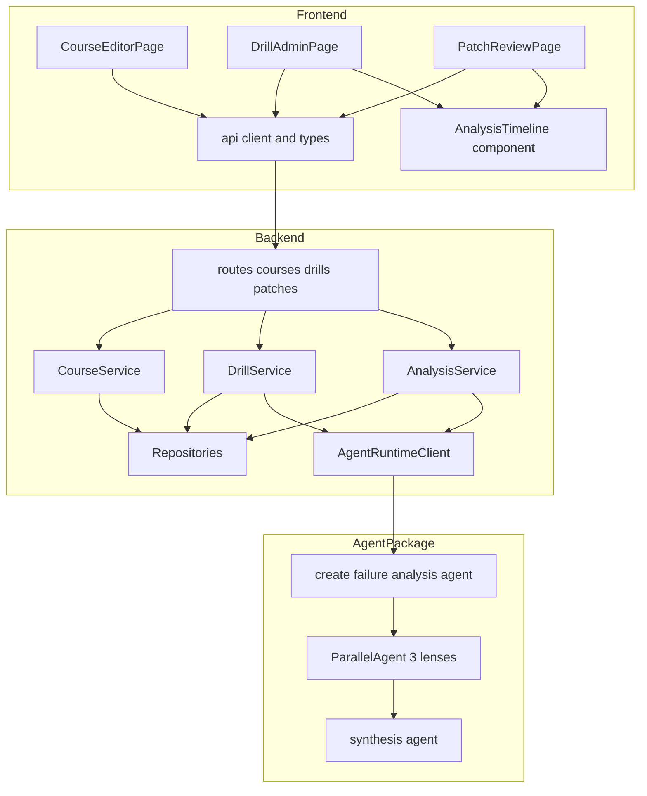
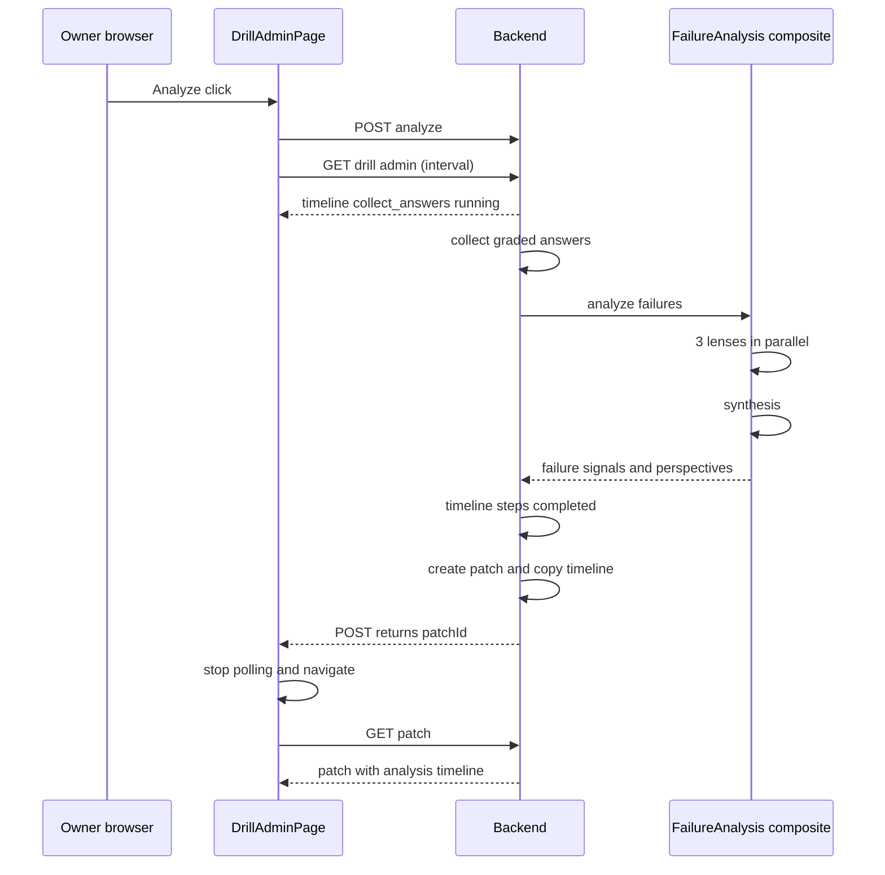

# Technical Design Document

## Overview

**Purpose**: Hackathon Feedback Loop は、講座オーナーと審査員に対して「教材 Markdown -> 根拠付きドリル生成 -> 回答収集 -> 多視点誤答分析 -> Markdown patch -> Before / After 改善確認」という改善ループを、画面上の観測値・根拠・判断ログ・数値で証明できる状態にする。

**Users**: 講座オーナー（および審査員）が管理画面で出題観点の入力、採点状況の確認、分析実行の観察、patch 根拠の確認、改善効果の比較を行う。受講者体験（share URL）は変更しない。

**Impact**: 既存の Course / DrillRun / DocumentPatch モデルへの field 追加、`DrillService` 検証強化、`AnalysisService` の段階記録化、failure_analysis_agent の composite 化、metrics endpoint 追加を行う。新しい層・新しい repository・新しいインフラは導入しない。

本書が実装仕様の正である。`docs/hackathon-feedback-loop-feature-design.md` は UI 文言・プロンプト方針の参考資料であり、本書と矛盾する場合（例: 分析失敗時の status 遷移）は本書を優先する。

### Goals

- すべての設問が教材 Markdown に実在する根拠を持つことを backend 境界で保証する（Req 2）
- 分析 Agent の観測値・根拠・判断結果を owner に段階表示し、patch に監査ログとして保存する（Req 4）
- 誤答分析を 3 観点の composite agent に拡張しつつ、契約互換と env による撤退経路を維持する（Req 5）
- 講座 version 間の平均点比較（Before / After）を提示する（Req 6）
- 出題観点（drillFocus）と分析前の採点集計（scoreSummary）で管理体験を完成させる（Req 1、3）

### Non-Goals

- 質問文の直接入力・設問の個別編集・1 問だけ再生成・問題バンク・LMS 連携
- SSE / WebSocket / background worker の導入（polling で実現する）
- patch レビュー専用エージェントの追加（将来拡張）
- Chain-of-thought（内部推論文・プロンプト本文）の保存・表示
- 認証・所有権機構の変更（google-login-owner-scope の成果をそのまま使う）

## Boundary Commitments

### This Spec Owns

- `Course.drill_focus` の保存・正規化・version 連動・revision 記録
- `DrillService._validate_questions` の根拠検証（excerpt の教材実在チェック）
- `DrillRun.analysis_timeline` / `DocumentPatch.analysis_timeline` のデータ形式と段階保存ロジック
- `DrillScoreSummary` の集計仕様と `DrillAdminResponse` への追加（`canAnalyze` の graded 基準化を含む）
- `GET /api/courses/{course_id}/metrics` の API 契約
- learner 配布可否の status 契約（ready / analyzing / analyzed を配布可能とし、分析失敗時は ready へ戻す）
- `create_failure_analysis_agent()` の composed 化と `FailureAnalysisOutput.perspectives`（optional）の契約
- frontend の AnalysisTimeline component、DrillAdminPage polling、CourseEditorPage の観点入力・比較カード

### Out of Boundary

- 認証・owner check の仕組み（google-login-owner-scope が所有。本 spec は既存 dependency を使うのみ）
- grading / drill_generator / document_patch 各 agent のプロンプト品質改善（drillFocus・原文引用制約の追記を除く）
- agent eval CI の仕組み自体（evalset の追加・更新は行うが workflow は変更しない）
- Firestore / local storage の permission・インフラ構成

### Allowed Dependencies

- `app.auth.require_current_user`（既存認証 dependency）
- `AgentRuntimeClient` / `AgentInvoker` 抽象（契約形状は変更しない。schema への optional field 追加のみ）
- `CourseRepository` / `DrillRepository` / `AnswerRepository` / `PatchRepository` の既存メソッド（新規 repository は作らない）
- 依存方向: schemas -> repositories -> services -> routes、および frontend では api/types -> api/client -> pages/components

### Revalidation Triggers

- `FailureAnalysisOutput` の必須 field 追加・変更（optional `perspectives` 以外）が起きた場合
- `DrillAdminResponse` / `DocumentPatch` の既存 field 削除・意味変更が起きた場合
- analyze API（`POST .../analyze`）の同期契約を非同期に変える場合
- `_TASK_AGENT_FACTORIES` の task 名や invoker 契約を変える場合

## Architecture

### Existing Architecture Analysis

- backend は schemas（`ApiModel`、camelCase alias、frozen）→ repositories → services → routes の層構造。model 更新は `model_copy(update={...})`
- agent 呼び出しは `AgentRuntimeClient`（schema 検証 + 2 回リトライ）→ `AgentInvoker`（`LocalAgentInvoker` / `AdkAgentInvoker`）。`AdkAgentInvoker` は task 名 → factory（`_TASK_AGENT_FACTORIES`）で leaf Agent を生成し Runner 実行する
- `AnalysisService.run_analysis` が start_analysis → analyze_failures → propose_document_patch → patch 保存を直列実行しており、timeline の段階保存はこの各境界に挿入できる
- frontend は api/types.ts + api/client.ts に契約を集約し、pages が useEffect 単発 load。polling パターンは本機能で初導入

### Architecture Pattern & Boundary Map



**Architecture Integration**:
- Selected pattern: 既存レイヤ構造への field / メソッド追加 + agent パッケージ内 composite。新境界は AnalysisTimeline（データ契約）のみ
- Domain boundaries: timeline の組み立ては AnalysisService が所有し、agent は構造化出力（failure_signals、perspectives、target_sections）だけを返す
- Existing patterns preserved: 同期 analyze API、frozen ApiModel、factory ベース agent 生成、owner check dependency
- Steering compliance: steering 未整備のため、`AGENTS.md` と各領域 skill（backend-fastapi / frontend / terraform)の規約に従う

### Technology Stack

| Layer | Choice / Version | Role in Feature | Notes |
|-------|------------------|-----------------|-------|
| Frontend | React + Vite + TypeScript（既存） | 観点入力・scoreSummary・timeline polling・比較カード | 新規依存なし |
| Backend | FastAPI + Pydantic v2（既存） | schema 拡張・根拠検証・集計・metrics API | 新規依存なし |
| Agent | Google ADK + Gemini（既存） | SequentialAgent / ParallelAgent による多視点分析 | 新規依存なし（ADK 既存バージョンの composite を使用） |
| Data | Firestore / local store（既存） | DrillRun / Patch への timeline 保存 | schema 追加のみ、migration 不要（既存 document は default 空 list） |

## File Structure Plan

### Modified Files（backend）

- `backend/app/schemas.py` — `Course` 系 5 schema に `drill_focus`、`DrillRun` に `drill_focus` / `analysis_timeline`、`DocumentPatch` に `analysis_timeline`、`DrillGenerationRequest` に `drill_focus`。新規: `AnalysisStepStatus`、`AnalysisTimelineItem`、`QuestionScoreSummary`、`DrillScoreSummary`、`CourseMetricsResponse`（+ run 要素）、`DrillAdminResponse` に `drill_focus` / `score_summary` / `analysis_timeline`、`FailureAnalysisResponse` に optional `perspectives`
- `backend/app/services/course_service.py` — `_normalize_drill_focus`、create/update での保存・version increment・revision 記録、`get_course_metrics(course_id, owner_user_id)`
- `backend/app/services/drill_service.py` — `_validate_questions(questions, course_markdown)` 根拠検証、DrillRun への drill_focus snapshot、`_build_score_summary` と admin response への反映、`can_analyze` の graded 基準化、`get_learner_drill` の配布可能 status を {ready, analyzing, analyzed} に拡張（分析ライフサイクルで share URL を無効化しない）
- `backend/app/services/analysis_service.py` — `_update_timeline` helper、run_analysis の 5 step 段階保存、失敗時は実行中 step を failed にして `DrillRun.status` を ready へ戻す（error_message 記録）、patch への timeline コピー、`perspectives` の timeline evidence 反映
- `backend/app/services/answer_service.py` — `submit_answer` の受付可能 status を `get_learner_drill` と同じ配布可能 allowlist（{ready, analyzing, analyzed}）に変更（分析中・分析後も回答 POST を受け付ける。Req 4.8）
- `backend/app/routes/courses.py` — `GET /{course_id}/metrics`（`CourseMetricsResponse`、owner check は既存 dependency + service 内 check）
- `backend/app/clients/local_agent_invoker.py` — 教材本文由来の sourceEvidence 生成、drillFocus の反映（Req 2.5）
- `backend/app/clients/adk_agent_invoker.py` — composite agent を返す factory の許容（変更は最小、必要ならコメントとテストのみ）

### Modified Files（agent）

- `agent/knowledge_drill_agent/schemas.py` — `DrillGenerationInput.drill_focus`（AliasChoices）、`FailureAnalysisOutput.perspectives: list[AnalysisPerspective]`（optional、default 空）、新規 `AnalysisPerspective {id, title, summary}`
- `agent/knowledge_drill_agent/config.py` — `analysis_mode`（env `KNOWLEDGE_DRILL_AGENT_ANALYSIS_MODE`、`single` | `composed`、default `composed`。`single` は撤退用の明示指定）
- `agent/knowledge_drill_agent/agent.py` — `create_failure_analysis_agent()` が mode に応じて leaf または `SequentialAgent(ParallelAgent(3 lenses), synthesis)` を返す。lens agent は `output_key` で state に書き、synthesis が placeholder で参照
- `agent/knowledge_drill_agent/prompts/drill_generator.md` — drillFocus 優先 + 原文引用（完全一致 excerpt）制約
- `agent/knowledge_drill_agent/prompts/failure_analysis.md` — perspectives 出力の追記（single mode 用）
- 新規 `agent/knowledge_drill_agent/prompts/failure_lens_material_gap.md` / `failure_lens_question_quality.md` / `failure_lens_stumble_pattern.md` / `failure_synthesis.md` — 3 レンズ + 統合プロンプト
- `agent/knowledge_drill_agent/sample_outputs/failure_analysis.json` — perspectives を含む sample（schema-valid 維持）
- `agent/evals/failure_analysis/`（evalset / test_config）— drillFocus・多視点ケースの追加は最小限

### Modified Files（frontend）

- `frontend/src/api/types.ts` — `AnalysisStepStatus`、`AnalysisTimelineItem`、`QuestionScoreSummary`、`DrillScoreSummary`、`CourseMetrics`、`CoursePayload.drillFocus`、`CourseDetail.drillFocus`、`DrillAdmin.drillFocus / scoreSummary / analysisTimeline`、`DocumentPatch.analysisTimeline`
- `frontend/src/api/client.ts` — `getCourseMetrics(courseId)` 追加
- `frontend/src/pages/CourseEditorPage.tsx` — 出題観点入力（500 文字 validation）、講座の状態エリアに Before / After 比較カード
- `frontend/src/pages/DrillAdminPage.tsx` — scoreSummary 表示、0 件時の分析無効化、分析中の interval polling と timeline 表示
- `frontend/src/pages/PatchReviewPage.tsx` — patch summary と failure signals の間に判断ログ表示
- 新規 `frontend/src/components/common/AnalysisTimeline.tsx` — status chip / title / summary / evidence の表示専用 component（api を import しない）

### Test Files

- backend: `test_courses_api.py`、`test_course_owner_scope.py`、`test_drill_service.py`、`test_analysis_service.py`、`test_schemas.py`、新規観点は既存ファイルに追加（新規テストファイルは metrics 用に `test_course_metrics.py` を許容）
- agent: `agent/tests/test_analysis_patch_agent_contract.py`、`test_agent_import.py`、backend 側 `test_adk_leaf_agents.py` / `test_agent_contract_compatibility.py` の composite 対応
- frontend: 各ページの colocated `*.test.tsx`、`AnalysisTimeline.test.tsx`

## System Flows

### 分析実行と timeline polling



- polling は 1 秒間隔目安（Req 4.2 の「数秒以内」を満たす）。POST 完了・エラー・unmount のいずれでも timer を確実に停止する
- 分析失敗時は実行中 step を failed にし、error_message を記録して drill run を ready へ戻す（share URL は無効化しない。Req 4.5、4.8、5.5）

## Requirements Traceability

| Requirement | Summary | Components | Interfaces | Flows |
|-------------|---------|------------|------------|-------|
| 1.1-1.4 | drillFocus 保存・正規化・version | CourseService、schemas | Course create/update API | - |
| 1.5 | 生成時 snapshot・生成入力へ伝搬 | DrillService | DrillGenerationRequest | - |
| 1.6-1.8 | 表示と受講者秘匿 | DrillAdminPage、learn routes | DrillAdminResponse | - |
| 2.1-2.2 | excerpt 実在検証と failed 化 | DrillService | _validate_questions | - |
| 2.3-2.4 | 観点優先・根拠限定の生成 | drill_generator prompt | DrillGenerationInput | - |
| 2.5 | local mode の根拠生成 | LocalAgentInvoker | AgentInvoker | - |
| 3.1-3.4 | scoreSummary 集計・表示・0 件時 | DrillService、DrillAdminPage | DrillScoreSummary | - |
| 3.5 | 受講者秘匿 | learn routes | LearnerDrillResponse | - |
| 3.6-3.7 | canAnalyze の graded 基準化・graded のみ集計 | DrillService | DrillAdminResponse | - |
| 4.1 | 5 step 段階保存 | AnalysisService | AnalysisTimelineItem | 分析 sequence |
| 4.2 | polling 更新表示 | DrillAdminPage | GET drill admin | 分析 sequence |
| 4.3-4.4 | patch への保存・Patch Review 表示 | AnalysisService、PatchReviewPage | DocumentPatch | 分析 sequence |
| 4.5 | 失敗時は step を failed にし ready へ復帰 | AnalysisService | - | 分析 sequence |
| 4.6-4.7 | 監査ログ限定・受講者秘匿 | AnalysisService、learn routes | - | - |
| 4.8 | 分析ライフサイクル中の share URL 維持（取得・回答） | DrillService、AnswerService | get_learner_drill / submit_answer 配布可否契約 | 分析 sequence |
| 5.1-5.3 | 3 観点統合と根拠表示 | composed agent、AnalysisService | FailureAnalysisOutput.perspectives | 分析 sequence |
| 5.4 | 従来方式への切り替え | agent config | KNOWLEDGE_DRILL_AGENT_ANALYSIS_MODE | - |
| 5.5 | 失敗時の扱い | AnalysisService | - | 分析 sequence |
| 6.1-6.4 | metrics API と owner check | CourseService、courses route | GET metrics | - |
| 6.2 | 比較カード表示 | CourseEditorPage | CourseMetrics | - |
| 6.5 | 受講者秘匿 | learn routes | - | - |

## Components and Interfaces

| Component | Domain/Layer | Intent | Req Coverage | Key Dependencies | Contracts |
|-----------|--------------|--------|--------------|------------------|-----------|
| CourseService 拡張 | backend service | drillFocus 管理と metrics 集計 | 1.1-1.4, 6.1, 6.3, 6.4 | CourseRepository, DrillRepository, AnswerRepository (P0) | Service, API |
| DrillService 拡張 | backend service | 根拠検証・snapshot・scoreSummary | 1.5, 2.1-2.2, 3.1-3.4 | AgentRuntimeClient (P0) | Service |
| AnalysisService 拡張 | backend service | timeline 段階保存と patch コピー | 4.1, 4.3, 4.5-4.6, 5.3, 5.5 | DrillRepository, PatchRepository (P0) | Service, State |
| composed failure analysis | agent package | 3 レンズ並列 + 統合 | 5.1-5.2, 5.4 | ADK Sequential/ParallelAgent (P0) | Service |
| metrics endpoint | backend route | Before / After データ提供 | 6.1, 6.3, 6.4 | require_current_user (P0) | API |
| AnalysisTimeline | frontend component | 判断ログの表示専用 UI | 4.2, 4.4, 5.3 | なし（props のみ） | State |
| DrillAdminPage 拡張 | frontend page | scoreSummary + polling | 1.6, 3.1-3.3, 4.2 | api client (P0) | State |
| CourseEditorPage 拡張 | frontend page | 観点入力 + 比較カード | 1.1, 1.3, 6.2 | api client (P0) | State |
| PatchReviewPage 拡張 | frontend page | 判断ログ表示 | 4.4 | api client (P0) | State |

### Backend Service Layer

#### AnalysisService 拡張

| Field | Detail |
|-------|--------|
| Intent | 分析の 5 step を観測値ベースで段階保存し、完了時に patch へ監査ログをコピーする |
| Requirements | 4.1, 4.3, 4.5, 4.6, 5.3, 5.5 |

**Responsibilities & Constraints**
- timeline の組み立て・保存は本 service のみが行う（agent には作らせない）
- step id は固定: `collect_answers` / `detect_failure_patterns` / `match_course_evidence` / `decide_patch_strategy` / `create_patch`
- summary / evidence には集計値と agent の構造化出力のみを使い、自由文の推論ログを保存しない

**Contracts**: Service [x] / State [x]

##### Service Interface

```python
class AnalysisService:
    def run_analysis(self, drill_run_id: str, owner_user_id: str) -> DocumentPatch: ...
    def _update_timeline(self, drill_run: DrillRun, item: AnalysisTimelineItem) -> DrillRun: ...
    def _build_score_evidence(self, answers: list[Answer]) -> tuple[str, list[str]]: ...
```

- Preconditions: drill run が owner のものであり、graded answer が 1 件以上ある
- Postconditions: 成功時 `DrillRun.status=analyzed`、`DocumentPatch.analysis_timeline` に完了時点の全 step。失敗時は実行中 step が `failed`、`error_message="analysis failed"` を記録し `DrillRun.status=ready` へ戻す（share URL を無効化しない。Req 4.5、4.8）
- Invariants: timeline の step 順序と id は固定。frozen model のため保存は `model_copy` + `DrillRepository.update`。learner 配布可能 status は {ready, analyzing, analyzed}（生成失敗の failed のみ配布不可）

**Implementation Notes**
- Integration: `perspectives`（5.3）は `detect_failure_patterns` step の evidence に「観点名: 1 行要約」で反映
- Validation: 各 step 遷移ごとに repository 保存し、polling で中間状態が観測できることをテストで保証
- Risks: 保存回数が増える（5-10 回/分析）。デモ規模では許容

#### DrillService 拡張

| Field | Detail |
|-------|--------|
| Intent | 生成結果の根拠検証、drillFocus snapshot、scoreSummary 集計 |
| Requirements | 1.5, 2.1, 2.2, 3.1-3.4 |

**Contracts**: Service [x]

##### Service Interface

```python
class DrillService:
    def _validate_questions(self, questions: list[DrillQuestion], course_markdown: str) -> None: ...
    def _build_score_summary(self, drill_run: DrillRun, answers: list[Answer]) -> DrillScoreSummary: ...
```

- Preconditions: `_validate_questions` は agent 応答の schema 検証後に呼ばれる
- Postconditions: excerpt 不在・空なら raise（既存の generation failed フローで `DrillRun.status=failed`）。`DrillAdminResponse` に score_summary / drill_focus / analysis_timeline が含まれ、`can_analyze` は `graded_answer_count > 0` になる（Req 3.6）
- Invariants: 検証は `excerpt in course.markdown` の包含（trim 後非空が前提）。graded 0 件時 `average_score=None`
- 集計規則（Req 3.7）: 対象は `status=graded` の回答のみ。`average_score` は丸めなしの float（表示丸めは frontend が小数第 1 位で行う）。`common_missing_points` は設問ごとに graded 回答の missingPoints を文字列完全一致で頻度集計し、出現 2 回以上を頻度降順（同数は初出順）で最大 3 件。`failure_tags` は重複排除のうえ頻度降順で最大 3 件
- `get_learner_drill` は status が {ready, analyzing, analyzed} のとき配布し、それ以外（generating / failed）は従来どおり 404（Req 4.8）

#### CourseService 拡張

| Field | Detail |
|-------|--------|
| Intent | drillFocus の正規化・version 連動・revision 記録、講座 metrics 集計 |
| Requirements | 1.1-1.4, 6.1, 6.3, 6.4 |

**Contracts**: Service [x] / API [x]

##### Service Interface

```python
class CourseService:
    def _normalize_drill_focus(self, value: str | None) -> str | None: ...
    def get_course_metrics(self, course_id: str, owner_user_id: str) -> CourseMetricsResponse: ...
```

- Postconditions: title / markdown / drill_focus のいずれか変更で version +1、revision に drill_focus 保存。metrics は drill run ごとに {drill_run_id, course_version, answer_count, average_score, max_score} を返す
- Invariants: 500 文字超は validation error（schema 側 max_length と二重防御）。owner でなければ既存の course_not_found 扱い

##### API Contract

| Method | Endpoint | Request | Response | Errors |
|--------|----------|---------|----------|--------|
| GET | /api/courses/{course_id}/metrics | - | CourseMetricsResponse | 401, 404 |

### Agent Package

#### composed failure analysis

| Field | Detail |
|-------|--------|
| Intent | 教材ギャップ / 設問品質 / つまずきパターンの 3 レンズ並列分析と統合 |
| Requirements | 5.1, 5.2, 5.4 |

**Responsibilities & Constraints**
- `create_failure_analysis_agent()` の返り値型は `BaseAgent`（leaf または composite）。呼び出し側（invoker / evals / root_agent）は factory 経由でのみ取得する
- composite: `SequentialAgent(name="failure_analysis_agent", sub_agents=[ParallelAgent(3 lenses), synthesis])`
- lens agent は `output_key` で state に書き、synthesis は instruction placeholder で参照。`output_schema=FailureAnalysisOutput` は synthesis のみに付与（最終応答契約を leaf と同一に保つ）
- mode 切り替え: `KNOWLEDGE_DRILL_AGENT_ANALYSIS_MODE`（default `composed`。Req 5.1 を default deploy で満たすため。`single` は障害時・締切直前の撤退用の明示指定であり、指定時は Req 5.4 の従来方式として動作する）

**Dependencies**
- External: google.adk.agents の SequentialAgent / ParallelAgent — composite 実行（P0）

**Implementation Notes**
- Integration: `FailureAnalysisOutput.perspectives` は optional（default 空 list）で後方互換。LocalAgentInvoker・既存 sample_outputs は未変更でも schema-valid
- Validation: `evals/failure_analysis/agent.py` の root_agent discovery が composite でも機能することを agent eval（workflow_dispatch quick profile 可）で確認
- Risks: leaf 前提のテスト（test_adk_leaf_agents.py 等）の更新が必要。ADK の composite 仕様差異が出た場合は env で mode=single を明示して撤退（default は composed のため、撤退時は環境変数の設定が必要）

### Frontend

#### AnalysisTimeline component（新規境界）

| Field | Detail |
|-------|--------|
| Intent | timeline items の表示専用 component |
| Requirements | 4.2, 4.4, 5.3 |

**Contracts**: State [x]

```typescript
type AnalysisTimelineProps = {
  title: string
  items: AnalysisTimelineItem[]
}
```

- api を import しない。型は type-only import
- status ごとの chip、summary、evidence list（最大 3 件表示）

#### DrillAdminPage / CourseEditorPage / PatchReviewPage 拡張

Summary-only（新規境界なし）。
- DrillAdminPage: `scoreSummary` 表示、`gradedAnswerCount === 0` で Analyze disabled + 案内文、Analyze 中は `setInterval` polling（1 秒目安）で `api.getDrill` を再取得し timeline を更新。POST resolve で Patch Review へ navigate、reject で error banner、cleanup で必ず timer 停止
- CourseEditorPage: `drillFocus` state・保存 payload・500 文字 validation・load 時反映。講座の状態エリアに metrics 比較カード（採点済み回答を持つ run が 2 つ以上のときのみ表示）
- PatchReviewPage: patch summary と failure signals の間に `AnalysisTimeline`（空なら非表示）

## Data Models

### Domain Model（追加分のみ）

- `AnalysisTimelineItem`（value object）: `{id, title, status, summary, evidence[], completed_at}`。`status: pending | running | completed | failed | skipped`。DrillRun（分析中の現在値）と DocumentPatch（提案時点の snapshot）の両方が保持する
- `Course.drill_focus: str | None`: version 管理対象。`CourseSummary` には含めない
- `DrillRun.drill_focus: str | None`: 生成時 snapshot（Course の後続変更に影響されない）
- `DrillScoreSummary` / `QuestionScoreSummary`: 保存しない読み取り時集計（graded answers 由来）
- `CourseMetricsResponse.runs[]`: `{drill_run_id, course_version, answer_count, average_score, max_score}`
- `AnalysisPerspective`（agent 契約）: `{id, title, summary}`。`FailureAnalysisOutput.perspectives` は optional

### Data Contracts & Integration

- API alias は既存規約どおり camelCase（`drillFocus`、`analysisTimeline`、`scoreSummary`）
- 受講者向け `LearnerDrillResponse` にはいずれの新 field も追加しない（Req 1.8、3.5、4.7、6.5）
- 既存 Firestore document に新 field が無い場合は default（None / 空 list）で読める（Pydantic default）。migration 不要

## Error Handling

- 根拠検証失敗（2.2）: `DrillService` が raise → 既存 generation failed フロー（`DrillRun.status=failed`、`error_message="drill generation failed"`）。無根拠設問は保存・配布されない
- 分析失敗（4.5、4.8、5.5）: 実行中 step を `failed` に更新し `error_message="analysis failed"` を記録したうえで `DrillRun.status=ready` へ戻す。timeline は失敗時点まで保存されたまま残り（監査可能）、share URL は無効化されず再分析も可能
- drillFocus validation（1.3）: schema `max_length=500` による 422 + frontend の事前 validation メッセージ
- metrics の owner 違反（6.4）: 既存 owner check と同じ `404 course_not_found`
- polling 中の GET 失敗: 表示は最後に成功した timeline を維持し、POST の結果（resolve / reject）を最終状態とする

## Testing Strategy

### Unit Tests（backend）
- `_normalize_drill_focus`: trim・空文字 None 化・500 文字境界（1.1-1.3）
- drill_focus 変更で version +1・revision 保存（1.4）
- `_validate_questions`: excerpt 不在 / 空白 excerpt で raise、包含時に通過（2.1-2.2）
- `_build_score_summary`: 0 件で None、設問別平均・missing points 集計（3.1-3.4）
- AnalysisService: 5 step の段階保存順序、失敗時 running→failed、patch への timeline コピー、perspectives の evidence 反映（4.1、4.3、4.5、5.3）
- `get_course_metrics`: run ごとの集計、0 件 run の None、owner check（6.1、6.3、6.4）

### Unit Tests（agent）
- `DrillGenerationInput` が drillFocus alias を受理（1.5）
- `FailureAnalysisOutput.perspectives` の default 空 list と sample_outputs の schema-valid（5.2）
- mode=single / composed で factory の返す agent 型が切り替わる（5.4）
- composite の sub_agents 構成（3 lenses + synthesis、output_schema は synthesis のみ）

### Integration Tests
- Course create → drill 生成 → generation payload に drillFocus 伝搬 → DrillRun snapshot（1.5）
- analyze 実行中の GET で中間 timeline が観測できる（4.1、4.2 相当の backend 側保証）
- LearnerDrillResponse に新 field が含まれない（1.8、3.5、4.7）
- `GET /metrics` の E2E 形状（6.1）

### Frontend Tests（Vitest）
- CourseEditor: drillFocus 入力・payload・500 文字 error・load 反映（1.1、1.3）
- DrillAdmin: scoreSummary 表示、0 件時 disabled + 案内、polling で timeline 更新・cleanup 停止（3.1-3.3、4.2）
- PatchReview: timeline 表示・空なら非表示（4.4）
- 比較カード: 2 run 以上で表示、1 run 以下で非表示（6.2）

### Agent Eval（実 Gemini）
- `python scripts/run_adk_evals.py --profile quick failure_analysis` を composed mode で実行し、rubric eval が通ることを確認（5.1、5.2）。CI は agent-eval.yml がそのまま担う
