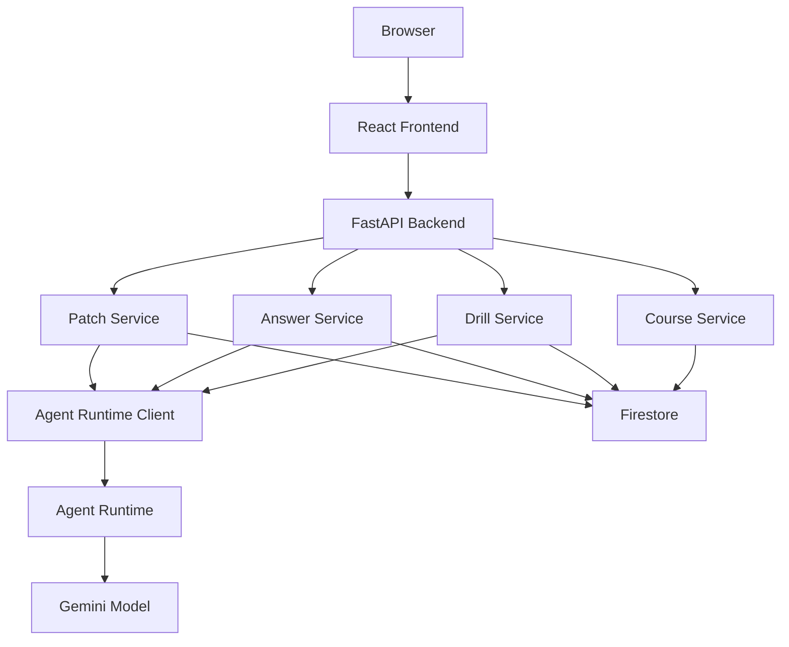
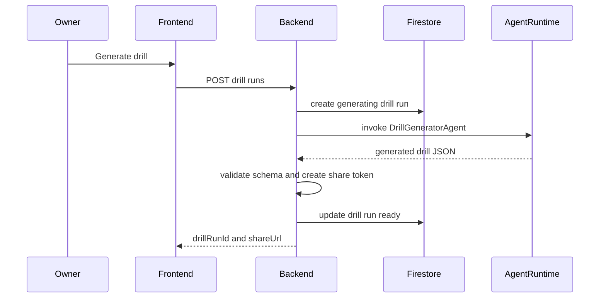
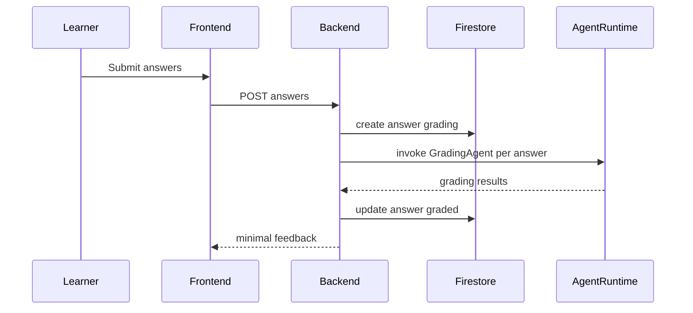
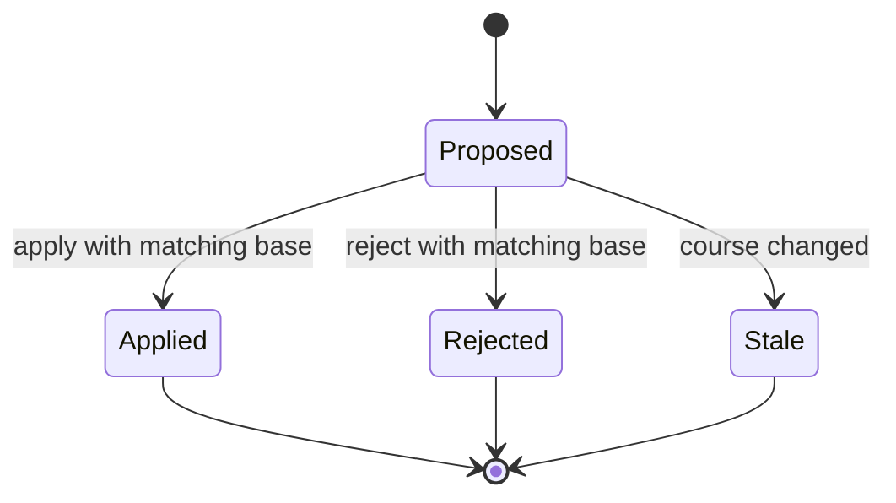
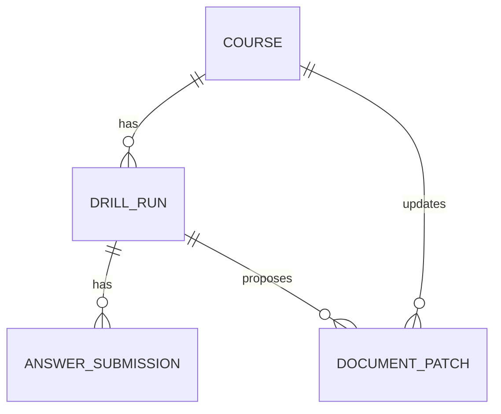

# Design Document

## Overview

Knowledge Drill MVP は、講座オーナーが Markdown 講座を保存し、Agent Runtime 上の Agent で 3 問の記述式ドリルを生成し、受講者回答から採点・誤答傾向・Document Patch を作る web application である。受講者には回答に必要な最小情報だけを公開し、rubric と ideal answer は管理者側に閉じる。

実装は Vite / React frontend、FastAPI backend、Firestore、Agent Runtime 上の ADK agent app で構成する。FastAPI は信頼境界として shareToken 検証、Firestore 更新、Agent 出力検証、diff 生成、Patch apply/reject を統制する。

### Goals
- 講座 Markdown からドリル生成、回答、採点、分析、Patch review までの MVP flow を実装可能にする。
- Agent と backend の責務境界を明確化し、Agent の不完全出力や遅延を failed / retry 可能状態として扱う。
- Patch apply / reject / stale 判定を一貫した状態遷移として設計し、人間の承認なしに講座を更新しない。

### Non-Goals
- PDF、画像、LMS、GitHub PR、本格的なログイン・権限管理、問題バンクは扱わない。
- Agent 呼び出しの background job 化は MVP では必須にしない。
- 複数講座オーナーや tenant 分離は今回の設計境界外とする。

## Boundary Commitments

### This Spec Owns
- Course、DrillRun、AnswerSubmission、DocumentPatch の API、永続状態、状態遷移。
- 講座オーナー向け Course Editor、Drill Admin、Analysis & Patch Review と受講者向け Answer Form。
- Agent Runtime へ送る request schema と Agent から受け取る response schema。
- 受講者 API から rubric / idealAnswer を除外する response contract。
- unified diff 生成、shareToken 生成、Patch apply/reject、stale 判定。

### Out of Boundary
- Google Cloud project、service account、Secret Manager、Agent Runtime deployment pipeline の実作成。
- 本格認証、role-based authorization、tenant 管理。
- PDF / image ingestion、Markdown preview の必須化、多肢選択問題、問題バンク。
- 30 秒超過時の Cloud Tasks / background job 化。

### Allowed Dependencies
- Frontend: Vite、React、TypeScript、React Router、diff viewer library。
- Backend: Python 3.11+、FastAPI、Pydantic v2、Google Cloud Firestore SDK、Google Cloud Agent Platform SDK for Python。
- Agent: Google ADK、Agent Runtime、Gemini model。
- Infrastructure: Cloud Run、Firestore、Firebase Hosting または Cloud Run、Cloud Logging、Secret Manager。

### Revalidation Triggers
- Agent Runtime SDK、ADK、または deployment contract が変わる。
- `.kiro/steering/` が追加され、tech stack、security、structure 方針が定義される。
- requirements に background job、auth、tenant、PDF、GitHub PR、LMS 連携が追加される。
- Agent output schema、Firestore collection shape、API response shape が変更される。

## Architecture

### Existing Architecture Analysis

既存実装はない。`docs/knowledge-drill-agent-engine-spec.md` の仕様を起点に、greenfield の directory structure と dependency direction を定義する。

### Architecture Pattern & Boundary Map

Selected pattern: layered service architecture with thin adapters。UI、API routes、service、repository、external adapter、agent app を分ける。backend service layer が business state transition を所有し、Agent は生成・採点・分析・Patch 提案だけを返す。

Dependency direction: `shared types/config -> repositories/adapters -> services -> API routes -> UI clients`。Agent app は shared schema と prompt を持つが、Firestore repository を import しない。



### Technology Stack

| Layer | Choice / Version | Role in Feature | Notes |
|-------|------------------|-----------------|-------|
| Frontend | Vite + React + TypeScript | Owner / learner UI | version は実装時に `package.json` で pin する |
| Routing | React Router | `/courses`, `/drills` routes | page-level data loading は API client 経由 |
| Backend | Python 3.11+ + FastAPI | REST API and trust boundary | response model で data leakage を防ぐ |
| Validation | Pydantic v2 | API / Agent schema validation | Agent output は必ず schema validation |
| Data | Firestore | Course / Drill / Answer / Patch state | Patch apply/reject は transaction |
| Agent | Google ADK + Agent Runtime | Drill, grading, analysis, patch proposal | Python SDK は実装時に quickstart version を確認 |
| Diff | Python `difflib` | unified diff generation | backend responsibility |

## File Structure Plan

### Directory Structure

```text
frontend/
  package.json
  vite.config.ts
  tsconfig.json
  src/
    main.tsx
    app/router.tsx
    api/client.ts
    api/types.ts
    pages/CourseEditorPage.tsx
    pages/DrillAdminPage.tsx
    pages/LearnerDrillPage.tsx
    pages/PatchReviewPage.tsx
    components/forms/MarkdownEditor.tsx
    components/drill/QuestionList.tsx
    components/drill/AnswerForm.tsx
    components/patch/DiffViewer.tsx
    components/patch/PatchActions.tsx
    components/common/StatusBanner.tsx
backend/
  pyproject.toml
  app/main.py
  app/config.py
  app/api/courses.py
  app/api/drills.py
  app/api/answers.py
  app/api/patches.py
  app/schemas/domain.py
  app/schemas/api.py
  app/schemas/agent.py
  app/services/course_service.py
  app/services/drill_service.py
  app/services/answer_service.py
  app/services/analysis_service.py
  app/services/patch_service.py
  app/repositories/firestore_client.py
  app/repositories/course_repository.py
  app/repositories/drill_repository.py
  app/repositories/share_token_repository.py
  app/repositories/answer_repository.py
  app/repositories/patch_repository.py
  app/integrations/agent_runtime_client.py
  app/utils/diff.py
  app/utils/share_token.py
  tests/
agent/
  knowledge_drill_agent/agent.py
  knowledge_drill_agent/schemas.py
  knowledge_drill_agent/prompts/drill_generator.md
  knowledge_drill_agent/prompts/grading.md
  knowledge_drill_agent/prompts/failure_analysis.md
  knowledge_drill_agent/prompts/document_patch.md
```

### Modified Files
- `.kiro/specs/knowledge-drill-mvp/spec.json` — design 生成状態と requirements approval を更新する。
- `docs/knowledge-drill-agent-engine-spec.md` — 実装中に仕様差分が見つかった場合のみ更新する。

## System Flows

### Drill Generation



### Answer Submission and Grading



### Patch Lifecycle



## Requirements Traceability

| Requirement | Summary | Components | Interfaces | Flows |
|-------------|---------|------------|------------|-------|
| 1.1 | Course 保存と再表示 | CourseService, CourseRepository, CourseEditorPage | Course API | Course CRUD |
| 1.2 | title 必須 | CourseService, CourseEditorPage | validation error | Course CRUD |
| 1.3 | markdown 必須 | CourseService, CourseEditorPage | validation error | Course CRUD |
| 1.4 | 20,000 文字上限 | CourseService | validation error | Course CRUD |
| 1.5 | latest drill / patch 表示 | CourseService, CourseEditorPage | CourseDetailResponse | Course CRUD |
| 2.1 | 3 問生成 | DrillService, AgentRuntimeClient | DrillGeneratorRequest | Drill Generation |
| 2.2 | 実務シナリオ型 | DrillGeneratorAgent | Agent prompt contract | Drill Generation |
| 2.3 | intent rubric ideal evidence | Agent schema, DrillRun model | DrillQuestion | Drill Generation |
| 2.4 | 各問 4 点 | DrillService validation | DrillQuestion validation | Drill Generation |
| 2.5 | 根拠なし生成禁止 | DrillGeneratorAgent | sourceEvidence contract | Drill Generation |
| 2.6 | 生成失敗表示 | DrillService, StatusBanner | failed drill_run | Error Handling |
| 3.1 | 生成問題と rubric 概要表示 | DrillAdminPage | Admin Drill API | Drill Admin |
| 3.2 | 共有 URL 表示 | DrillService, DrillAdminPage | shareUrl | Drill Admin |
| 3.3 | 推測困難 token | ShareToken utility | shareToken | Drill Generation |
| 3.4 | 回答数表示 | DrillService, DrillRepository | answerCount | Drill Admin |
| 3.5 | 1 件以上で分析開始 | DrillAdminPage, AnalysisService | Analyze API | Analysis |
| 4.1 | 有効 URL で回答欄表示 | LearnerDrillPage | Learner Drill API | Learner Flow |
| 4.2 | rubric / ideal 非表示 | API schemas, LearnerDrillPage | LearnerDrillResponse | Learner Flow |
| 4.3 | learnerName 必須 | AnswerService, AnswerForm | validation error | Learner Flow |
| 4.4 | answerText 必須 | AnswerService, AnswerForm | validation error | Learner Flow |
| 4.5 | 提出完了と最小 feedback | AnswerService | SubmitAnswerResponse | Answer Submission |
| 4.6 | 無効 token | DrillService, AnswerService | 404 invalid_share_token | Learner Flow |
| 5.1 | rubric 採点 | AnswerService, GradingAgent | GradingRequest | Answer Submission |
| 5.2 | 採点結果 fields | Agent schema, Answer model | GradingResult | Answer Submission |
| 5.3 | 補完採点禁止 | GradingAgent prompt | grading constraints | Answer Submission |
| 5.4 | 短文回答は不足点 | GradingAgent, AnswerService | GradingResult | Answer Submission |
| 5.5 | 採点失敗状態 | AnswerService, StatusBanner | answer failed | Error Handling |
| 6.1 | Failure Signal 生成 | AnalysisService, FailureAnalysisAgent | FailureAnalysisRequest | Analysis |
| 6.2 | Failure Signal fields | Agent schema, Patch model | FailureSignal | Analysis |
| 6.3 | 共通傾向優先 | FailureAnalysisAgent prompt | analysis constraints | Analysis |
| 6.4 | sampleSize confidenceNote | Agent schema, PatchReviewPage | FailureSignal | Analysis |
| 6.5 | 理解不足と説明不足を区別 | FailureAnalysisAgent | FailureSignal fields | Analysis |
| 6.6 | 会社ルール創作禁止 | FailureAnalysisAgent | prompt constraints | Analysis |
| 7.1 | Document Patch 提案 | AnalysisService, DocumentPatchAgent | DocumentPatchRequest | Analysis |
| 7.2 | patchedMarkdown summary risk diff | PatchService, Diff utility | DocumentPatch | Patch Review |
| 7.3 | Markdown 構造維持 | DocumentPatchAgent prompt | patch constraints | Patch Review |
| 7.4 | 最小変更 | DocumentPatchAgent prompt | patch constraints | Patch Review |
| 7.5 | 不確かさを riskNotes | DocumentPatchAgent | riskNotes | Patch Review |
| 7.6 | 自動適用禁止 | PatchService | state transition | Patch Lifecycle |
| 8.1 | Review 画面表示 | PatchReviewPage | PatchDetailResponse | Patch Review |
| 8.2 | Apply | PatchService | ApplyPatch API | Patch Lifecycle |
| 8.3 | Reject | PatchService | RejectPatch API | Patch Lifecycle |
| 8.4 | ownerFeedback 保存 | PatchService | ownerFeedback | Patch Lifecycle |
| 8.5 | stale 表示 | PatchService, PatchReviewPage | stale status | Patch Lifecycle |
| 8.6 | non proposed 409 | PatchService | patch_not_proposed | Patch Lifecycle |
| 9.1 | rubric / ideal 非公開 | API schemas | Learner responses | Security |
| 9.2 | token なし非表示 | DrillService | invalid_share_token | Security |
| 9.3 | 機密資料前提表示 | CourseEditorPage | guidance banner | Security |
| 9.4 | 明示操作なし更新禁止 | PatchService | Apply API only | Patch Lifecycle |
| 9.5 | 本格 auth 対象外 | API boundary | no auth middleware | Boundary |
| 10.1 | 生成中表示 | DrillService, StatusBanner | generating status | Drill Generation |
| 10.2 | 分析中表示 | AnalysisService, StatusBanner | analyzing status | Analysis |
| 10.3 | 失敗と retry 表示 | Services, StatusBanner | failed statuses | Error Handling |
| 10.4 | 不完全結果を確定表示しない | AgentRuntimeClient, Services | validation failure | Error Handling |
| 10.5 | 対象識別 | API responses, UI pages | ids in responses | All flows |

## Components and Interfaces

| Component | Domain/Layer | Intent | Req Coverage | Key Dependencies | Contracts |
|-----------|--------------|--------|--------------|------------------|-----------|
| CourseService | Backend service | Course validation and latest state | 1.1, 1.2, 1.3, 1.4, 1.5 | CourseRepository P0 | Service, API |
| DrillService | Backend service | Drill generation lifecycle and share token | 2.1, 2.2, 2.3, 2.4, 2.5, 2.6, 3.1, 3.2, 3.3, 3.4, 3.5, 10.1 | AgentRuntimeClient P0, DrillRepository P0, ShareTokenRepository P0 | Service, API, State |
| AnswerService | Backend service | Learner submission and grading lifecycle | 4.1, 4.2, 4.3, 4.4, 4.5, 4.6, 5.1, 5.2, 5.3, 5.4, 5.5 | AgentRuntimeClient P0, AnswerRepository P0 | Service, API, State |
| AnalysisService | Backend service | Failure analysis and patch proposal | 6.1, 6.2, 6.3, 6.4, 6.5, 6.6, 7.1, 7.2, 7.3, 7.4, 7.5, 10.2 | AgentRuntimeClient P0, PatchService P1 | Service, API |
| PatchService | Backend service | Patch review, stale, apply, reject | 7.6, 8.1, 8.2, 8.3, 8.4, 8.5, 8.6, 9.4 | PatchRepository P0, CourseRepository P0 | Service, API, State |
| AgentRuntimeClient | Backend adapter | Typed remote agent invocation | 2, 5, 6, 7, 10.4 | Agent Runtime P0 | Service |
| Firestore Repositories | Data adapter | Collection persistence and transactions | 1, 3, 5, 8, 10 | Firestore P0 | Service, State |
| KnowledgeDrillAgentApp | Agent | ADK agents and prompts | 2, 5, 6, 7 | Gemini P0 | Service |
| Frontend Pages | UI | Owner and learner workflows | 1, 3, 4, 8, 9, 10 | Backend API P0 | API, State |

### Backend Services

#### CourseService

| Field | Detail |
|-------|--------|
| Intent | Course CRUD と latest related state を返す |
| Requirements | 1.1, 1.2, 1.3, 1.4, 1.5 |

**Responsibilities & Constraints**
- title と markdown を検証し、20,000 文字上限を enforce する。
- course version を更新時に increment する。
- latestDrillRunId / latestPatchId を course detail response に含める。

**Contracts**: Service [x] / API [x] / Event [ ] / Batch [ ] / State [x]

##### Service Interface
```python
class CourseService:
    def create_course(self, request: CourseCreateRequest) -> CourseCreateResponse: ...
    def get_course(self, course_id: str) -> CourseDetailResponse: ...
    def update_course(self, course_id: str, request: CourseUpdateRequest) -> CourseDetailResponse: ...
```

##### API Contract
| Method | Endpoint | Request | Response | Errors |
|--------|----------|---------|----------|--------|
| POST | `/api/courses` | `CourseCreateRequest` | `CourseCreateResponse` | 400, 500 |
| GET | `/api/courses/{courseId}` | none | `CourseDetailResponse` | 404, 500 |
| PUT | `/api/courses/{courseId}` | `CourseUpdateRequest` | `CourseDetailResponse` | 400, 404, 500 |

#### DrillService

| Field | Detail |
|-------|--------|
| Intent | DrillRun を生成し、share URL と admin 表示を提供する |
| Requirements | 2.1, 2.2, 2.3, 2.4, 2.5, 2.6, 3.1, 3.2, 3.3, 3.4, 3.5, 10.1 |

**Responsibilities & Constraints**
- `status = generating` の drill_run を先に保存し、Agent 成功時に `ready` へ更新する。
- Agent output は `questions.length == 3`、rubric points 合計 4、sourceEvidence 必須を検証する。
- shareToken は backend で生成し、Agent には渡さない。
- shareToken は `share_tokens/{token}` 予約 document を Firestore transaction の create-only 書き込みで確保し、同じ transaction で drill_run と予約 document を関連付ける。予約済み token 衝突時は token を再生成して最大 3 回まで再試行する。

**Contracts**: Service [x] / API [x] / Event [ ] / Batch [ ] / State [x]

##### Service Interface
```python
class DrillService:
    def generate_drill(self, course_id: str) -> DrillRunCreateResponse: ...
    def get_admin_drill(self, course_id: str, drill_run_id: str) -> AdminDrillRunResponse: ...
    def get_learner_drill(self, share_token: str) -> LearnerDrillResponse: ...
```

##### API Contract
| Method | Endpoint | Request | Response | Errors |
|--------|----------|---------|----------|--------|
| POST | `/api/courses/{courseId}/drill-runs` | none | `DrillRunCreateResponse` | 400, 404, 500 |
| GET | `/api/courses/{courseId}/drill-runs/{drillRunId}` | none | `AdminDrillRunResponse` | 404, 500 |
| GET | `/api/drills/{shareToken}` | none | `LearnerDrillResponse` | 404 `invalid_share_token`, 500 |

#### AnswerService

| Field | Detail |
|-------|--------|
| Intent | Learner answers を保存し、GradingAgent で採点する |
| Requirements | 4.1, 4.2, 4.3, 4.4, 4.5, 4.6, 5.1, 5.2, 5.3, 5.4, 5.5, 9.1, 9.2 |

**Responsibilities & Constraints**
- 無効 shareToken は 404 `invalid_share_token` とし、answer は作成しない。
- `SubmitAnswerRequest.answers` はちょうど 3 件でなければならない。answer の questionId set は drill_run.questions の id set と完全一致し、未知 questionId、欠落 questionId、重複 questionId は 400 validation error として reject する。
- valid submission は `status = grading` として保存し、採点成功時に `graded`、失敗時に `failed` とする。
- response は minimal feedback のみで、rubric と idealAnswer を含めない。

**Contracts**: Service [x] / API [x] / Event [ ] / Batch [ ] / State [x]

##### Service Interface
```python
class AnswerService:
    def submit_answers(self, share_token: str, request: SubmitAnswerRequest) -> SubmitAnswerResponse: ...
```

##### API Contract
| Method | Endpoint | Request | Response | Errors |
|--------|----------|---------|----------|--------|
| POST | `/api/drills/{shareToken}/answers` | `SubmitAnswerRequest` | `SubmitAnswerResponse` | 400 `invalid_answer_set`, 400 `duplicate_question_id`, 400 `unknown_question_id`, 404 `invalid_share_token`, 500 |

#### AnalysisService

| Field | Detail |
|-------|--------|
| Intent | graded answers から Failure Signal と Document Patch を生成する |
| Requirements | 6.1, 6.2, 6.3, 6.4, 6.5, 6.6, 7.1, 7.2, 7.3, 7.4, 7.5, 10.2 |

**Responsibilities & Constraints**
- analyze 開始時に drill_run が `ready`、`analyzed`、または analysis failure 由来の `failed` であることを確認し、`status = analyzing` に更新する。`analyzed` からの再分析は既存 patch を変更せず、新しい proposed patch を作成する。
- `failed` から再分析できるのは、drill_run.questions が 3 件あり、shareToken が存在し、1 件以上の graded answer がある場合だけである。drill generation failure 由来の `failed` は再分析不可で、409 `drill_not_analyzable` を返す。
- 1 件以上の `status = graded` answer が必要。`failed` または `grading` answer は分析入力から除外し、該当件数を response / log に含める。
- 3 件未満の場合も実行できるが、FailureSignal に `sampleSize` と `confidenceNote` を含める。
- DocumentPatchAgent の `patchedMarkdown` から backend が unified diff を生成する。
- 成功時は patch を `status = proposed` で保存し、drill_run を `status = analyzed` に更新し、course.latestPatchId と course.latestDrillRunId を更新する。
- Agent 呼び出し、schema validation、diff 生成、保存のいずれかが失敗した場合は drill_run を `status = failed` に更新し、errorMessage を保存する。UI は同じ analyze endpoint を再実行できる。

**Contracts**: Service [x] / API [x] / Event [ ] / Batch [ ] / State [x]

##### Service Interface
```python
class AnalysisService:
    def analyze_drill_run(self, course_id: str, drill_run_id: str) -> AnalyzeDrillRunResponse: ...
```

##### API Contract
| Method | Endpoint | Request | Response | Errors |
|--------|----------|---------|----------|--------|
| POST | `/api/courses/{courseId}/drill-runs/{drillRunId}/analyze` | none | `AnalyzeDrillRunResponse` | 400 `no_graded_answers`, 404, 409 `drill_not_analyzable`, 500 |

#### PatchService

| Field | Detail |
|-------|--------|
| Intent | Patch 詳細表示、stale 判定、Apply / Reject を管理する |
| Requirements | 7.6, 8.1, 8.2, 8.3, 8.4, 8.5, 8.6, 9.4, 10.5 |

**Responsibilities & Constraints**
- `GET /api/patches/{patchId}` は proposed patch と current course markdown を比較し、必要なら `stale` に更新する。
- Apply / Reject は transaction 内で `patch.status == proposed` と `baseMarkdown == course.markdown` を確認する。
- `patch.status != proposed` は 409 `patch_not_proposed` と currentStatus を返す。

**Contracts**: Service [x] / API [x] / Event [ ] / Batch [ ] / State [x]

##### Service Interface
```python
class PatchService:
    def get_patch(self, patch_id: str) -> PatchDetailResponse: ...
    def apply_patch(self, patch_id: str, request: PatchDecisionRequest) -> PatchDecisionResponse: ...
    def reject_patch(self, patch_id: str, request: PatchDecisionRequest) -> PatchDecisionResponse: ...
```

##### API Contract
| Method | Endpoint | Request | Response | Errors |
|--------|----------|---------|----------|--------|
| GET | `/api/patches/{patchId}` | none | `PatchDetailResponse` | 404, 500 |
| POST | `/api/patches/{patchId}/apply` | `PatchDecisionRequest` | `PatchDecisionResponse` | 404, 409, 500 |
| POST | `/api/patches/{patchId}/reject` | `PatchDecisionRequest` | `PatchDecisionResponse` | 404, 409, 500 |

### Agent Integration

#### AgentRuntimeClient

| Field | Detail |
|-------|--------|
| Intent | Agent Runtime remote agent を typed request / response で呼び出す |
| Requirements | 2.1, 5.1, 6.1, 7.1, 10.4 |

**Responsibilities & Constraints**
- task 名と Pydantic schema を対応付ける。
- Agent 出力 schema 違反時は同一入力で 1 回だけ retry する。
- Firestore path、Secret、管理 token、受講者に非公開の response payload を Agent に渡さない。

**Contracts**: Service [x] / API [ ] / Event [ ] / Batch [ ] / State [ ]

##### Service Interface
```python
class AgentRuntimeClient:
    def generate_drill(self, request: DrillGeneratorRequest) -> DrillGeneratorOutput: ...
    def grade_answer(self, request: GradingRequest) -> GradingOutput: ...
    def analyze_failures(self, request: FailureAnalysisRequest) -> FailureAnalysisOutput: ...
    def propose_patch(self, request: DocumentPatchRequest) -> DocumentPatchOutput: ...
```

#### KnowledgeDrillAgentApp

| Field | Detail |
|-------|--------|
| Intent | ADK agents と prompts を Agent Runtime に deploy する単位 |
| Requirements | 2.2, 2.5, 5.3, 6.3, 6.6, 7.3, 7.4, 7.5 |

**Responsibilities & Constraints**
- DrillGeneratorAgent、GradingAgent、FailureAnalysisAgent、DocumentPatchAgent を root agent 配下に定義する。
- 各 prompt は仕様の禁止事項を明示する。
- Agent output は `agent/knowledge_drill_agent/schemas.py` の schema に一致する JSON のみを返す。

### Frontend

Frontend pages は API contract に従う presentational + workflow components とする。domain state の authority は backend / Firestore にあり、UI は API response の status を表示する。

| Page | Responsibility | Requirements |
|------|----------------|--------------|
| `CourseEditorPage` | Course save、Generate drill、latest state 表示 | 1.1, 1.2, 1.3, 1.4, 1.5, 2.1, 9.3 |
| `DrillAdminPage` | questions、rubric summary、share URL、answer count、analyze button | 3.1, 3.2, 3.3, 3.4, 3.5 |
| `LearnerDrillPage` | token drill 表示、answer submit、minimal feedback、invalid token 表示 | 4.1, 4.2, 4.3, 4.4, 4.5, 4.6, 9.1, 9.2 |
| `PatchReviewPage` | analysis summary、diff、risk、ownerFeedback、Apply / Reject、stale 表示 | 8.1, 8.2, 8.3, 8.4, 8.5, 8.6 |

## Data Models

### Domain Model



### Logical Data Model

- `courses`: title、markdown、version、latestDrillRunId、latestPatchId。course markdown の authority。
- `drill_runs`: courseId、courseVersion、status、questions、shareToken、errorMessage。question は admin-only fields を含む。
- `answers`: courseId、drillRunId、status、learnerName、answers、gradingResults、totalScore、maxScore、errorMessage。
- `patches`: courseId、drillRunId、status、failureSignals、baseMarkdown、patchedMarkdown、diffText、patchSummary、riskNotes、ownerFeedback。

### Physical Data Model

Firestore collections:

```text
courses/{courseId}
drill_runs/{drillRunId}
share_tokens/{shareToken}
answers/{answerId}
patches/{patchId}
```

Required indexes:
- `drill_runs`: `courseId`, `createdAt desc`
- `answers`: `drillRunId`, `createdAt desc`
- `patches`: `courseId`, `drillRunId`, `createdAt desc`
- `share_tokens/{shareToken}`: document id is the token. Fields: `drillRunId`, `courseId`, `createdAt`. Creation must use create-only semantics in the same transaction that creates the `drill_runs/{drillRunId}` document.

### State Transitions

- DrillRun: `generating -> ready | failed`, `ready -> analyzing -> analyzed | failed`
- DrillRun retry rules: `failed` drill generation can be retried by creating a new drill_run; `failed` analysis can be retried on the same drill_run only if questions remain ready, shareToken exists, and at least 1 graded answer exists.
- AnswerSubmission: `grading -> graded | failed`
- DocumentPatch: `proposed -> applied | rejected | stale`

Invalid transitions return 409 when user-triggered, or internal failed status when caused by Agent / validation failure.

## Error Handling

### Error Strategy
- Validation errors return 400 with field-level message.
- Missing course, drill, answer, or patch returns 404.
- Invalid shareToken returns 404 `invalid_share_token` and does not reveal existence of other resources.
- Invalid answer set returns 400 with one of `invalid_answer_set`, `duplicate_question_id`, or `unknown_question_id`. The response includes field-level details but does not create or modify answer documents.
- Analysis state conflict returns 409 `drill_not_analyzable` with current drill_run status.
- Patch status conflict returns 409 `patch_not_proposed` with `currentStatus`.
- Agent schema validation failure retries once, then persists failed state and user-visible retry message.

### Monitoring
- Log request id, courseId, drillRunId, patchId, agent task name, agent latency, validation error reason.
- Do not log full learner answers by default. If enabled in development, guard by environment flag.
- Record Agent validation failures separately from transport failures.

## Testing Strategy

### Unit Tests
- `CourseService` rejects empty title, empty markdown, and markdown over 20,000 chars.
- `DrillService` rejects Agent output unless exactly 3 questions, each rubric totals 4 and sourceEvidence exists.
- `AnswerService` maps invalid token to 404 and never creates answer.
- `AnswerService` rejects missing, duplicate, or unknown questionId sets before creating answer.
- `AnalysisService` sets drill_run to analyzing, then analyzed with course.latestPatchId on success, or failed with errorMessage on failure.
- `PatchService` returns 409 for non-proposed patch and includes `currentStatus`.
- `diff.py` returns unified diff from baseMarkdown and patchedMarkdown.

### Integration Tests
- Course create/update/get persists version and latest references.
- Drill generation creates `generating`, calls AgentRuntimeClient, stores `ready`, and returns shareUrl.
- Drill generation reserves `share_tokens/{token}` and creates the drill_run in one transaction; forced token collision retries with a new token.
- Answer submission creates `grading`, stores `graded`, and excludes rubric / idealAnswer from learner response.
- Answer submission with missing, duplicate, or unknown questionId returns 400 and leaves no answer document.
- Analysis transitions ready to analyzing to analyzed, creates FailureSignals, DocumentPatch, diffText, and updates course.latestPatchId.
- Analysis failure transitions drill_run to failed and stores errorMessage for retry display.
- Patch apply transaction updates course markdown/version and patch status atomically; stale case does not update course.

### E2E/UI Tests
- Owner creates course, generates drill, sees share URL and answer count.
- Learner opens valid share URL, submits 3 answers, sees completion and minimal feedback.
- Learner opens invalid share URL and sees invalid link state.
- Owner analyzes answers, reviews diff, enters feedback, applies patch.
- Owner opens stale patch and sees Apply disabled with reanalysis guidance.

### Performance/Load
- Course markdown at 20,000 chars can be saved, generated, and analyzed within configured request timeout in development.
- Concurrent Apply requests for the same patch result in one success and one 409 or stale response.
- Agent latency and validation failures are observable in logs.

## Security Considerations

- Learner response models exclude rubric and idealAnswer by construction.
- shareToken is high entropy and structurally unique through `share_tokens/{token}` create-only reservation before persistence.
- Secret values and service account credentials are backend/runtime only.
- Agent receives only course title, course markdown, questions, learner answers, and grading results; no Firestore paths or admin token.
- Patch cannot modify course markdown without explicit Apply call.

## Performance & Scalability

- MVP uses synchronous Agent calls. Timeouts and 1 retry are the only resilience mechanism in scope.
- Firestore query patterns are bounded by courseId, drillRunId, shareToken document id, and createdAt indexes.
- If Agent calls frequently exceed 30 seconds, add a separate background job spec before implementation expands this design.

## Migration Strategy

No existing data migration is required because the project is greenfield. Schema changes after first deployment require migration notes for existing `courses`, `drill_runs`, `share_tokens`, `answers`, and `patches` documents.
