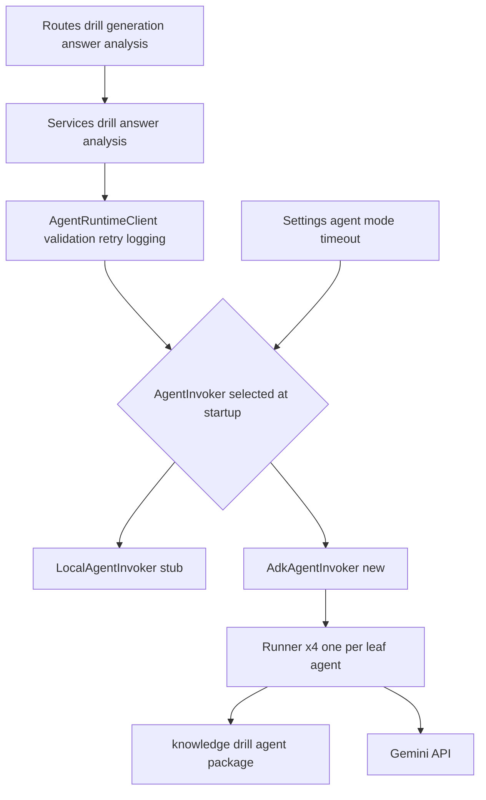
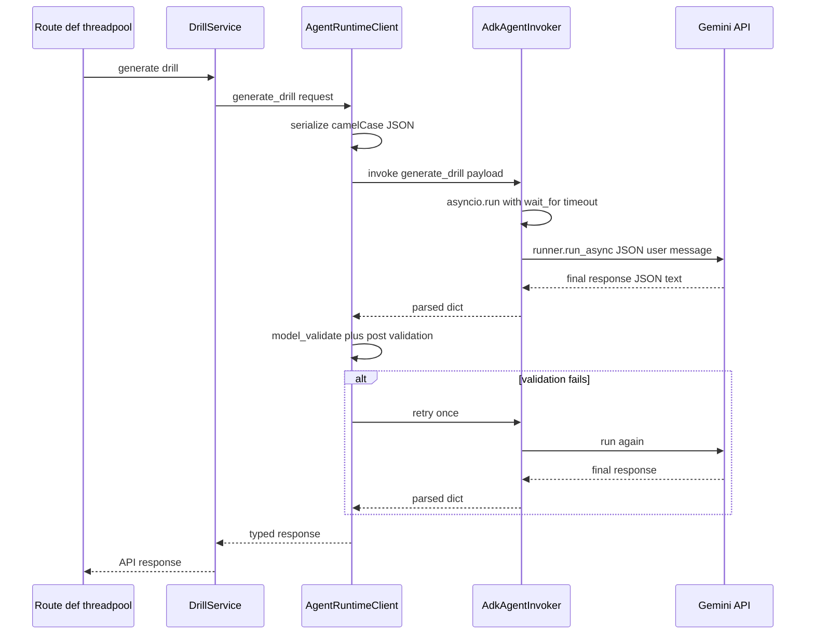

# Technical Design — real-agent-invocation

## Overview

**Purpose**: 本フィーチャーは、Knowledge Drills backend の4つのエージェント操作（ドリル生成・回答採点・失敗分析・パッチ提案）を、固定サンプル応答のスタブから Google ADK 製エージェントの実呼び出し（Gemini API）に切り替える能力を講座オーナー・受講者・運用者に提供する。

**Users**: 講座オーナーは実際の講座内容に即したドリル生成・分析・パッチ提案を、受講者は回答内容に応じた実採点を得る。開発者・運用者は運用設定で実接続とローカルスタブを切り替える。

**Impact**: 既存の `AgentRuntimeClient` → `AgentInvoker` 境界はそのまま維持し、`AgentInvoker` プロトコルの新実装 `AdkAgentInvoker` と設定駆動の注入切り替えを追加する。API 契約・フロントエンドは不変。本スペックは戦略（docs/hackathon-strategy.md）の Phase 0（前提基盤）であり、improvement_agent 統合（4→3化）は後続スペックが本基盤の上に構築する。

### Goals

- 4操作すべてを Gemini API を用いる実エージェント呼び出しで処理できるようにする（要件1〜3）
- スキーマ検証・再試行・タイムアウト・エラー応答・ログ方針を backend 境界で保証する（要件4）
- 運用設定による実接続／ローカルスタブの切り替えと、認証欠落の起動時 fail fast（要件5）
- 既存 API 契約と、外部接続なしで完結するテストスイートの維持（要件6）

### Non-Goals

- Firestore 実接続、Cloud Run デプロイ、CI/CD（別の前提タスク）
- improvement_agent への統合・エージェント構成変更（後続スペック）
- エージェント思考過程のストリーム表示・非同期ジョブ化・フロントエンド変更
- Agent Engine（Vertex AI）へのリモートデプロイ（research.md の Option B、将来拡張）

## Boundary Commitments

### This Spec Owns

- `AgentInvoker` プロトコルの実接続実装（`AdkAgentInvoker`）とタスク名→リーフエージェントの決定的マッピング
- invoker 選択の配線（`create_app`）と、それを制御する backend 設定（実行モード・タイムアウト）
- 実行モード `adk` 時の認証設定検証（起動時 fail fast）
- `AgentRuntimeClient` の採点応答の文脈整合性検証（questionId 一致・score 上限）の追加
- `AgentInvocationError` の HTTP エラー応答へのマッピング
- backend の依存関係追加（google-adk、agent パッケージへのパス参照）
- エージェント操作に到達するルートの実行方式（スレッドプール実行への変更）

### Out of Boundary

- エージェント定義・プロンプト・エージェント側スキーマの内容変更（agent パッケージの所有。単一親制約の回避に必要な最小のファクトリ追加のみ許容）
- サービス層のビジネスロジック、リポジトリ層、API のリクエスト・レスポンス形式
- フロントエンドおよび UI 挙動
- Gemini モデルの品質チューニング（プロンプト改善は agent パッケージ側の作業）

### Allowed Dependencies

- backend → `google-adk`（新規、agent/uv.lock と同系の 2.x に固定）および `knowledge_drill_agent` パッケージ（パス依存、import のみ）
- `AdkAgentInvoker` → `google.adk.runners.Runner` / `google.adk.sessions.InMemorySessionService` / `google.genai.types`
- 認証は google-genai の標準環境変数（`GOOGLE_API_KEY` または Vertex AI モード変数）に委譲する
- 依存方向: routes → services → `AgentRuntimeClient` → `AgentInvoker` 実装 → ADK/agent パッケージ。逆方向 import は禁止。agent パッケージは backend を import しない

### Revalidation Triggers

- `AgentInvoker` プロトコル（`Callable[[str, AgentPayload], AgentResponse]`）またはタスク名 4 種の変更
- backend 設定キー（実行モード・タイムアウト）の名称・意味の変更
- agent パッケージの公開面（エージェント名・入出力スキーマ・ファクトリ）の変更
- エージェント応答の検証位置（Pydantic 境界）の移動 — 後続の improvement_agent スペックは本境界を前提とする

## Architecture

### Existing Architecture Analysis

- 呼び出し境界は `AgentRuntimeClient._invoke_typed`（`backend/app/clients/agent_runtime_client.py:46`）に集約済み: camelCase シリアライズ → invoker 呼び出し → `model_validate` → ValidationError 時に計2試行 → `AgentInvocationError`。ログはタスク名・レイテンシ・件数のみ（ペイロード非出力）
- スタブ注入は `backend/app/main.py:59` の1箇所。この既存パターン（コンストラクタ注入）を維持する
- 全ルートが `async def` で同期サービスを呼ぶため、長時間の同期エージェント呼び出しはイベントループを停止させる（research.md 参照）。エージェント操作に到達するルート関数（下記 Routes def 化に一覧）のみ `def` 化してスレッドプールに逃がす

### Architecture Pattern & Boundary Map



**Architecture Integration**:
- Selected pattern: 既存の Ports & Adapters（`AgentInvoker` がポート、スタブ/ADK がアダプタ）を踏襲。新パターンは導入しない
- Domain boundaries: 検証・再試行は `AgentRuntimeClient`、LLM 実行は `AdkAgentInvoker`、モード選択は `create_app` + `Settings` に分離
- Existing patterns preserved: コンストラクタ注入、camelCase API 契約、ペイロード非出力ログ
- New components rationale: `AdkAgentInvoker` のみが新規境界（ADK/Gemini への唯一の接点）

### Technology Stack

| Layer | Choice / Version | Role in Feature | Notes |
|-------|------------------|-----------------|-------|
| Backend / Services | FastAPI（既存）+ Python 3.11 | エージェント操作 API | 5ルート関数を def 化（契約不変、Routes def 化参照） |
| Agent Runtime | google-adk 2.3.x（新規依存） | リーフエージェントの in-process 実行 | agent/uv.lock の解決済みバージョンに整合 |
| LLM | Gemini API（gemini-2.5-flash 既定） | 生成・採点・分析・パッチ | モデル名は `KNOWLEDGE_DRILL_AGENT_MODEL` で変更可 |
| Agent 定義 | knowledge_drill_agent パッケージ（既存） | プロンプト・入出力スキーマの所有 | backend からパス依存で import |
| 設定 | pydantic-settings（既存） | 実行モード・タイムアウト | `KNOWLEDGE_DRILLS_` prefix を踏襲 |

**運用設定（要件 5.1）**:

| 変数 | 既定値 | 用途 |
|------|--------|------|
| `KNOWLEDGE_DRILLS_AGENT_MODE` | `local` | `local`（スタブ）/ `adk`（実接続）の切り替え |
| `KNOWLEDGE_DRILLS_AGENT_TIMEOUT_SECONDS` | `60` | エージェント呼び出し1回あたりの打ち切り時間 |
| `KNOWLEDGE_DRILL_AGENT_MODEL` | `gemini-2.5-flash` | 使用モデル（agent パッケージが読む既存変数） |
| `GOOGLE_API_KEY` ほか | — | Gemini 認証（AI Studio モード。Vertex AI モードは `GOOGLE_GENAI_USE_VERTEXAI=TRUE` + `GOOGLE_CLOUD_PROJECT` + `GOOGLE_CLOUD_LOCATION`） |

## File Structure Plan

### New Files

```
backend/app/clients/
└── adk_agent_invoker.py     # AdkAgentInvoker: Runner構築・タスク名マッピング・async ブリッジ・タイムアウト・認証検証
backend/tests/
└── test_adk_agent_invoker.py  # フェイク Runner 注入によるユニットテスト（外部接続なし）
```

### Modified Files

- `backend/app/config.py` — `agent_mode`（`local`/`adk`）と `agent_timeout_seconds` を `Settings` に追加
- `backend/app/main.py` — `settings.agent_mode` による invoker 選択（`local` → `LocalAgentInvoker` / `adk` → `AdkAgentInvoker` ファクトリ呼び出し）
- `backend/app/clients/agent_runtime_client.py` — `_invoke_typed` に任意の事後検証フックを追加し、`grade_answer` で questionId 一致・score 上限を検証
- `backend/app/errors.py` — `AgentInvocationError` → HTTP 502 `agent_invocation_failed` のハンドラ追加
- `backend/app/routes/courses.py` / `drills.py` / `learn.py` — エージェント操作に到達するルート関数5つを `async def` → `def` に変更（対象一覧と legacy ルートの扱いは Routes def 化コンポーネント参照）
- `backend/pyproject.toml`（+ `uv.lock`） — `google-adk` 追加と agent パッケージへのパス依存（`[tool.uv.sources]`）
- `backend/tests/test_runtime_dependencies.py` — 依存リストのアサーション更新
- `backend/tests/test_agent_runtime_client.py` — 採点事後検証（一致・不一致・再試行）のテスト追加
- `agent/knowledge_drill_agent/agent.py` — （条件付き）単一親制約により個別 Runner 実行が阻害される場合のみ、スタンドアロンのリーフエージェント生成ファクトリを追加

## System Flows

実接続モードでのドリル生成の代表フロー（採点・分析・パッチも同型）:



- **再試行ポリシー（確定）**: 再試行の対象は検証失敗（スキーマ不適合・採点事後検証違反）のみで、既存の計2試行を維持する。invoker 内の実行失敗（接続・認証・タイムアウト・最終応答欠落）は `AgentInvocationError` として即時送出し、再試行しない。「retryable な実行失敗」の分類は導入しない（要件 4.1 / 4.2 の文言と一対一で対応）
- `AgentInvocationError` は専用ハンドラが 502 を返し、他リクエストの処理は継続する（要件 4.2）

## Requirements Traceability

| Requirement | Summary | Components | Interfaces | Flows |
|-------------|---------|------------|------------|-------|
| 1.1 | ドリル生成の実エージェント化 | AdkAgentInvoker, InvokerSelection | `__call__("generate_drill", payload)` | System Flows |
| 1.2 | 講座 Markdown をエージェント入力に渡す | AgentRuntimeClient（既存シリアライズ）, AdkAgentInvoker | JSON ユーザーメッセージ | System Flows |
| 1.3 | 生成応答のスキーマ検証後に公開 | AgentRuntimeClient | `DrillGenerationResponse` 検証 | System Flows alt |
| 2.1 | 採点の実エージェント化 | AdkAgentInvoker | `__call__("grade_answer", payload)` | System Flows |
| 2.2 | score が採点基準範囲内 | AgentRuntimeClient 事後検証 | `grade_answer` post-validation | System Flows alt |
| 2.3 | questionId 一致検証・不一致は保存しない | AgentRuntimeClient 事後検証 | `grade_answer` post-validation | System Flows alt |
| 3.1 | 失敗分析の実エージェント化 | AdkAgentInvoker | `__call__("analyze_failures", payload)` | System Flows |
| 3.2 | パッチ提案の実エージェント化 | AdkAgentInvoker | `__call__("propose_document_patch", payload)` | System Flows |
| 4.1 | 有限回数の再試行 | AgentRuntimeClient（既存2試行を維持） | `_invoke_typed` | System Flows alt |
| 4.2 | 失敗時サーバーエラー + 稼働継続 | ErrorHandler, Routes def 化 | 502 `agent_invocation_failed` | System Flows |
| 4.3 | 接続・認証失敗のログとエラー応答 | AdkAgentInvoker, ErrorHandler | `AgentInvocationError` | System Flows |
| 4.4 | タイムアウト打ち切り | AdkAgentInvoker | `asyncio.wait_for(timeout)` | System Flows |
| 4.5 | ペイロード内容をログに出さない | AgentRuntimeClient（既存）, AdkAgentInvoker | ログ方針 | — |
| 5.1 | モデル名・認証の運用設定 | Settings, 環境変数表 | `KNOWLEDGE_DRILL_AGENT_MODEL` ほか | — |
| 5.2 | adk モードで4操作すべて実呼び出し | InvokerSelection, AdkAgentInvoker | タスク名マッピング | — |
| 5.3 | local モードで従来のスタブ応答 | InvokerSelection, LocalAgentInvoker（既存） | — | — |
| 5.4 | 認証欠落の起動時報告 | AdkAgentInvoker ファクトリ | `create_adk_invoker()` 起動時検証 | — |
| 6.1 | API 契約の維持 | 全体（invoker 差し替えのみ） | 既存 API 契約 | — |
| 6.2 | 外部接続なしで全テスト成功 | テスト戦略（フェイク Runner 注入・local 既定） | — | — |

## Components and Interfaces

| Component | Domain/Layer | Intent | Req Coverage | Key Dependencies | Contracts |
|-----------|--------------|--------|--------------|------------------|-----------|
| AdkAgentInvoker | clients | ADK リーフエージェントの in-process 実行 | 1.1–3.2, 4.3–4.5, 5.2, 5.4 | google-adk (P0), agent pkg (P0) | Service |
| AgentRuntimeClient 拡張 | clients | 採点応答の文脈整合性検証 | 1.3, 2.2, 2.3, 4.1 | AdkAgentInvoker/LocalAgentInvoker (P0) | Service |
| InvokerSelection | app 起動 | 設定による invoker 選択 | 5.2, 5.3 | Settings (P0) | State |
| ErrorHandler 追加 | errors | AgentInvocationError の HTTP 応答化 | 4.2, 4.3 | AgentRuntimeClient (P1) | API |
| Routes def 化 | routes | エージェント操作のスレッドプール実行 | 4.2 | — | API |

### clients

#### AdkAgentInvoker

| Field | Detail |
|-------|--------|
| Intent | 4つのタスク名を対応するリーフエージェントの Runner 実行にマッピングし、最終応答 JSON を dict で返す |
| Requirements | 1.1, 1.2, 2.1, 3.1, 3.2, 4.3, 4.4, 4.5, 5.2, 5.4 |

**Responsibilities & Constraints**
- 起動時にリーフエージェント4つそれぞれの `Runner`（共有 `InMemorySessionService`）を構築し再利用する
- `__call__(task_name, payload)`: ペイロードを JSON 文字列化してユーザーメッセージとし、新規セッションで1回実行、`is_final_response()` の最終テキストを `json.loads` して返す
- 同期プロトコル維持: 内部で `asyncio.run(asyncio.wait_for(..., timeout))`。呼び出し元はスレッドプール上の同期ルート
- 失敗の正規化: 接続・認証エラー、タイムアウト、最終応答欠落、JSON パース不能はすべて `AgentInvocationError` に変換し、ペイロード内容を含めずログする
- スキーマ検証は行わない（backend の Pydantic 境界 = `AgentRuntimeClient` の責務）

**Dependencies**
- Outbound: `knowledge_drill_agent` パッケージ — リーフエージェント定義（P0）
- External: `google-adk` Runner/Sessions、Gemini API — LLM 実行（P0）

**Contracts**: Service [x]

##### Service Interface

```python
class AdkAgentInvoker:
    """AgentInvoker プロトコル実装。task_name -> leaf agent の決定的マッピング。"""

    def __init__(
        self,
        *,
        timeout_seconds: float,
        runner_factory: Callable[[], Mapping[str, Runner]] | None = None,  # テスト注入点
    ) -> None: ...

    def __call__(self, task_name: str, payload: AgentPayload) -> AgentResponse: ...
        # Raises: AgentInvocationError（未知タスク名・接続/認証失敗・タイムアウト・応答欠落・JSONパース不能）


def create_adk_invoker(settings: Settings) -> AdkAgentInvoker: ...
    # 起動時検証: 認証設定（GOOGLE_API_KEY または Vertex AI モード変数一式）の欠落を
    # 明確なメッセージ付き例外で報告する（要件 5.4）
```

- Preconditions: `create_adk_invoker` は `agent_mode == "adk"` のときのみ呼ばれる
- Postconditions: `__call__` は camelCase キーの dict を返すか `AgentInvocationError` を送出する
- Invariants: タスク名マッピングは `generate_drill` / `grade_answer` / `analyze_failures` / `propose_document_patch` の4つで固定

**Implementation Notes**
- Integration: リーフエージェントは `root_agent.sub_agents` に登録済み（単一親制約）。個別 Runner 構築が衝突する場合は agent パッケージのファクトリでスタンドアロン生成に切り替える（research.md 参照）
- Validation: `input_schema` は Runner 直接呼び出しでは強制されないため、ペイロード形状は既存のリクエストモデル（シリアライズ済み）を正とする
- Risks: google-adk 2.x と google-cloud-aiplatform の依存解決は実装冒頭に `uv lock` で確認

#### AgentRuntimeClient 拡張

| Field | Detail |
|-------|--------|
| Intent | 採点応答のリクエスト文脈との整合性検証を検証境界に追加する |
| Requirements | 1.3, 2.2, 2.3, 4.1 |

**Responsibilities & Constraints**
- `_invoke_typed` に任意の事後検証フック `post_validate: Callable[[ResponseT], str | None]`（違反理由 or None）を追加
- `grade_answer` は `response.question_id == request.question.id` かつ `response.score <= request.question.max_score` を検証。違反はスキーマ不適合と同じ再試行→`AgentInvocationError` パス
- 既存の2試行・ログ方針・他3操作の挙動は不変

**Contracts**: Service [x]（既存インターフェース不変、内部フックのみ）

### app 起動 / errors / routes

#### InvokerSelection（main.py）

- `create_app` で `settings.agent_mode` を分岐: `"adk"` → `create_adk_invoker(settings)`、それ以外 → `LocalAgentInvoker()`。注入先・サービス構成は不変（5.2, 5.3）

#### ErrorHandler 追加（errors.py）

##### API Contract

| Method | Endpoint | Request | Response | Errors |
|--------|----------|---------|----------|--------|
| — | 全エージェント操作エンドポイント共通 | — | `ErrorResponse` | 502 `agent_invocation_failed` |

- `AgentInvocationError` ハンドラを追加登録。メッセージにペイロード内容を含めない（4.2, 4.3, 4.5）

#### Routes def 化

対象はエージェント操作に到達する以下の **5 ルート関数のみ**。エージェントを呼ばないルートは `async def` のまま。パス・リクエスト・レスポンスは不変（4.2, 6.1）。

| ルート関数 | 定義位置 | エンドポイント | 変更 |
|-----------|---------|---------------|------|
| `generate_drill` | `backend/app/routes/courses.py:86` | POST `/api/courses/{course_id}/drill-runs` | `async def` → `def` |
| `analyze_course_drill` | `backend/app/routes/courses.py:122` | POST `/api/courses/{course_id}/drill-runs/{drill_run_id}/analyze` | `async def` → `def` |
| `analyze_drill` | `backend/app/routes/drills.py:26` | POST `/api/drill-runs/{drill_run_id}/analysis` | `async def` → `def` |
| `submit_answer` | `backend/app/routes/learn.py:42` | POST `/api/drills/{share_token}/answers` | `async def` → `def` |
| `submit_answer_legacy` | `backend/app/routes/learn.py:61` | POST `/api/learn/{share_token}/answers` | `async def` → `def` + `return await submit_answer(...)` を同期呼び出し `return submit_answer(...)` に変更 |

- `submit_answer_legacy` は `submit_answer` に委譲しているため、**両方を同時に `def` 化**し `await` を外す。片方のみの変更は禁止（legacy ルート破損の原因）
- 実装完了時の検証: `grep -n "async def" backend/app/routes/*.py` の結果にこの5関数が含まれないこと、および `rg "await submit_answer" backend/app/routes` が0件であることを確認する

## Error Handling

### Error Strategy

失敗は2系統に正規化する: (a) 検証失敗（スキーマ不適合・採点事後検証違反）= `AgentRuntimeClient` で再試行後 `AgentInvocationError`、(b) 実行失敗（接続・認証・タイムアウト・応答欠落）= `AdkAgentInvoker` で即時 `AgentInvocationError`。いずれも専用ハンドラが 502 を返し、プロセスは稼働継続する。

### Error Categories and Responses

- **System Errors (502 `agent_invocation_failed`)**: エージェント呼び出しの全失敗。ログにはタスク名・試行回数・例外種別のみ（ペイロード非出力）
- **User Errors (4xx)**: 既存の `AppError` 系（回答不一致等）は不変
- **起動時エラー**: `adk` モードで認証設定欠落 → 欠落変数名を明示した例外で起動失敗（5.4）

### Monitoring

既存の `app.agent` ロガー（タスク名・レイテンシ・エラー件数）を踏襲。`AdkAgentInvoker` も同方針で実行結果のみログする。

## Testing Strategy

### Unit Tests

1. `AdkAgentInvoker`: フェイク `runner_factory` 注入で4タスク名→対応 Runner の実行と最終応答 dict 化を検証（外部接続なし）
2. `AdkAgentInvoker`: タイムアウト超過・最終応答欠落・JSON パース不能が `AgentInvocationError` になること（4.3, 4.4）
3. `create_adk_invoker`: 認証設定欠落パターン（API キーなし・Vertex 変数不足）で欠落を明示して失敗すること（5.4）
4. `AgentRuntimeClient.grade_answer`: questionId 不一致・score 超過の応答が再試行され、2回目成功で回復／2回失敗で `AgentInvocationError`（2.2, 2.3, 4.1）
5. `Settings`: `agent_mode`/`agent_timeout_seconds` の既定値と環境変数上書き（5.1）

### Integration Tests

1. 既定（local モード）の `create_app` で既存の全操作フローが従来どおり成功する（5.3, 6.1, 6.2）
2. `agent_mode=adk` + 認証欠落で `create_app`（または invoker 生成）が明確に失敗する（5.4）
3. `AgentInvocationError` を送出するフェイク invoker を注入した API 呼び出しが 502 `agent_invocation_failed` を返し、後続リクエストが正常処理される（4.2）
4. 既存契約テスト（sample_outputs ↔ backend スキーマ）が引き続き成功する（6.1）

### Manual Smoke（CI 外・要件外の動作確認）

1. 実 API キーを設定した `adk` モードで、ドリル生成→採点→分析→パッチの4操作を1周させる手動スクリプト（`uv run` で実行。CI には含めない — 6.2）

## Security Considerations

- API キー等の認証情報は環境変数のみで扱い、コード・ログ・エラーレスポンスに出力しない（4.5 と同方針）
- 講座本文・受講者回答は Gemini API に送信される。ハッカソン MVP として許容し、デモ用データのみを扱う運用とする（本番顧客データの取り扱いは本スペックの範囲外）

## Performance & Scalability

- 実エージェント呼び出しは1回あたり数秒〜数十秒。`def` ルート（スレッドプール実行）によりイベントループは占有されず、同時実行上限は FastAPI スレッドプール（既定40）で MVP には十分
- タイムアウト既定 60 秒（`KNOWLEDGE_DRILLS_AGENT_TIMEOUT_SECONDS` で調整可能）
