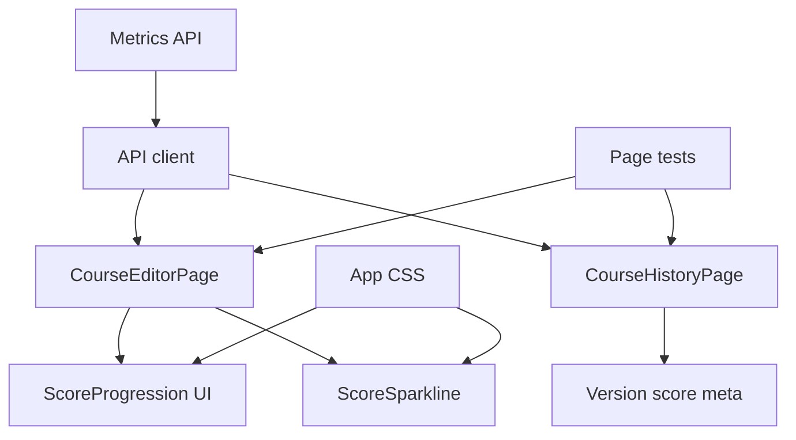

# Technical Design Document

## Overview

**Purpose**: Score Progression UI は、講座オーナーに複数 version の採点結果推移を見せ、教材改善ループの中間ステップと改善/悪化の方向を Course Editor と Course History 上で確認できるようにする。

**Users**: 講座オーナーが Course Editor でスコア率推移を確認し、Course History で version diff と平均点を同じ画面で照合する。

**Impact**: 既存の metrics API、API client、API 型をそのまま利用し、frontend の owner page と CSS と page tests だけを変更する。backend、learner view、講座状態カードの patch 導線は変更しない。

### Goals

- 採点済み metrics run 全件を Course Editor の `スコアの推移` として表示する。
- raw 点数表示は維持しつつ、差分・chip tone・sparkline はスコア率基準に統一する。
- Course History の version 行に平均点を添え、metrics 取得失敗時も履歴と diff を壊さない。
- `aria-label="改善メトリクス"` と owner/learner 境界を維持する。

### Non-Goals

- backend/API 契約、metrics 集計、owner check の変更。
- chart library や global state の導入。
- Drill Admin、learner view、Patch Review 導線の変更。
- metrics response order から時系列上の最新 run を推測すること。

## Boundary Commitments

### This Spec Owns

- Course Editor の Before / After metrics 表示を score progression 表示へ置き換える UI 振る舞い。
- Course Editor 内の scored run filter、course version sort、score rate delta 計算、sparkline 表示。
- Course History の version 行 meta に平均点を合成する page-level logic。
- Metrics 取得失敗時に owner page を継続表示する graceful degradation。
- `frontend/src/app/App.css` の metrics-card 関連 CSS。
- Course Editor / Course History の page tests 更新。

### Out of Boundary

- `GET /api/courses/{courseId}/metrics` の response shape 変更。
- `frontend/src/api/types.ts` と `frontend/src/api/client.ts` の契約変更。
- `CourseDetail`、revision API、diff API、learner API の変更。
- `最新パッチ` リンクの削除、置換、移動。
- `components/` への reusable chart component 抽出。

### Allowed Dependencies

- `frontend/src/api/client.ts` の既存 `api.getCourseMetrics`、`api.listCourseRevisions`、`api.diffCourseRevisions`。
- `frontend/src/api/types.ts` の既存 `CourseMetricsResponse` / `CourseMetricsRun` / `CourseRevisionSummary`。
- React local state / effect と React Router の既存 page patterns。
- 既存 CSS variables、card/chip/select-row class。
- 依存方向: `pages -> api`、`pages -> components`、`pages -> lib`。本 spec では新規 `components` / `lib` は追加しない。

### Revalidation Triggers

- `CourseMetricsRun` に時系列 field が追加され、同一 version run の選択規則を「応答順の最後」から変更したくなった場合。
- `CourseMetricsRun.maxScore` の nullability、意味、または 0 許容が変わる場合。
- Metrics API の owner check または response order 契約が変わる場合。
- Course Editor の講座状態カード構造または `最新パッチ` 導線が別 spec で変わる場合。
- Learner route に owner metrics を出す要求が出た場合。

## Architecture

### Existing Architecture Analysis

- `CourseEditorPage.tsx` は page-local state と helper で form、course load、metrics comparison を管理している。`loadCourseMetrics` は API failure を `null` に落として、course load 自体を失敗させない。
- `CourseHistoryPage.tsx` は revisions load と selected version の diff load を分けている。metrics はまだ読んでいない。
- `api.getCourseMetrics` と `CourseMetricsResponse` / `CourseMetricsRun` は既に存在するため、API/client/type の変更は不要である。
- `App.css` の `.metrics-card__body` は 2 カラム grid で、progression には sparkline + flow の縦積みが必要になる。
- `.kiro/steering/` は存在しないため、frontend skill と既存 page patterns を設計基準にする。

### Architecture Pattern & Boundary Map



**Architecture Integration**:
- Selected pattern: page-local extension。既存 owner page に helper と表示部品を追加する。
- Domain/feature boundaries: Course Editor は score progression、Course History は version meta 合成だけを持つ。
- Existing patterns preserved: API は page effect から呼ぶ。component から API import しない。page tests は mocked API response で検証する。
- New components rationale: `ScoreSparkline` は Course Editor 専用で、shared component 化しない。
- Steering compliance: `.kiro/steering/` は未配置。frontend skill の浅い構造、依存方向、完了前チェックに従う。

### Technology Stack

| Layer | Choice / Version | Role in Feature | Notes |
|-------|------------------|-----------------|-------|
| Frontend | React v19 + TypeScript v6 + Vite v8 | owner page UI と local state | 既存 stack。詳細 version は `frontend/package.json` を参照 |
| Testing | Vitest v4 + Testing Library | page-level behavior tests | 既存 stack。詳細 version は `frontend/package.json` を参照 |
| Styling | `frontend/src/app/App.css` | metrics card layout と responsive flow | 新規 dependency なし |
| Backend / Services | 既存 metrics API | データ供給 | 変更しない |

## File Structure Plan

### Directory Structure

```text
frontend/src/
├── pages/
│   ├── CourseEditorPage.tsx        # score progression helper, card, sparkline
│   ├── CourseEditorPage.test.tsx   # score progression rendering and filtering tests
│   ├── CourseHistoryPage.tsx       # metrics load and version meta composition
│   └── CourseHistoryPage.test.tsx  # version average and failure degradation tests
└── app/
    └── App.css                     # metrics card, sparkline, flow styles
```

### Modified Files

- `frontend/src/pages/CourseEditorPage.tsx` - `MetricsComparison` を `ScoreProgression` に置き換え、全 scored run の表示、score rate delta、sparkline、metrics failure degrade を保持する。
- `frontend/src/pages/CourseHistoryPage.tsx` - revisions と metrics を並行取得し、version ごとの平均点 meta を作る。metrics failure は `null` として扱う。
- `frontend/src/app/App.css` - `.metrics-card__body` を sparkline + flow 向けに変更し、`.metrics-sparkline`、`.metrics-flow`、`.metrics-flow__step`、`.metrics-flow__delta` を追加する。
- `frontend/src/pages/CourseEditorPage.test.tsx` - Before / After 期待を `スコアの推移` と score rate delta 期待に更新し、3 run、未採点除外、metrics failure を追加する。
- `frontend/src/pages/CourseHistoryPage.test.tsx` - `getCourseMetrics` mock を追加し、平均点表示、未採点非表示、metrics failure degrade、同一 version 応答順の最後を検証する。

### Unmodified Files

- `frontend/src/api/types.ts` - `CourseMetricsResponse` / `CourseMetricsRun` は既存契約を使用する。
- `frontend/src/api/client.ts` - `api.getCourseMetrics` は既存 method を使用する。
- backend / agent / learner page - 本 spec の境界外。

## Requirements Traceability

| Requirement | Summary | Components | Interfaces | Flows |
|-------------|---------|------------|------------|-------|
| 1.1 | 2 件以上の scored run でカード表示 | CourseEditorPage, ScoreProgressionCard | CourseMetricsResponse | editor load |
| 1.2 | 回答あり計測済み run を含める | ScoreProgressionBuilder | CourseMetricsRun | editor load |
| 1.3 | 未採点または未計測 run を除外 | ScoreProgressionBuilder | CourseMetricsRun | editor load |
| 1.4 | version 昇順と同一 version 応答順維持 | ScoreProgressionBuilder | CourseMetricsRun | editor load |
| 1.5 | 2 件未満はカード非表示 | CourseEditorPage | ScoreProgression | editor load |
| 1.6 | version、平均点、満点、回答数表示 | ScoreProgressionCard | ScoredMetricsRun | editor render |
| 1.7 | 区間スコア率差分表示 | ScoreProgressionCard | score rate helper | editor render |
| 1.8 | 総スコア率差分 chip 表示 | ScoreProgressionCard | ScoreProgression | editor render |
| 1.9 | 非負総差分は success tone | ScoreProgressionCard | ScoreProgression | editor render |
| 1.10 | 負総差分は warning tone | ScoreProgressionCard | ScoreProgression | editor render |
| 1.11 | Editor metrics failure でカードだけ省略 | CourseEditorPage | loadCourseMetrics | editor load |
| 2.1 | score rate sparkline 表示 | ScoreSparkline | ScoredMetricsRun | editor render |
| 2.2 | 差分、tone、折れ線を score rate で統一 | ScoreProgressionBuilder, ScoreSparkline | score rate helper | editor render |
| 2.3 | カード accessible name 維持 | ScoreProgressionCard | aria-label | editor render |
| 2.4 | sparkline alternative label | ScoreSparkline | aria-label | editor render |
| 2.5 | narrow width で flow を折り返す | App.css | metrics flow CSS | responsive render |
| 3.1 | History で revisions と metrics を並行取得 | CourseHistoryPage | api.getCourseMetrics | history load |
| 3.2 | version 行に平均点表示 | CourseHistoryPage | VersionScoreMap | history render |
| 3.3 | 同一 version は response order の最後 | CourseHistoryPage | VersionScoreMap | history load |
| 3.4 | scored run なしは日時のみ | CourseHistoryPage | VersionScoreMap | history render |
| 3.5 | 平均点と日時を区切り表示 | CourseHistoryPage | formatVersionMeta | history render |
| 3.6 | History metrics failure で平均点だけ省略 | CourseHistoryPage | loadCourseMetrics | history load |
| 4.1 | 講座状態カードの役割維持 | CourseEditorPage | existing side list | editor render |
| 4.2 | 最新パッチ link を維持 | CourseEditorPage | existing Link | editor render |
| 4.3 | owner pages に限定 | CourseEditorPage, CourseHistoryPage | route boundaries | owner render |
| 4.4 | learner view に表示しない | File boundary | no learner files | route boundary |
| 4.5 | API shape 変更なし | API boundary | existing types/client | integration |

## Components and Interfaces

| Component | Domain/Layer | Intent | Req Coverage | Key Dependencies | Contracts |
|-----------|--------------|--------|--------------|------------------|-----------|
| ScoreProgressionBuilder | Frontend page helper | metrics runs から表示可能 progression を作る | 1.1-1.5, 1.7-1.10, 2.2 | CourseMetricsResponse (P0) | State |
| ScoreProgressionCard | Frontend UI | progression の見出し、chip、run flow を表示する | 1.1, 1.6-1.10, 2.3 | ScoreProgressionBuilder (P0), App.css (P1) | State |
| ScoreSparkline | Frontend UI | score rate の折れ線を SVG で表示する | 2.1, 2.2, 2.4 | ScoreProgressionCard (P0) | State |
| CourseHistoryVersionScores | Frontend page helper | metrics を version meta 用 map に変換する | 3.1-3.6 | CourseMetricsResponse (P0) | State |
| MetricsStyles | CSS | metrics card の縦積み layout と responsive flow | 2.5 | App.css variables (P1) | State |
| PageTests | Test | page behavior と degrade を検証する | 1.1-4.5 | mocked api client (P0) | State |

### Frontend Page Layer

#### ScoreProgressionBuilder

| Field | Detail |
|-------|--------|
| Intent | `CourseMetricsResponse` から Course Editor の progression state を作る |
| Requirements | 1.1-1.5, 1.7-1.10, 2.2 |

**Responsibilities & Constraints**
- scored run は `answerCount > 0`、`averageScore !== null`、`maxScore !== null`、`maxScore > 0` を満たす run とする。
- sort は `courseVersion` 昇順、同一 version は metrics 応答内の元 index 昇順とする。
- progression が 2 run 未満なら `null` を返す。
- score rate は `averageScore / maxScore`、delta は rate 差分を 100 倍したパーセントポイントとして扱う。

**Dependencies**
- Inbound: `CourseEditorPage` - render 判定 (P0)
- Outbound: `CourseMetricsResponse` - existing API response (P0)

**Contracts**: Service [ ] / API [ ] / Event [ ] / Batch [ ] / State [x]

##### State Management
- State model:
  - `ScoredMetricsRun = CourseMetricsRun & { averageScore: number; maxScore: number }`
  - `ScoreProgression = { runs: ScoredMetricsRun[]; totalRateDelta: number }`
- Invariants:
  - `runs.length >= 2`
  - Every `run.maxScore > 0`
  - `totalRateDelta = (last.averageScore / last.maxScore - first.averageScore / first.maxScore) * 100`

**Implementation Notes**
- Integration: Existing `buildMetricsComparison` を `buildScoreProgression` に置き換える。
- Validation: Unit-level export は不要。page test で visible behavior を検証する。
- Risks: `maxScore` が 0 の fixture が入ると division が破綻するため、filter で除外する。

#### ScoreProgressionCard

| Field | Detail |
|-------|--------|
| Intent | progression 全体を owner に表示する |
| Requirements | 1.1, 1.6-1.10, 2.3 |

**Responsibilities & Constraints**
- `article` の accessible name は `改善メトリクス` を維持する。
- 見出しは `スコアの推移` とする。
- chip tone は `totalRateDelta >= 0` なら success、負なら warning とする。
- 各 run は `v{courseVersion}`、`averageScore.toFixed(1) / maxScore 点`、`回答 {answerCount} 件` を表示する。
- run 間には区間 score rate delta を `+32.5 pp` のような符号付き 1 桁小数で表示する。

**Dependencies**
- Inbound: `CourseEditorPage` - progression props (P0)
- Outbound: `ScoreSparkline` - visual trend (P1)
- Outbound: `App.css` - layout and typography (P1)

**Contracts**: Service [ ] / API [ ] / Event [ ] / Batch [ ] / State [x]

##### State Management
- Receives immutable `ScoreProgression` props and derives only presentation labels.
- Does not call API and does not mutate page state.

**Implementation Notes**
- Integration: Existing `MetricRunColumn` can be renamed/adapted for progression steps.
- Validation: tests assert title, card label, all versions, raw scores, answer counts, interval deltas, total delta, and filtered run absence.
- Risks: `pp` text may wrap; CSS flow must allow wrapping without changing fixed sparkline height.

#### ScoreSparkline

| Field | Detail |
|-------|--------|
| Intent | score rate trend を compact SVG として表示する |
| Requirements | 2.1, 2.2, 2.4 |

**Responsibilities & Constraints**
- Uses score rate for y-axis normalization so run-specific maxScore differences do not contradict delta/tone.
- Provides `role="img"` and `aria-label="バージョンごとのスコア率の推移"`。
- Has no external chart dependency and no API dependency.
- Uses stable viewBox and preserves layout height.

**Dependencies**
- Inbound: `ScoreProgressionCard` - runs props (P0)
- Outbound: `App.css` - `.metrics-sparkline` color and dimensions (P1)

**Contracts**: Service [ ] / API [ ] / Event [ ] / Batch [ ] / State [x]

##### State Management
- Input: `runs: ScoredMetricsRun[]`
- Derived points:
  - x positions distribute evenly across the viewBox.
  - y positions use `1 - averageScore / maxScore` with top/bottom padding.
- Invariants:
  - `runs.length >= 2`
  - every run has `maxScore > 0`

**Implementation Notes**
- Integration: SVG can be inline in `CourseEditorPage.tsx`.
- Validation: testing should assert accessible label exists; pixel-perfect SVG testing is out of scope.
- Risks: identical scores produce flat line; still valid and should render circles.

#### CourseHistoryVersionScores

| Field | Detail |
|-------|--------|
| Intent | Course History の version row meta に平均点を追加する |
| Requirements | 3.1-3.6 |

**Responsibilities & Constraints**
- revisions load と metrics load を同一 effect で並行実行する。
- metrics load failure は `null` に落とし、revisions load failure とは分離する。
- scored run は Course Editor と同じ guard を使う。
- 同一 version の複数 run は iteration の後勝ちで map を上書きする。これは response order の最後であり、時系列上の最新とは扱わない。
- row meta は `[scoreText, dateText].filter(Boolean).join(' · ')` で作る。

**Dependencies**
- Inbound: `CourseHistoryPage` - ready state render (P0)
- Outbound: `api.listCourseRevisions` - revisions (P0)
- Outbound: `api.getCourseMetrics` - metrics (P1)
- Outbound: `api.diffCourseRevisions` - existing diff behavior (P0)

**Contracts**: Service [ ] / API [x] / Event [ ] / Batch [ ] / State [x]

##### API Contract

| Method | Endpoint | Request | Response | Errors |
|--------|----------|---------|----------|--------|
| GET | `/api/courses/{courseId}/metrics` | none | `CourseMetricsResponse` | metrics failure degrades to no averages |
| GET | `/api/courses/{courseId}/revisions` | none | `CourseRevisionListResponse` | history page failure |
| GET | `/api/courses/{courseId}/revisions/diff` | `from`, `to` query | `CourseRevisionDiff` | diff panel failure |

##### State Management
- Page state can remain `ready` with revisions plus derived `versionScores`.
- If metrics is `null`, version meta displays only date or `-`.

**Implementation Notes**
- Integration: add `getCourseMetrics` to the existing vi mock in `CourseHistoryPage.test.tsx`.
- Validation: tests cover scored version, unscored version, metrics failure, and duplicate version response order.
- Risks: long meta text can exceed narrow select row; current text remains compact, but mobile smoke should verify no overlap.

## Data Models

### Domain Model

- `CourseMetricsRun`: existing API item for one drill run's course version, answer count, average score, and max score.
- `ScoredMetricsRun`: UI value object that narrows `averageScore` and `maxScore` to numbers and requires `answerCount > 0` and `maxScore > 0`.
- `ScoreRate`: `averageScore / maxScore`, expressed internally as 0-1 ratio and formatted deltas as percentage points.
- `VersionScore`: Course History row meta value `{ averageScore: number; maxScore: number }` selected by course version.

### Data Contracts & Integration

- No backend schema or API response changes.
- Existing null semantics are preserved:
  - `averageScore: null` or `maxScore: null` means not displayed in progression or version score map.
  - `answerCount: 0` means not displayed in progression or version score map.
- Defensive UI guard:
  - `maxScore <= 0` is treated as not scored for this UI because score rate cannot be defined.

## Error Handling

### Error Strategy

- Course Editor:
  - `api.getCourse(courseId)` failure remains a page failure.
  - `api.getCourseMetrics(courseId)` failure returns `null`; score progression card is omitted.
- Course History:
  - `api.listCourseRevisions(courseId)` failure remains a page failure.
  - `api.getCourseMetrics(courseId)` failure returns `null`; version rows show date only.
  - `api.diffCourseRevisions` failure remains a diff panel failure.

### Error Categories and Responses

- Metrics failure: graceful degradation with no owner-facing error banner, because primary course editing/history workflow still works.
- Revisions or course load failure: existing error banner behavior stays unchanged.
- Invalid metric values (`maxScore <= 0`): omit affected run from score-derived UI.

## Testing Strategy

### Unit and Page Tests

- `CourseEditorPage.test.tsx`:
  - Update existing Before / After test to expect `スコアの推移`, `aria-label="改善メトリクス"`, raw scores, and `pp` deltas.
  - Add 3-run progression test for all versions, interval score rate deltas, and total score rate delta.
  - Add filtering test for `answerCount: 0`, null scores, and `maxScore <= 0`.
  - Add metrics failure test proving course form still renders and progression card is absent.
- `CourseHistoryPage.test.tsx`:
  - Add `getCourseMetrics` mock with default `{ runs: [] }`.
  - Add version row average display test.
  - Add no-score row test.
  - Add duplicate version test proving response order's last scored run wins.
  - Add metrics failure test proving revisions and diff still render.

### Verification Commands

- `npm run typecheck`
- `npm run lint`
- `npm test -- CourseEditorPage.test.tsx CourseHistoryPage.test.tsx` or equivalent Vitest filter

### Manual / Visual Checks

- Course Editor desktop width: sparkline, run flow, chip, and side card render without overlap.
- Course Editor mobile width: `.metrics-flow` wraps without text collision.
- Course History version rows: average + date meta remains readable.
- Learner routes are not modified and do not show metrics.
