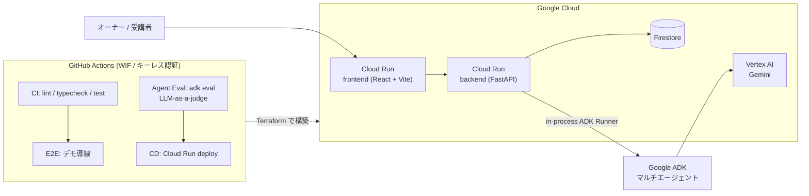
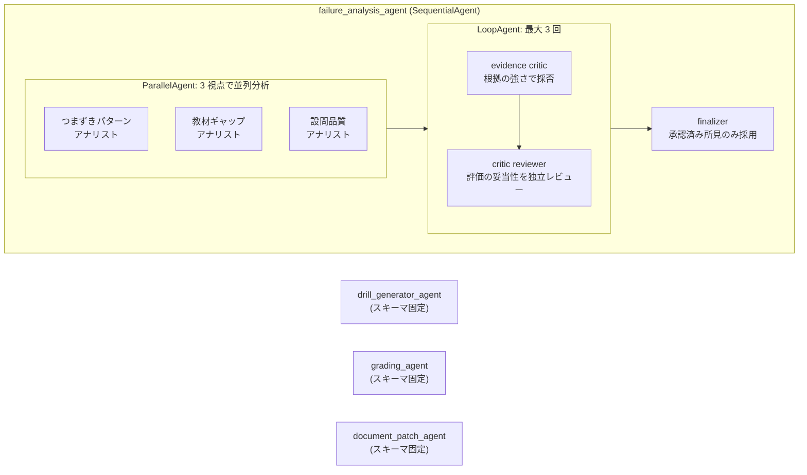

# Knowledge Drills

> **書いた瞬間から腐っていくドキュメントに、DevOps を。**
> 受講者のつまずきをテレメトリとして、資料が自分で改善プロポーザルを出す。

Markdown 教材から AI が確認ドリルを生成し、受講者の誤答データを分析エージェントが
自律分析して教材の改善パッチを起案する、ナレッジの CI/CD アプリケーション。

RAG が「ドキュメントを使って AI が答える」なら、Knowledge Drills はその逆張り —
**AI がドキュメント自身を直す**。


## DevOps のフィードバックループを「知識」に適用する

| DevOps | Knowledge Drills |
|---|---|
| コード | 教材 Markdown |
| 本番テレメトリ / インシデント | 受講者の誤答データ |
| SRE / 障害分析 | 分析エージェント（つまずき特定 → 根拠照合 → 方針判断） |
| 修復 PR | Markdown パッチ提案 |
| PR レビュー | パッチレビュー（独立レビューエージェント + 人間の承認） |
| デプロイ | パッチ適用（教材バージョンの increment） |
| SLO 改善の確認 | Before / After 平均点（v1 1.8 → v3 3.6） |

## 2 分で改善ループを一周する

ログインすると回答データ投入済みのデモ講座が用意されます。

1. **デモ講座を開く** — 採点済み回答 4 件と設問別のつまずきが見える
2. **受講者として回答する** — 共有 URL からログイン不要で回答・AI 採点
3. **分析エージェントを実行** — 実行状況がタイムラインで流れ、パッチ要否を自律判断
4. **提案されたパッチをレビューして適用** — 判断ログと diff を確認。却下すると、その理由は次回の分析で考慮される
5. **スコアの推移で効果を確認** — 教材 v1 平均 1.8 点 → v3 平均 3.6 点。改善が数字で閉じる


## アーキテクチャ



### エージェント構成

信頼性が要る所は決定的に、判断が要る所は自律的に。ドリル生成と採点は
`output_schema` 固定の単一エージェント、誤答分析は ADK の
Sequential / Parallel / Loop を組み合わせた複合エージェントで構成しています。



- **提案者と検証者の分離**: パッチの根拠を作る分析側と、その妥当性を審査する
  critic / reviewer は別コンテキストの別エージェント。コードの author と reviewer を
  分けるのと同じ理由です
- **見送り判断**: 分析エージェントは「パッチを出さない」判断を含めて自律的に決めます。
  却下されたパッチの理由は次回分析の入力になります
- **ガードレール**: エージェント出力は backend の Pydantic 境界で検証
  （設問の根拠が教材本文に実在するか、スコアが満点を超えないか、サンプル数が
  実データと一致するか）。検証に落ちた出力は配布されません

### 設計判断

- **Agent Engine ではなく in-process ADK Runner**: 同期 API 要件とデプロイの単純さを優先。
  invoker は `agent_mode` で差し替え可能な抽象のため、スケール時は Agent Engine へ移行できます
- **swarm ではなく決定的オーケストレーション + 自律判断**: 分析の実行順は固定し、
  各ステップ内の判断（採否・見送り・対象セクション）だけを自律化。監査可能な
  判断ログ（分析タイムライン）を UI にそのまま出せる構成にしています

## エージェントのテスト戦略

「このエージェント自身も DevOps で動いている」を成立させるための 4 層です。

| レイヤー | LLM | 何を守るか | いつ走るか |
|---|---|---|---|
| unit（pytest / vitest） | なし | ロジック・スキーマ境界 | 全 PR |
| E2E（Playwright, local モード） | なし | デモ導線・画面の配線 | CI 成功後の PR |
| **Agent Eval（`adk eval` + LLM-as-a-judge）** | **実 Gemini** | 4 エージェントの応答品質 | `agent/**` 差分の PR / main push |
| フルスタック E2E（opt-in） | 実 Gemini | backend ↔ ADK の接続 | `E2E_LLM=1` 手動 |

- Agent Eval は rubric ベースの LLM judge（`rubric_based_final_response_quality_v1`）で
  「採点は回答に書かれた内容だけを根拠にしているか」等を判定します。経費精算・情シス・勤怠の
  3 ジャンルを 4 エージェント縦断で共有し、単一ジャンルへの過学習を検出します
- **main push では Agent Eval がデプロイゲート**になります。`agent/**` の変更は
  LLM-as-a-judge を通過しない限り Cloud Run にデプロイされません。無関係な変更は
  ゲートをバイパスする path ベースの選択的ゲートです

## 構成

| ディレクトリ | 内容 |
|---|---|
| `backend/` | FastAPI（Cloud Run）。アプリの信頼境界: Firestore 更新・schema 検証・diff 生成 |
| `frontend/` | Vite + React + TypeScript |
| [`agent/`](agent/README.md) | Google ADK エージェント（ドリル生成 / 採点 / 誤答分析 / パッチ生成）+ eval |
| `terraform/` | Google Cloud インフラ（Cloud Run / Artifact Registry / WIF 等） |

## 開発

通常の開発操作はリポジトリ直下の `Makefile` から実行する。

| 目的 | コマンド |
|---|---|
| backend / frontend の dev server 起動 | `make dev` |
| backend の dev server 起動 | `make dev-backend` |
| frontend の dev server 起動 | `make dev-frontend` |
| 依存関係のインストール | `make install` |
| lint / typecheck / test | `make check` |
| test | `make test` |
| lint | `make lint` |
| typecheck | `make typecheck` |
| format | `make format` |
| frontend build | `make build-frontend` |

ローカルはデフォルトで認証なし・in-memory ストレージ・決定的なローカルエージェントで動くため、
`make dev` だけで改善ループを一周できます（LLM 呼び出しなし）。

個別に確認する場合は次を使う。これらは外部接続・認証情報なしで成功することを前提にしている。

```sh
cd backend && uv run --native-tls --frozen pytest && uv run --native-tls --frozen ruff check . && uv run --native-tls --frozen mypy .
cd agent   && uv run --native-tls --frozen pytest && uv run --native-tls --frozen ruff check . && uv run --native-tls --frozen mypy .
cd frontend && npm test && npm run lint && npm run typecheck && npm run build
```

frontend は `npm` と `package-lock.json` を使う。主な npm scripts は `dev`、`test`、
`test:e2e`、`typecheck`、`build`、`lint`、`depcheck`、`knip`、`preview`。

Playwright E2E はローカルでも実行できる（バックエンド・フロントエンドは自動起動）。

```sh
cd frontend && npm run test:e2e
```

Terraform は `terraform/` で管理する。通常の確認は `fmt`、`validate`、`plan` までとし、
`apply` はインフラ状態を変更するため明示的な実行判断を必要とする。

```sh
cd terraform
terraform fmt
terraform validate
terraform plan
```

Codex の project-local command rules は `.codex/rules/default.rules` に置く。この repository が
trusted のときだけ読み込まれ、通常の `uv run --native-tls` / `npm` / `make` /
Terraform 確認コマンドを許可し、`terraform apply` / `destroy` は拒否する。

## CI / CD

CI は Backend / Frontend / E2E / Agent Eval で workflow を分け、該当ディレクトリに差分がある
PR だけで実行する。

- `.github/workflows/backend-ci.yml`: `backend/**` / `agent/**` の通常 CI
- `.github/workflows/frontend-ci.yml`: `frontend/**`
- `.github/workflows/e2e.yml`: CI 成功後にデモ導線の Playwright E2E を実行する
- `.github/workflows/agent-eval.yml`: `agent/**` 差分時に eval 専用 WIF で実 Gemini eval を実行する
- `.github/workflows/backend-cd.yml` / `frontend-cd.yml`: main push で Cloud Run へデプロイ。
  agent 変更時は Agent Eval の成功を待ってからデプロイする

`agent-eval.yml` は deploy 用 service account ではなく、Terraform が作成する
eval 専用 service account を使う。Terraform apply 後、repository variables に
`GCP_AGENT_EVAL_WORKLOAD_IDENTITY_PROVIDER` と `GCP_AGENT_EVAL_SERVICE_ACCOUNT` を設定する。

## Agent eval をローカルで回す

エージェントの出力品質は `adk eval` で回帰検証する（実 Gemini 呼び出しが発生。
1エージェントあたり1〜2分・数円程度）。CI では `agent/**` 差分時に
`.github/workflows/agent-eval.yml` が eval 専用 service account で同じ wrapper を実行する。
詳細な設計と全コマンドは
[`agent/evals/README.md`](agent/evals/README.md) を参照。

```sh
cd agent

# 認証（初回のみ）
gcloud auth application-default login
cp .env.example .env
# .env の GOOGLE_CLOUD_PROJECT を、Vertex AI で gemini-3.1-flash-lite を
# global endpoint から実行できるプロジェクトに変更する

# 全 eval を実行し、ADK の結果 JSON を読んで失敗時は非ゼロ終了する
python scripts/run_adk_evals.py
```

注意:

- `--isolated` は必須。省くと .venv に eval 依存（numpy 等）が残り、以後の `mypy .` が
  失敗する（復旧は `cd agent && uv sync --frozen`）。`scripts/run_adk_evals.py` は内部で
  `--isolated` を付けて実行する
- `adk eval` は eval 失敗時も exit code 0 を返すことがあるため、直接呼ばず
  `scripts/run_adk_evals.py` を使う
- 実行結果の詳細 JSON は `agent/evals/*/.adk/eval_history/` に保存される（gitignore 済み）
