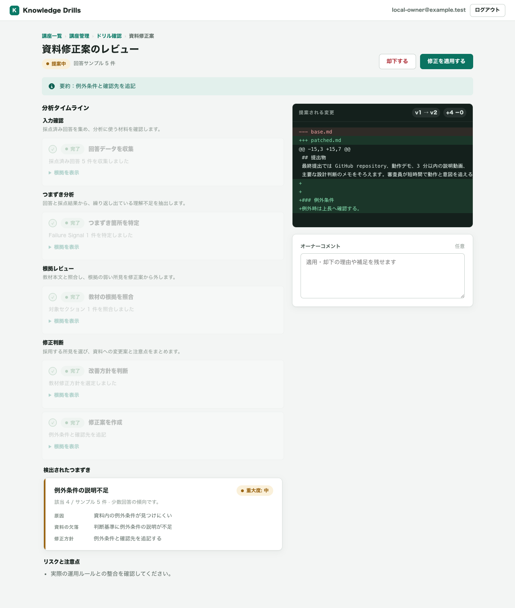
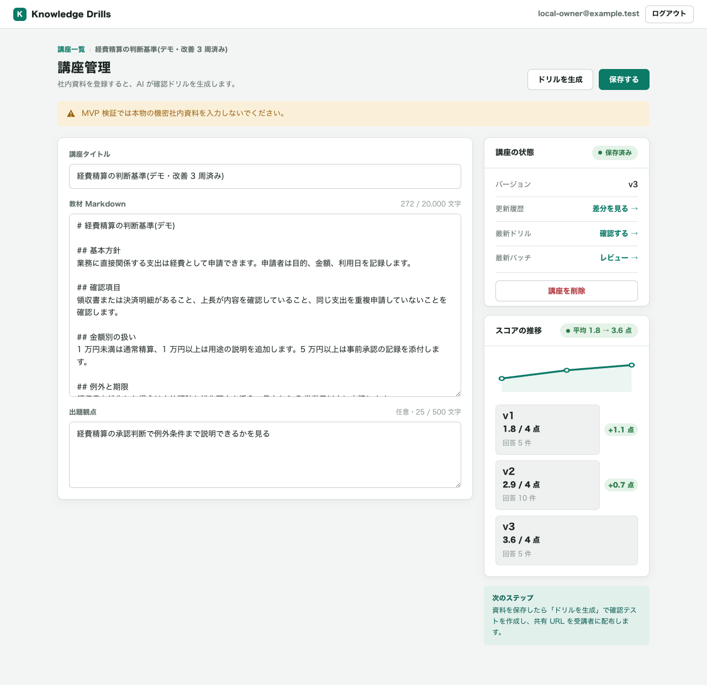
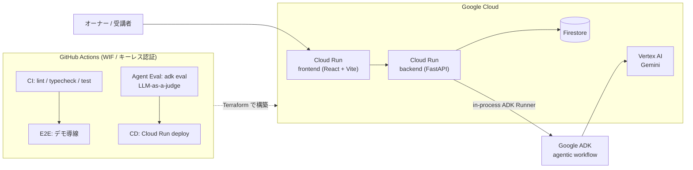
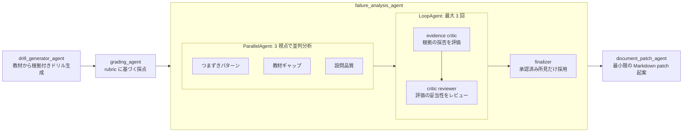

# 書いた瞬間から腐っていくドキュメントに、DevOps を — 受講者のつまずきをテレメトリとして、資料が自分で改善プロポーザルを出す「Knowledge Drills」

Status: Draft v0.2（2026-07-09）
用途: ブログ公開 / Proto Pedia 掲載文 / デモ動画（3分）の台本ベース
提出先: [DevOps × AI Agent Hackathon 2026](https://findy.notion.site/devops-ai-agent-hackathon-2026)

- GitHub: 【リポジトリ URL】
- デプロイ URL: 【Cloud Run URL】
- デモ動画: 【動画 URL】
- **回答体験（ログイン不要・1分）: 【公開講座の共有 URL】** — あなたの回答がこのプロダクトのテレメトリになります

---

## ドキュメントには、テレメトリがない

コードには DevOps がある。テストが落ちれば気づけるし、エラー率が上がればアラートが飛ぶ。
壊れたことを観測して、直して、デプロイする。このループが当たり前になって久しい。

一方で、研修資料やオンボーディングドキュメントはどうか。

書いた瞬間から腐り始めるのに、**「読者がどこでつまずいたか」を作者が知る術がない**。
分かりにくい章はずっと分かりにくいまま放置され、新人は毎年同じ場所で迷子になる。
壊れているのに、壊れたというシグナルがどこにも上がってこない。

Knowledge Drills は、この「テレメトリのないドキュメント」に DevOps のループを持ち込むアプリケーションだ。

> **受講者のつまずきをテレメトリとして、資料が自分で改善プロポーザルを出す。**

RAG のように「ドキュメントを使って AI が答える」のではない。**AI がドキュメント自身を直す**、その逆張りである。

このプロダクトでやっているのは、教育ツールというより **ドキュメント運用の DevOps 化** だ。

| DevOps | Knowledge Drills |
|---|---|
| コード | 講座 Markdown |
| 本番テレメトリ / インシデント | 受講者の誤答データ |
| 障害分析 | 分析エージェントによるつまずき特定・根拠照合・方針判断 |
| 修復 PR | Markdown patch 提案 |
| PR レビュー | 独立した critic / reviewer と人間の承認 |
| デプロイ | patch apply による講座 version 更新 |
| SLO 改善の確認 | Before / After 平均点の推移 |

## 何をするものか: ナレッジの CI/CD ループ

Markdown で書いた講座を投入すると、次のループが回る。

```
講座 Markdown
   │ つくる
   ▼
実務シナリオ型ドリル生成（3問・出題根拠付き）
   │
   ▼
share URL で受講者が回答 ──▶ rubric に基づく自動採点
   │ まわす
   ▼
誤答傾向の分析（根拠・判断ログ・タイムライン付き）
   │
   ▼
講座 Markdown への改善パッチを自動起案（diff + リスクノート）
   │
   ▼
人間がレビューして apply / reject ──▶ 講座 version が上がる
   │ とどける
   ▼
Before / After のスコア推移で改善効果を数字で確認 ──▶（次の周回へ）
```

ポイントは 4 つ。

1. **ドリルは教材に根拠を持つ。** 各設問は「教材のどのセクションのどの記述に基づくか」（sourceEvidence)を持ち、その記述が教材に実在することを backend が検証する。エージェントの幻覚で存在しない出題根拠を作らせない。
2. **分析は証拠付きで判断を見せる。** 誤答分析は「どの回答が・何人中何人・教材のどの欠落に起因するか」を、実行タイムラインと判断ログとして UI に残す。「なんとなく直しました」ではなく、調査の過程が観測できる。
3. **根拠の弱い所見は、patch になる前に棄却される。** 分析は 3 視点の並列分析のあと、独立した critic / reviewer のループ（最大 3 回）が各所見の根拠を評価し、承認された所見だけが patch 起案に進む。「見つけたものを全部提案する bot」ではなく、提案する前に自分の分析を疑う工程を持っている。
4. **最後は必ず人間がゲートする。** パッチは diff とリスクノート付きの提案であり、適用するかは講座オーナーが判断する。エージェントは起案まで、信頼境界は人間側にある。

## デモ: ハッカソンの参加ガイド自体を、このプロダクトで改善する

デモ用に 2 つの講座をシードしてある。

**1 つ目は「経費精算の判断基準」— 改善ループを 3 周した完成形。**
v1 では「領収書を紛失したときの扱い」が書かれておらず、受講者の誤答がそこに集中した。
分析エージェントがこのギャップを特定し、「例外と期限」セクションの追記パッチを起案。
適用のたびに講座 version が上がり、平均スコアは **1.8 → 2.9 → 3.6（4点満点）** と推移した。
資料の改善が、主張ではなく数字で証明される。これが一番見せたい 1 枚だ。

**2 つ目は「DevOps × AI Agent Hackathon 2026 参加ガイド」— つまり、このハッカソン自体に近い題材。**
回答者は「デモ回答者A〜D」。その誤答は「デモ URL が認証を要する場合の扱いがガイド本文にない」という、
ドキュメント側の実在するギャップに集中している。ここで分析を実行すると、
エージェントが参加ガイドの記載不足を特定し、改善パッチを起案する。

**ハッカソンの参加ガイドのような運用ドキュメントすら、このプロダクトの改善ループに乗る。**
審査員が短時間で読み解く必要のあるドキュメントで、ドリルの質と分析の質をその場で確かめられる。

そして、この記事を読んでいるあなた自身も、このループの一部になれる。
冒頭の共有 URL から参加ガイドのドリルに回答すると（ログイン不要・1分）、その回答は
デモ用データではない本物のテレメトリとして蓄積される。誤答が集まれば分析エージェントが
パッチを起案し、参加ガイドは次の version に進化する。
**読者の回答が、いま読んでいる対象のプロダクトを育てる。**





## アーキテクチャ



バックエンドは FastAPI。Firestore 更新、schema 検証、diff 生成、patch apply は backend 側の責務に寄せた。
エージェントが直接データを書き換えないようにして、信頼境界を明確にしている。

エージェント構成は、完全自由な swarm ではなく **deterministic orchestration + autonomous judgment** にした。
つまり、実行順は監査しやすい固定の workflow にする。一方で、各ステップの中では入力に応じて判断を分岐させる。



この構成にした理由は、エージェントを「自由に暴れさせる」ことではなく、教材改善という運用タスクに必要な判断を
監査可能な形で残すためだ。分析では次の判断が起きる。

- 誤答の原因が教材側の記述不足にあるなら、教材ギャップの所見として patch 起案に渡す
- 設問や rubric が誤答を誘発しているなら、教材のせいにせず、設問品質の問題として切り分ける
- 根拠が弱い所見は critic が棄却し、finalizer は承認済みの所見しか採用しない
- 採用・棄却の理由は判断ログ（review note)として保存され、分析タイムラインから確認できる

この「教材か、設問か」「採用か、棄却か」の判断こそが、agentic workflow にした理由である。

## 設計判断

### 信頼性が要る所は決定的に、判断が要る所は agentic に

ドリル生成と採点は「出力が壊れたら受講者体験が壊れる」場所なので、Pydantic schema で入出力を固定し、
JSON 契約（camelCase、3 問固定、rubric 合計 = maxScore、score ≤ maxScore）を backend の境界で検証する。
一方、誤答分析とパッチ起案は「判断」の場所である。ここは単発の LLM 呼び出しではなく、
観測、照合、診断、方針判断、patch 起案を分けた agentic workflow にした。
ただし、何でも自律実行させるわけではない。patch の適用は必ず人間が確認する。

エージェントに全部を任せるのではなく、**判断の分岐が必要な場所にだけエージェントを置く**。
これが「エージェントとしての必然性」に対する私たちの回答だ。

### あえて agentic workflow にした

今回の実装は、ユーザーの代わりに勝手に何日も働くような完全自律エージェントではない。
しかし、それは弱さではなく、教材改善という領域では意図的な制約だと考えている。

教材は、社内ルールや業務判断を含むことが多い。エージェントがいきなり本文を書き換えて配布するのは危険である。
だから Knowledge Drills では、実行順は固定し、出力は schema で検証し、patch は人間が承認する。
その代わり、分析の中ではエージェントに判断させる。

これは CI/CD に近い。CI の job graph は固定されているが、テスト結果によって merge できるかは変わる。
Knowledge Drills も同じで、workflow は固定、判断は入力依存、最後は人間の gate。
そのバランスが、運用に乗せられる AI エージェントの形だと考えた。

### 次の周回: このプロダクト自身も改善ループの途中にいる

実はこの記事の初稿では「まだやれていない判断が 2 つある」と書いていた。
承認された所見がゼロ件のときに patch 起案そのものを見送る分岐と、
人間が却下した patch の理由を次の分析入力に還元する「却下からの学習」だ。

このうち**見送り分岐は、提出前に一周まわして実装した**。critic / reviewer が所見を
1 件も承認しなかった場合、分析は patch を作らずに正常完了し、「所見が承認されなかったため
見送った」という判断がタイムラインに残る。「patch を出さない」も、根拠つきの立派な出力である。

残るは「却下からの学習」。invoker と schema の信頼境界は変えずに、分析入力へ判断材料を
足すだけで実現できる見立てで、次の拡張の最優先に置いている。
ドキュメントと同じで、プロダクトも一周ごとに良くしていく。

### Agent Engine をあえて使わなかった

エージェント実行は Vertex AI Agent Engine ではなく、Cloud Run 上の in-process ADK Runner にした。
理由はデプロイの単純さと同期呼び出し要件。審査で触れるのは提出物であって実行基盤の名前ではない。
ただし invoker は `agent_mode` で差し替え可能な抽象（`AgentRuntimeClient` / `AdkAgentInvoker`）にしてあり、
スケールが必要になれば Agent Engine へ移行できる。拡張パスを残した上で、今の要件に最小の構成を選んだ。

### エージェントにも CI/CD を

「まわす」のはドキュメントだけではない。エージェント自身も CI/CD に乗せた。

- PR ごとに backend / frontend / agent の lint・typecheck・test を差分のあるディレクトリだけ実行
- E2E テスト（demo loop / knowledge drill）を PR でゲート
- `adk eval` の evalset + judge rubric で、プロンプト変更によるエージェント出力の品質回帰を検知

プロンプトを直したらエージェントの評価が走り、落ちればデプロイできない。
エージェントの振る舞いも、テストで守られたデプロイ可能な成果物として扱っている。

## 証拠室: この記事の主張を 30 秒で確かめる

ここまでの技術主張は、すべて一次証拠へのリンクで確認できる。

| 主張 | 証拠 |
|---|---|
| eval が通らないと main にデプロイされない | main push での Agent Eval 成功 run: [actions/runs/29068390062](https://github.com/tomomj/knowledge-drills/actions/runs/29068390062) / ゲート実装: [`backend-cd.yml` の `wait-for-agent-eval`](https://github.com/tomomj/knowledge-drills/blob/main/.github/workflows/backend-cd.yml) |
| eval が劣化を実際にブロックする | 採点プロンプトを意図的に劣化させた実演 PR: [#66](https://github.com/tomomj/knowledge-drills/pull/66)（[Agent Eval が fail した run](https://github.com/tomomj/knowledge-drills/actions/runs/29082680790)。マージ不可の状態を展示） |
| eval は 4 エージェントを縦断して品質を判定する | 下の evalset 構成表 + [`agent/evals/`](https://github.com/tomomj/knowledge-drills/tree/main/agent/evals) |
| パッチは判断ログ付きで起案・適用される | デモ講座のパッチレビュー画面（分析タイムライン + diff + 棄却された所見） |
| 改善はスコアで閉じる | 経費精算講座 v1 1.8 → v3 3.6（シードデータのデモ）+ 参加ガイド講座の実測【提出前に追記】 |
| 3 分で全体が分かる | デモ動画: 【動画 URL】（0:00 課題 / 0:30 つくる / 1:00 まわす / 2:20 メタな一撃 / 2:50 とどける） |

evalset の構成（LLM-as-a-judge、rubric ベース。経費精算・情シス・勤怠の 3 ジャンルを共有して単一ジャンルへの過学習を検出する）:

| eval | ケース数 | judge が守っているもの |
|---|---|---|
| grading | 4 | 採点が回答に実際に書かれた内容だけを根拠にし、rubric にない基準で加点・減点していないか |
| drill_generator | 3 | 3 問すべてが実務シナリオ型で、出題・模範解答・出題根拠が教材本文に実在する記述に基づくか |
| failure_analysis | 2 | 所見が複数受講者に共通する誤答に根拠を持ち、対象セクション・件数が実データと矛盾しないか |
| document_patch | 2 | パッチが所見に対応する最小変更に留まり、教材にないルールや数値を創作していないか |

## おわりに

「この資料、どこが分かりにくいんだろう」に、もう勘で答えなくていい。
受講者のつまずきはテレメトリになり、資料は自分で改善プロポーザルを出し、
効果はスコア推移のグラフで検証される。

コードが手に入れた「つくる、まわす、とどける」のループを、ナレッジにも。

- GitHub: 【リポジトリ URL】
- デプロイ URL: 【Cloud Run URL】
- 回答体験（ログイン不要・1分）: 【公開講座の共有 URL】

---

## 付録: デモ動画 台本（3分・撮影用）

記事本編とメッセージを揃えてある。1 カット目の一文はサムネイル兼オープニング。

| 時刻 | シーン | ナレーション / 画面 |
|---|---|---|
| 0:00 | タイトル | 「書いた瞬間から腐っていくドキュメントに、DevOps を。」一文コンセプトを静止画で 5 秒 |
| 0:10 | 課題 | 経費精算の講座 v1 を表示。「この資料のどこが分かりにくいか、作者は知る術がない」 |
| 0:30 | つくる | Generate drill → 3 問生成。設問を 1 つ開き、出題根拠（教材の該当箇所）を見せる。share URL で受講者が回答（早送り） |
| 1:00 | まわす（勝負の1分） | 分析実行。タイムラインが進む: 回答収集 → つまずき特定 → 教材根拠の照合 → 改善方針の判断 → パッチ作成。「例外条件の記載不足」の特定と根拠（6/10 人が同じ箇所で誤答）をズーム |
| 1:40 | 人間のゲート | パッチの diff とリスクノートを見せて apply。「起案はエージェント、判断は人間。ここが信頼境界」 |
| 2:00 | クライマックス | スコア推移グラフ 1.8 → 2.9 → 3.6。「資料の改善が、数字で証明された。これがナレッジの CI/CD」 |
| 2:20 | メタな一撃 | ハッカソン参加ガイド講座に切り替え。「最後に。このハッカソンの参加ガイドで同じことをやってみた」→ 分析がガイドの記載不足（デモ URL の公開条件）を特定しパッチ起案 |
| 2:50 | クロージング | アーキ図 + 「つくる、まわす、とどける — ナレッジにも」→ GitHub / デプロイ URL |

### 撮影メモ

- 画面録画は講座一覧から始めると「改善ループのダッシュボード」感が伝わる
- 1:00 の分析タイムラインでは、根拠照合と patch 方針判断を必ず見せる
- 2:00 のグラフは最重要ショット。ズームとポーズで 5 秒以上確保する
