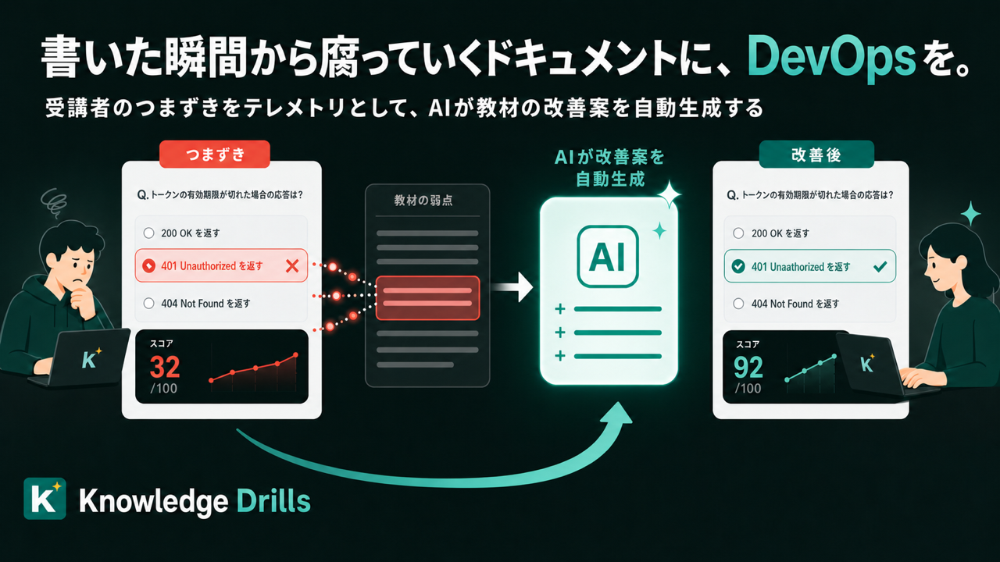
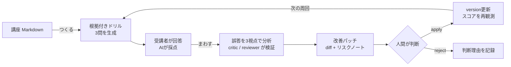
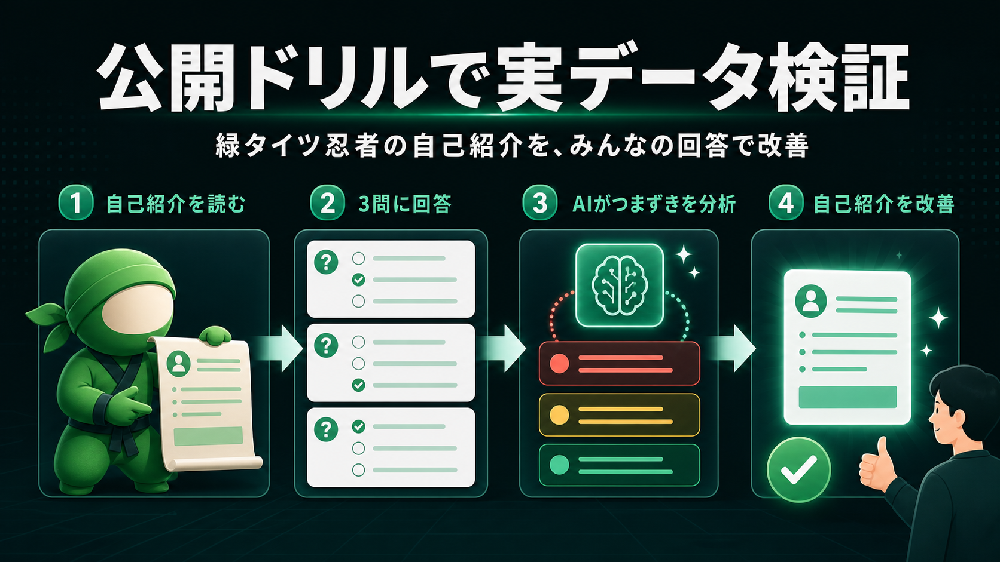
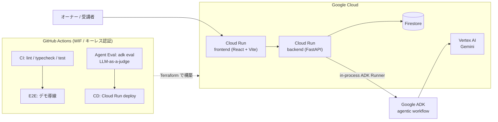
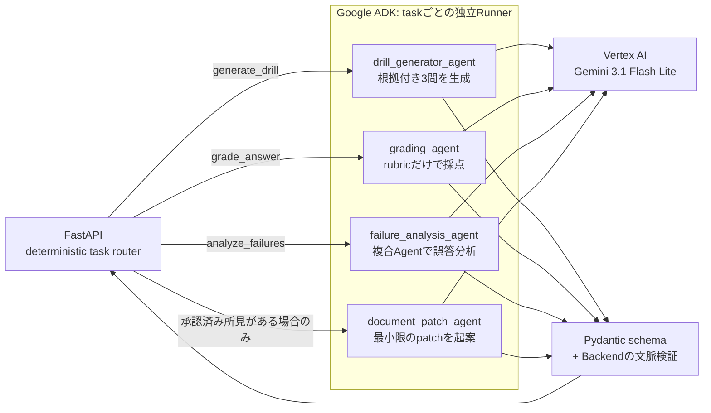
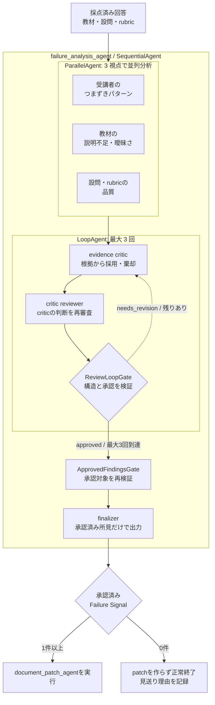

# 書いた瞬間から腐っていくドキュメントに、DevOps を — 受講者のつまずきをテレメトリとして、資料が自分で改善プロポーザルを出す「Knowledge Drills」

提出先: [DevOps × AI Agent Hackathon 2026](https://findy.notion.site/devops-ai-agent-hackathon-2026)

- GitHub: https://github.com/tomomj/knowledge-drills
- デプロイ URL: https://knowledge-drills-prd-frontend-96923902284.asia-northeast1.run.app
- **回答体験（ログイン不要・1分）: https://knowledge-drills-prd-frontend-96923902284.asia-northeast1.run.app/drills/fB_WDuwHY9XPctBlt69gftD0EDDR8IGD1b8GNoH3g6c** — あなたの回答が教材改善のヒントになります

---

## ドキュメントには、テレメトリがありません

コードには DevOps があります。テストが落ちれば気づけますし、エラー率が上がればアラートが飛びます。
壊れたことを観測して、直して、デプロイする。このループは、今では当たり前になっています。

ここでいうテレメトリとは、状態を知るために集める観測データのことです。
コードならエラー率やレイテンシー、教材なら受講者がどこでつまずいたかがその役割を担います。

一方で、研修資料やオンボーディングドキュメントはどうでしょうか。

書いた瞬間から腐り始めるのに、**「読者がどこでつまずいたか」を作者が知る術がありません**。
分かりにくい章はずっと分かりにくいまま放置され、新人は毎年同じ場所で迷子になります。
壊れているのに、壊れたというシグナルがどこにも上がってきません。

Knowledge Drills は、この「テレメトリのないドキュメント」に DevOps のループを持ち込むアプリケーションです。

> **受講者のつまずきをテレメトリとして、資料が自分で改善プロポーザルを出します。**

RAG のように「ドキュメントを使って AI が答える」のではありません。**AI がドキュメント自身を直す**、その逆張りです。

このプロダクトでやっているのは、教育ツールというより **ドキュメント運用の DevOps 化** です。

| DevOps | Knowledge Drills |
|---|---|
| コード | 講座 Markdown |
| 本番テレメトリ / インシデント | 受講者の誤答データ |
| アラート | 誤答閾値超過バッジ |
| 障害分析 | 分析エージェントによるつまずき特定・根拠照合・方針判断 |
| 修復 PR | Markdown patch 提案 |
| PR レビュー | 独立した critic / reviewer と人間の承認 |
| デプロイ | patch apply による講座 version 更新 |
| SLO 改善の確認 | Before / After 平均点の推移 |

## 何をするものか: ナレッジの CI/CD ループ

Markdown で書いた講座を投入すると、次のループが回ります。

ポイントは 3 つです。

1. **ドリルは教材に根拠を持ちます。** 各設問は「教材のどのセクションのどの記述に基づくか」（sourceEvidence）を持ち、その記述が教材に実在することを backend が検証します。エージェントの幻覚で存在しない出題根拠を作らせません。
2. **分析は証拠付きです。** 何人がどこでつまずき、教材のどの欠落に起因するかを判断ログとして残します。根拠の弱い所見は critic / reviewer が patch 起案前に棄却します。
3. **最後は人間がゲートします。** エージェントは diff とリスクノートを起案し、適用または却下は講座オーナーが決めます。

## デモ: シードデータで一周を見せ、公開ドリルで本番を回す

デモ用に 2 つの講座をシードしています。

**1 つ目は「経費精算の判断基準」— 改善ループを 3 周した完成形です。**
v1 では「領収書を紛失したときの扱い」が書かれておらず、受講者の誤答がそこに集中しました。
分析エージェントがこのギャップを特定し、「例外と期限」セクションの追記パッチを起案します。
適用のたびに講座 version が上がり、平均スコアは **1.8 → 2.9 → 3.6（4点満点）** と推移しました。
資料の改善が、主張ではなく数字で証明されます。これが一番見せたい 1 枚です。

**2 つ目は「DevOps × AI Agent Hackathon 2026 参加ガイド」— つまり、このハッカソン自体に近い題材です。**
回答者は「デモ回答者A〜D」です。その誤答は「デモ URL が認証を要する場合の扱いがガイド本文にない」という、
ドキュメント側の実在するギャップに集中しています。ここで分析を実行すると、
エージェントが参加ガイドの記載不足を特定し、改善パッチを起案します。

**ハッカソンの参加ガイドのような運用ドキュメントすら、このプロダクトの改善ループに乗ります。**
審査員が短時間で読み解く必要のあるドキュメントで、ドリルの質と分析の質をその場で確かめられます。

シードデータだけで終わらせず、公開検証も始めました。
題材は **「そのだの取扱説明書 — 緑タイツ忍者が Knowledge Drills を作った話」** です。
緑タイツで背景に同化しようとする甲賀流忍者と、このアプリの判断基準を短い教材にしました。

冒頭の共有 URL から回答すると（ログイン不要・全 3 問・約 1 分）、その回答は
デモ用データではない実際のテレメトリとして蓄積されます。誤答が集まれば分析エージェントが
自己紹介の分かりにくい箇所を探し、改善パッチを起案します。回答には公開教材の内容だけを使い、
個人情報・勤務先・機密情報を書かないよう明記しました。

**読者の回答が、このプロダクトの説明そのものを育てます。**

## アーキテクチャ

### システム全体

React frontend と FastAPI backend を Cloud Run 上で動かし、Firestore と Vertex AI に接続します。
Backend 内の Google ADK Runner から、実処理 Agent が Gemini 3.1 Flash Lite を呼び出します。
Firestore 更新、diff 生成、patch の適用は Backend の責務です。
Agent はデータを直接書き換えず、判断結果だけを schema に沿って返します。

### Agent 実行アーキテクチャ

`root_agent` は ADK discovery 用に残していますが、本番では自由な Agent 転送を行いません。FastAPI が task 名を見て、対応する
parentless Agent 専用の ADK Runner を選びます。実行経路を固定しながら、各 Agent の中では入力に応じた判断ができます。

| Agent | 判断すること | 守る契約 |
|---|---|---|
| drill generator | 教材のどこを実務シナリオにするか | 3問固定、教材に実在する `sourceEvidence` |
| grading | 回答が rubric をどこまで満たすか | 回答にない内容を補わない、`score <= maxScore` |
| failure analysis | 原因が受講者・教材・設問のどこにあるか | 回答件数、教材根拠、採否理由を残す |
| document patch | どの最小変更で所見を解消するか | 承認済み所見だけを使い、diff とリスクを返す |

### 誤答分析 Agent の内部

Agentic な判断が最も必要なのは誤答分析です。単発のプロンプトではなく、3視点の並列分析、
根拠を疑うレビューループ、承認済み所見だけを採用する finalizer を `SequentialAgent` で構成しています。

3 つの分析結果は session state へ保存され、critic と reviewer が根拠・採否・リスクを検証します。
最大 3 回で承認に至らなくても、明示的に承認された所見だけを部分採用できます。承認済み所見が
ゼロならパッチ生成を見送り、「直さない」という判断もタイムラインへ残します。

## 設計判断

### 自由にさせる場所を限定する

完全自由な swarm ではなく、**deterministic orchestration + autonomous judgment** を選びました。
どの Agent を実行するかは Backend が固定し、原因の切り分けや根拠の採否だけを Agent に判断させます。
予期しない Agent 転送を防ぎながら、単純なワークフローでは扱えない判断を残すためです。

### Schema と人間を信頼境界にする

Agent の入出力は Pydantic schema で固定し、3 問固定、rubric 合計、score 上限、教材根拠の実在を
Backend でも検証します。Agent はパッチを起案するところまでで、適用・却下は必ず講座オーナーが決めます。
社内ルールを含む教材でも、AI に最終決定やデータ更新を渡さないための境界です。

### エージェントにも CI/CD を

PR では lint・typecheck・test、E2E、`adk eval` を実行し、プロンプトの品質回帰も検知します。
GitHub 公開時には Agent Eval を required check に設定し、通過した main だけを Cloud Run へデプロイします。
実処理は Gemini 3.1 Flash Lite、LLM-as-a-judge は Gemma 4 です。実行役と評価役を分けています。

## 実装と検証結果を 30 秒で確かめる

ここまでの技術主張は、すべて一次証拠へのリンクで確認できます。

| 主張 | 証拠 |
|---|---|
| eval がプロンプトの劣化を検出する | 採点プロンプトを意図的に劣化させた実演 PR [#66](https://github.com/tomomj/knowledge-drills/pull/66)（[Agent Eval が fail した run](https://github.com/tomomj/knowledge-drills/actions/runs/29082680790)）/ 通常時の [Agent Eval 成功 run](https://github.com/tomomj/knowledge-drills/actions/runs/29068390062) |
| eval は 4 エージェントを縦断して品質を判定する | 下の evalset 構成表 + [`agent/evals/`](https://github.com/tomomj/knowledge-drills/tree/main/agent/evals) |
| パッチは判断ログ付きで起案・適用される | デモ講座のパッチレビュー画面（分析タイムライン + diff + 棄却された所見） |
| 改善はスコアで閉じる | 経費精算講座 v1 1.8 → v3 3.6（改善ループを再現するシードデータ。実利用実績とは区別） |
| 実データを収集できる | ログイン不要の「そのだの取扱説明書」公開ドリル（冒頭の回答体験 URL） |

evalset の構成は次のとおりです（LLM-as-a-judge、rubric ベース。経費精算・情シス・勤怠の 3 ジャンルを共有して単一ジャンルへの過学習を検出します）。

| eval | ケース数 | judge が守っているもの |
|---|---|---|
| grading | 4 | 採点が回答に実際に書かれた内容だけを根拠にし、rubric にない基準で加点・減点していないか |
| drill_generator | 3 | 3 問すべてが実務シナリオ型で、出題・模範解答・出題根拠が教材本文に実在する記述に基づくか |
| failure_analysis | 2 | 所見が複数受講者に共通する誤答に根拠を持ち、対象セクション・件数が実データと矛盾しないか |
| document_patch | 2 | パッチが所見に対応する最小変更に留まり、教材にないルールや数値を創作していないか |

## おわりに

「この資料、どこが分かりにくいんだろう」に、もう勘で答える必要はありません。
受講者のつまずきはテレメトリになり、資料は自分で改善プロポーザルを出し、
効果はスコア推移のグラフで検証されます。

コードが手に入れた「つくる、まわす、とどける」のループを、ナレッジにも持ち込みます。

- GitHub: https://github.com/tomomj/knowledge-drills
- デプロイ URL: https://knowledge-drills-prd-frontend-96923902284.asia-northeast1.run.app
- 回答体験（ログイン不要・1分）: https://knowledge-drills-prd-frontend-96923902284.asia-northeast1.run.app/drills/fB_WDuwHY9XPctBlt69gftD0EDDR8IGD1b8GNoH3g6c
