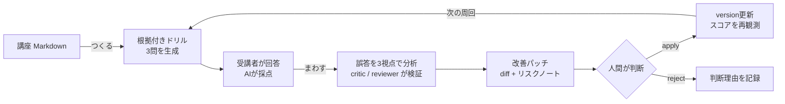

# ストーリー

- GitHub: https://github.com/tomomj/knowledge-drills
- デプロイ URL: https://knowledge-drills-prd-frontend-96923902284.asia-northeast1.run.app
- **回答体験（ログイン不要・1分）: https://knowledge-drills-prd-frontend-96923902284.asia-northeast1.run.app/drills/fB_WDuwHY9XPctBlt69gftD0EDDR8IGD1b8GNoH3g6c** — あなたの回答が教材改善のヒントになります

---

## ドキュメントには、テレメトリがありません

コードには DevOps があります。テストが落ちれば気づけますし、エラー率が上がればアラートが飛びます。
壊れたことを観測して、直して、デプロイする。このループは、今では当たり前になっています。

ここでいうテレメトリとは、状態を知るために集める観測データのことです。
コードならエラー率やレイテンシー、教材なら受講者がどこでつまずいたかがその役割を担います。

一方で、研修資料やオンボーディングドキュメントはどうでしょうか。

書いた瞬間から腐り始めるのに、**「読者がどこでつまずいたか」を作者が知る術がありません**。
分かりにくい章はずっと分かりにくいまま放置され、新人は毎年同じ場所で迷子になります。
壊れているのに、壊れたというシグナルがどこにも上がってきません。

Knowledge Drills は、この「テレメトリのないドキュメント」に DevOps のループを持ち込むアプリケーションです。

> **受講者のつまずきをテレメトリとして、資料が自分で改善プロポーザルを出します。**

RAG のように「ドキュメントを使って AI が答える」のではありません。**AI がドキュメント自身を直す**、その逆張りです。

このプロダクトでやっているのは、教育ツールというより **ドキュメント運用の DevOps 化** です。

| DevOps | Knowledge Drills |
|---|---|
| コード | 講座 Markdown |
| 本番テレメトリ / インシデント | 受講者の誤答データ |
| アラート | 誤答閾値超過バッジ |
| 障害分析 | 分析エージェントによるつまずき特定・根拠照合・方針判断 |
| 修復 PR | Markdown patch 提案 |
| PR レビュー | 独立した critic / reviewer と人間の承認 |
| デプロイ | patch apply による講座 version 更新 |
| SLO 改善の確認 | Before / After 平均点の推移 |

## 何をするものか: ナレッジの CI/CD ループ

Markdown で書いた講座を投入すると、次のループが回ります。

ポイントは 3 つです。

1. **ドリルは教材に根拠を持ちます。** 各設問は「教材のどのセクションのどの記述に基づくか」（sourceEvidence）を持ち、その記述が教材に実在することを backend が検証します。エージェントの幻覚で存在しない出題根拠を作らせません。
2. **分析は証拠付きです。** 何人がどこでつまずき、教材のどの欠落に起因するかを判断ログとして残します。根拠の弱い所見は critic / reviewer が patch 起案前に棄却します。
3. **最後は人間がゲートします。** エージェントは diff とリスクノートを起案し、適用または却下は講座オーナーが決めます。

## デモ: シードデータで一周を見せ、公開ドリルで本番を回す

デモ用に 2 つの講座をシードしています。

**1 つ目は「経費精算の判断基準」— 改善ループを 3 周した完成形です。**
v1 では「領収書を紛失したときの扱い」が書かれておらず、受講者の誤答がそこに集中しました。
分析エージェントがこのギャップを特定し、「例外と期限」セクションの追記パッチを起案します。
適用のたびに講座 version が上がり、平均スコアは **1.8 → 2.9 → 3.6（4点満点）** と推移しました。
資料の改善が、主張ではなく数字で証明されます。これが一番見せたい 1 枚です。

**2 つ目は「DevOps × AI Agent Hackathon 2026 参加ガイド」— つまり、このハッカソン自体に近い題材です。**
回答者は「デモ回答者A〜D」です。その誤答は「デモ URL が認証を要する場合の扱いがガイド本文にない」という、
ドキュメント側の実在するギャップに集中しています。ここで分析を実行すると、
エージェントが参加ガイドの記載不足を特定し、改善パッチを起案します。

**ハッカソンの参加ガイドのような運用ドキュメントすら、このプロダクトの改善ループに乗ります。**
審査員が短時間で読み解く必要のあるドキュメントで、ドリルの質と分析の質をその場で確かめられます。

シードデータだけで終わらせず、公開検証も始めました。
題材は **「そのだの取扱説明書 — 緑タイツ忍者が Knowledge Drills を作った話」** です。
緑タイツで背景に同化しようとする甲賀流忍者と、このアプリの判断基準を短い教材にしました。

冒頭の共有 URL から回答すると（ログイン不要・全 3 問・約 1 分）、その回答は
デモ用データではない実際のテレメトリとして蓄積されます。誤答が集まれば分析エージェントが
自己紹介の分かりにくい箇所を探し、改善パッチを起案します。回答には公開教材の内容だけを使い、
個人情報・勤務先・機密情報を書かないよう明記しました。

**読者の回答が、このプロダクトの説明そのものを育てます。**

## おわりに

「この資料、どこが分かりにくいんだろう」に、もう勘で答える必要はありません。
受講者のつまずきはテレメトリになり、資料は自分で改善プロポーザルを出し、
効果はスコア推移のグラフで検証されます。

コードが手に入れた「つくる、まわす、とどける」のループを、ナレッジにも持ち込みます。

- GitHub: https://github.com/tomomj/knowledge-drills
- デプロイ URL: https://knowledge-drills-prd-frontend-96923902284.asia-northeast1.run.app
- 回答体験（ログイン不要・1分）: https://knowledge-drills-prd-frontend-96923902284.asia-northeast1.run.app/drills/fB_WDuwHY9XPctBlt69gftD0EDDR8IGD1b8GNoH3g6c
