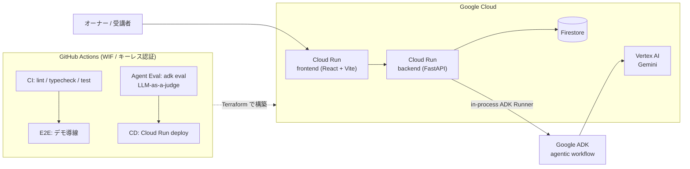
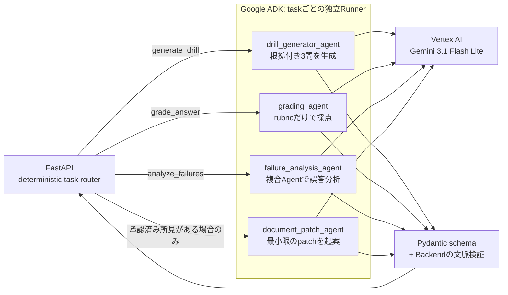
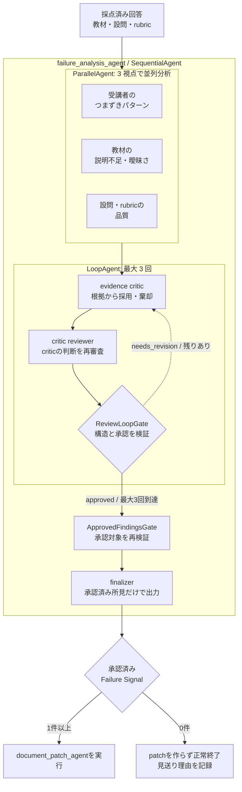

# システム構成

## システム全体

React frontend と FastAPI backend を Cloud Run 上で動かし、Firestore と Vertex AI に接続します。
Backend 内の Google ADK Runner から、実処理 Agent が Gemini 3.1 Flash Lite を呼び出します。
Firestore 更新、diff 生成、patch の適用は Backend の責務です。
Agent はデータを直接書き換えず、判断結果だけを schema に沿って返します。

## Agent 実行アーキテクチャ

`root_agent` は ADK discovery 用に残していますが、本番では自由な Agent 転送を行いません。FastAPI が task 名を見て、対応する
parentless Agent 専用の ADK Runner を選びます。実行経路を固定しながら、各 Agent の中では入力に応じた判断ができます。

| Agent | 判断すること | 守る契約 |
|---|---|---|
| drill generator | 教材のどこを実務シナリオにするか | 3問固定、教材に実在する `sourceEvidence` |
| grading | 回答が rubric をどこまで満たすか | 回答にない内容を補わない、`score <= maxScore` |
| failure analysis | 原因が受講者・教材・設問のどこにあるか | 回答件数、教材根拠、採否理由を残す |
| document patch | どの最小変更で所見を解消するか | 承認済み所見だけを使い、diff とリスクを返す |

## 誤答分析 Agent の内部

Agentic な判断が最も必要なのは誤答分析です。単発のプロンプトではなく、3視点の並列分析、
根拠を疑うレビューループ、承認済み所見だけを採用する finalizer を `SequentialAgent` で構成しています。

3 つの分析結果は session state へ保存され、critic と reviewer が根拠・採否・リスクを検証します。
最大 3 回で承認に至らなくても、明示的に承認された所見だけを部分採用できます。承認済み所見が
ゼロならパッチ生成を見送り、「直さない」という判断もタイムラインへ残します。

## 設計判断

### 自由にさせる場所を限定する

完全自由な swarm ではなく、**deterministic orchestration + autonomous judgment** を選びました。
どの Agent を実行するかは Backend が固定し、原因の切り分けや根拠の採否だけを Agent に判断させます。
予期しない Agent 転送を防ぎながら、単純なワークフローでは扱えない判断を残すためです。

### Schema と人間を信頼境界にする

Agent の入出力は Pydantic schema で固定し、3 問固定、rubric 合計、score 上限、教材根拠の実在を
Backend でも検証します。Agent はパッチを起案するところまでで、適用・却下は必ず講座オーナーが決めます。
社内ルールを含む教材でも、AI に最終決定やデータ更新を渡さないための境界です。

### エージェントにも CI/CD を

PR では lint・typecheck・test、E2E、`adk eval` を実行し、プロンプトの品質回帰も検知します。
GitHub 公開時には Agent Eval を required check に設定し、通過した main だけを Cloud Run へデプロイします。
実処理は Gemini 3.1 Flash Lite、LLM-as-a-judge は Gemma 4 です。実行役と評価役を分けています。

## 実装と検証結果を 30 秒で確かめる

ここまでの技術主張は、すべて一次証拠へのリンクで確認できます。

| 主張 | 証拠 |
|---|---|
| eval がプロンプトの劣化を検出する | 採点プロンプトを意図的に劣化させた実演 PR [#66](https://github.com/tomomj/knowledge-drills/pull/66)（[Agent Eval が fail した run](https://github.com/tomomj/knowledge-drills/actions/runs/29082680790)）/ 通常時の [Agent Eval 成功 run](https://github.com/tomomj/knowledge-drills/actions/runs/29068390062) |
| eval は 4 エージェントを縦断して品質を判定する | 下の evalset 構成表 + [`agent/evals/`](https://github.com/tomomj/knowledge-drills/tree/main/agent/evals) |
| パッチは判断ログ付きで起案・適用される | デモ講座のパッチレビュー画面（分析タイムライン + diff + 棄却された所見） |
| 改善はスコアで閉じる | 経費精算講座 v1 1.8 → v3 3.6（改善ループを再現するシードデータ。実利用実績とは区別） |
| 実データを収集できる | ログイン不要の「そのだの取扱説明書」公開ドリル（冒頭の回答体験 URL） |

evalset の構成は次のとおりです（LLM-as-a-judge、rubric ベース。経費精算・情シス・勤怠の 3 ジャンルを共有して単一ジャンルへの過学習を検出します）。

| eval | ケース数 | judge が守っているもの |
|---|---|---|
| grading | 4 | 採点が回答に実際に書かれた内容だけを根拠にし、rubric にない基準で加点・減点していないか |
| drill_generator | 3 | 3 問すべてが実務シナリオ型で、出題・模範解答・出題根拠が教材本文に実在する記述に基づくか |
| failure_analysis | 2 | 所見が複数受講者に共通する誤答に根拠を持ち、対象セクション・件数が実データと矛盾しないか |
| document_patch | 2 | パッチが所見に対応する最小変更に留まり、教材にないルールや数値を創作していないか |
