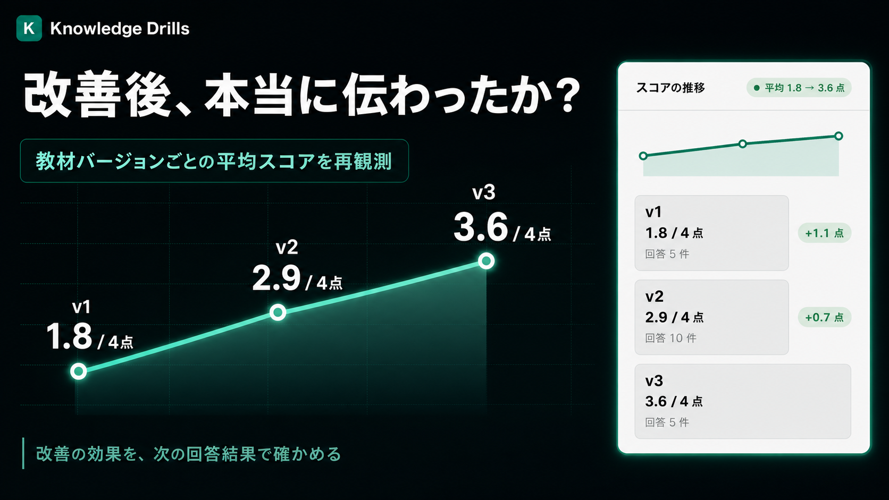

# ストーリー

- [GitHub](https://github.com/tomomj/knowledge-drills)
- [アプリを開く](https://knowledge-drills-prd-frontend-96923902284.asia-northeast1.run.app)
- **[ログイン不要で回答してみる（全3問・約1分）](https://knowledge-drills-prd-frontend-96923902284.asia-northeast1.run.app/drills/fB_WDuwHY9XPctBlt69gftD0EDDR8IGD1b8GNoH3g6c)**

## ドキュメントにも DevOps を

コードは、エラーやテスト失敗から問題を見つけ、修正できます。

しかし、研修資料やオンボーディング資料では、次のことが分かりません。

- 読者がどこでつまずいたか
- 説明が足りない箇所はどこか
- 修正後に分かりやすくなったか

**Knowledge Drills は、受講者の誤答をテレメトリとして使い、教材の改善案を作るアプリです。**

## 何ができるのか

1. Markdown の教材から、根拠付きのドリルを生成
2. 受講者の回答を AI が採点
3. 誤答を分析し、教材の説明不足を特定
4. Markdown の改善パッチを提案
5. 人間がパッチを適用または却下
6. 次の回答結果から、改善効果を確認

RAG が「ドキュメントを使って回答する」仕組みなら、Knowledge Drills は**ドキュメント自体を改善する**仕組みです。

| DevOps | Knowledge Drills |
|---|---|
| コード | 教材 Markdown |
| テレメトリ | 受講者の誤答 |
| 障害分析 | AI による誤答分析 |
| 修復 PR | Markdown パッチ |
| レビュー・デプロイ | 人間による承認・適用 |
| 改善確認 | バージョンごとの平均スコア |

## 安全に改善するための3つのルール

- **根拠のある問題だけを作る:** 設問が教材のどの記述に基づくかを保存し、Backend でも実在を検証します。
- **根拠の弱い分析を通さない:** 誤答を3つの視点で分析し、critic と reviewer が採否を確認します。
- **最後は人間が決める:** AI はパッチを提案するだけです。適用・却下は教材のオーナーが判断します。

## デモで確認できること

### 経費精算の判断基準

- 誤答が集中した「領収書を紛失した場合」の説明不足を検出
- AI が「例外と期限」への追記パッチを提案
- 教材の平均スコアが **1.8 → 2.9 → 3.6（4点満点）** に変化

### ハッカソン参加ガイド

- 「デモ URL に認証が必要な場合」の説明不足を検出
- ハッカソンの運用ドキュメント自体を改善対象にしたデモ

### 公開ドリル

- 題材は「そのだの取扱説明書 — 緑タイツ忍者が Knowledge Drills を作った話」
- 回答は実際のテレメトリとして蓄積
- 誤答が集まると、自己紹介の分かりにくい箇所を AI が分析

**[ログイン不要で公開ドリルに回答できます（全3問・約1分）](https://knowledge-drills-prd-frontend-96923902284.asia-northeast1.run.app/drills/fB_WDuwHY9XPctBlt69gftD0EDDR8IGD1b8GNoH3g6c)**

## おわりに

> **つくる → まわす → つまずきを見つける → 直す → 効果を確かめる**

Knowledge Drills は、この DevOps ループをナレッジにも持ち込みます。
