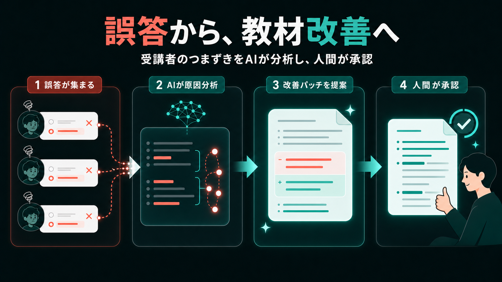
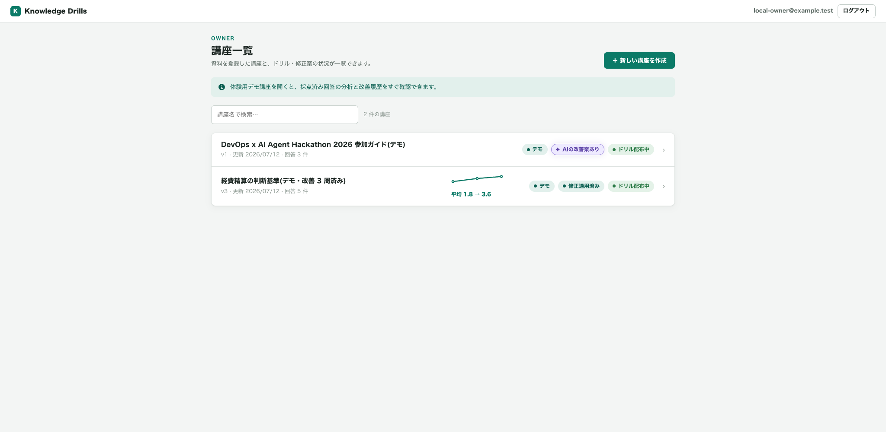
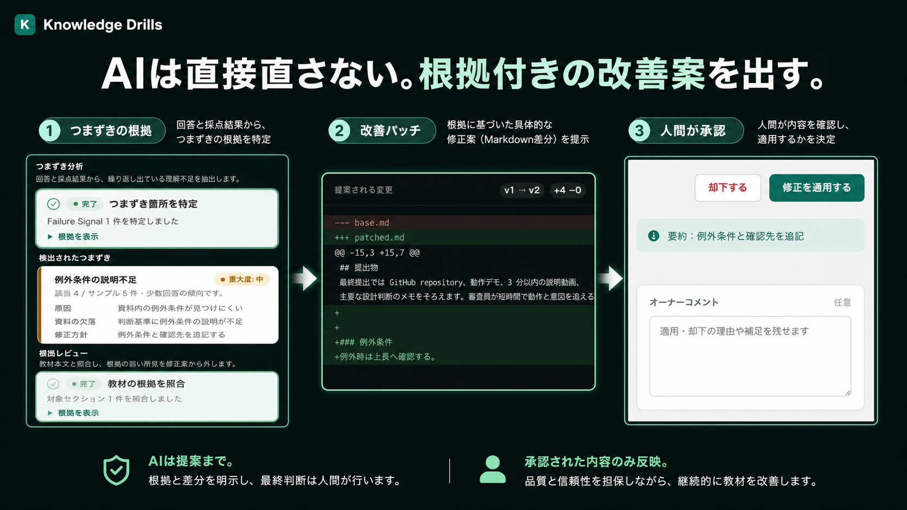
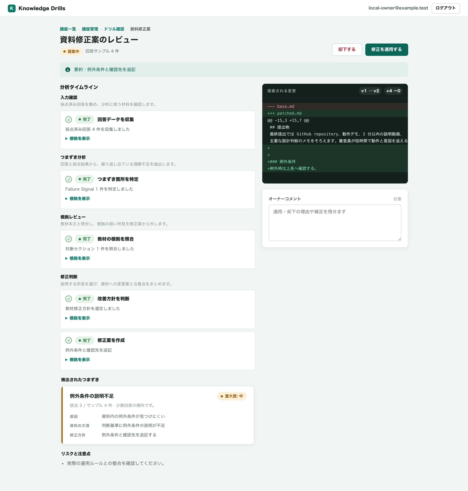
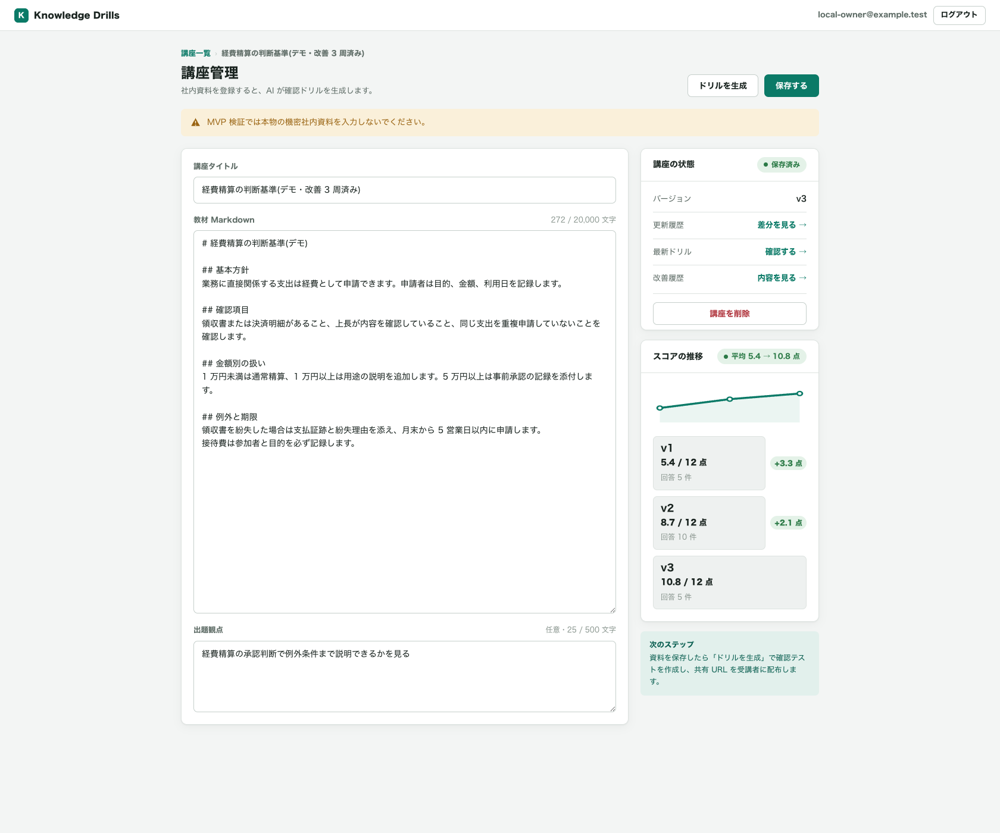
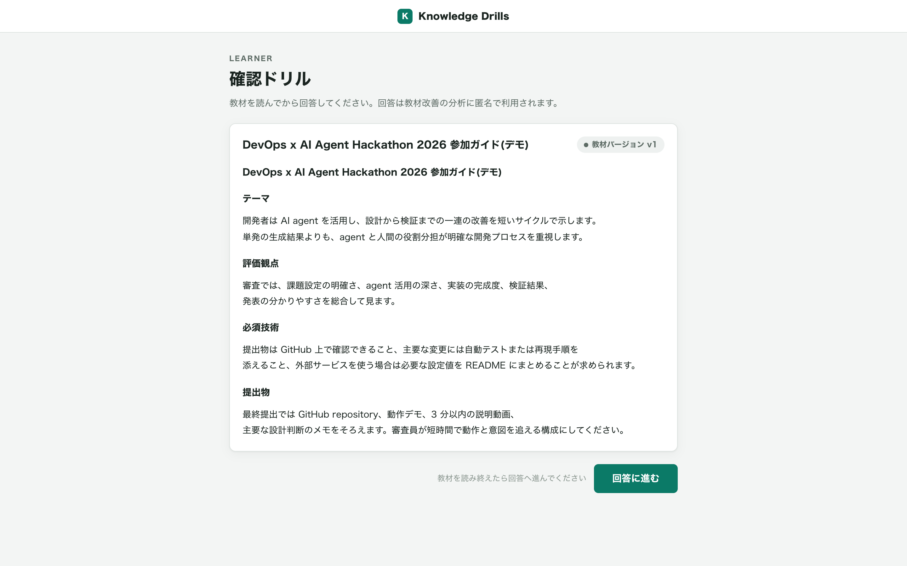
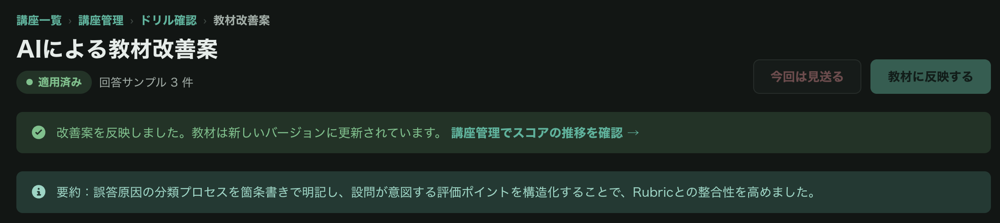

# ストーリー

- **[3分デモ動画](https://youtu.be/4h23ZbeP9_k)**
- [GitHub](https://github.com/tomomj/knowledge-drills)
- [アプリを開く](https://knowledge-drills-prd-frontend-96923902284.asia-northeast1.run.app)
- **[ログイン不要で回答してみる（全3問・約1分）](https://knowledge-drills-prd-frontend-96923902284.asia-northeast1.run.app/drills/fB_WDuwHY9XPctBlt69gftD0EDDR8IGD1b8GNoH3g6c)**

## 3分デモ動画

**[YouTubeでデモ動画を見る](https://youtu.be/4h23ZbeP9_k)**

## ドキュメントにも DevOps を

コードには DevOps があります。テストが落ちれば気づけますし、エラー率が上がればアラートが飛びます。
壊れたことを観測して、直して、デプロイする。このループは、今では当たり前になっています。

一方で、研修資料やオンボーディングドキュメントはどうでしょうか。
内容は少しずつ現状とずれ、説明が足りない場所では、新しい読者が何度も同じつまずきを繰り返します。

それでも作者には、テスト失敗もアラートも届きません。**「読者がどこでつまずいたか」を知るためのテレメトリがない**からです。
どこを直すべきかも、直した結果がよかったのかも、勘と個別の聞き取りに頼るしかありません。

Knowledge Drills は、この「観測できないドキュメント」に DevOps のループを持ち込むアプリです。

> **受講者のつまずきをテレメトリにして、教材が自分で改善案を出します。**

## 何ができるのか

Knowledge Drills は、Markdown の教材からドリルを作り、受講者の誤答から教材の改善パッチを提案するアプリです。
問題を作って終わりではなく、修正後の回答結果まで観測し、教材を継続的に改善します。

具体的には、次のループを回します。

1. Markdown の教材から、根拠付きのドリルを生成
2. 受講者の回答を AI が採点
3. 未分析の回答が閾値に達すると、**エージェントが自動で分析を開始**し、教材の説明不足を特定
   （閾値はデモ用に 3 件へ設定。少人数でも改善サイクルが体験できるようにするため）
4. Markdown の改善パッチを提案
5. 人間がパッチを適用または却下
6. 次の回答結果から、改善効果を確認

分析の起動に人間の操作は要りません。回答が集まると、エージェントが自分で動き出します。
ただし教材を変更できるのは人間の承認だけです（後述の 3 つのルール）。

RAG が「ドキュメントを使って回答する」仕組みなら、Knowledge Drills は**ドキュメント自体を改善する**仕組みです。
コードの DevOps と対応させると、次のようになります。

| DevOps | Knowledge Drills |
|---|---|
| コード | 教材 Markdown |
| テレメトリ | 受講者の誤答 |
| 障害分析 | AI による誤答分析 |
| 修復 PR | Markdown パッチ |
| レビュー・デプロイ | 人間による承認・適用 |
| 改善確認 | バージョンごとの平均スコア |

## 安全に改善するための3つのルール

AI が教材を扱うからこそ、もっともらしい問題や修正案をそのまま通さない仕組みが必要です。
Knowledge Drills では、次の3つを境界にしています。

- **根拠のある問題だけを作る:** 設問が教材のどの記述に基づくかを保存し、Backend でも実在を検証します。
- **根拠の弱い分析を通さない:** 誤答を3つの視点で分析し、critic と reviewer が採否を確認します。
- **最後は人間が決める:** AI はパッチを提案するだけです。適用・却下は教材のオーナーが判断します。

## デモで確認できること

「改善できそう」という主張だけで終わらないように、教材の欠落を見つけるところから、パッチ適用後の効果測定までをデモにしています。

### 経費精算の判断基準

改善ループを最初から最後まで確認できるように用意した、シードデータのデモ講座です。
受講者の誤答は、教材に説明がなかった「領収書を紛失した場合」に集中しました。

AI が回答・採点結果と教材を照合して欠落を特定し、「例外」の追記パッチを提案しました。
人間が差分を確認して適用した後、次の教材バージョンの回答結果を再観測します。

この再現用デモデータでは、教材バージョンごとの平均スコアが
**5.4 → 8.7 → 10.8（12点満点）** と推移しました。

## 実測ループの記録（審査期間中も更新されます）

上の経費精算講座は、改善ループを確実に再現するためのシードデータです。
ここからは、**実在する人の回答**で本番の改善ループが動いている記録です。

### 公開ドリルから実際のループに参加できます

題材は「そのだの取扱説明書 — 緑タイツ忍者が Knowledge Drills を作った話」です。
ログイン不要で、全 3 問を約 1 分で回答できます。

**[公開ドリルに回答して、実際の改善ループに参加する](https://knowledge-drills-prd-frontend-96923902284.asia-northeast1.run.app/drills/fB_WDuwHY9XPctBlt69gftD0EDDR8IGD1b8GNoH3g6c)**

ここで送信された回答は、本番環境のテレメトリとして蓄積されます。
未分析の回答が 3 件（デモ用の閾値設定）に達すると、エージェントが自動で分析を開始。
改善が必要な場合だけ教材のパッチを起案し、人間の承認後に次のバージョンへ反映します。
つまり、**このドリルへの回答が、次の改善ループを実際に動かします。**

### 実測ログ

- **現在の稼働実績（2026-07-12）**: 実回答 **3 件** → AI 自動分析 **1 回** →
  改善パッチを承認 → 教材 **v2 を公開済み**。

  

- **2026-07-15（予定）**: v2 への実回答で平均スコアを再観測し、Before / After を追記。
- **2026-07-22（予定）**: 回答の蓄積に応じて 2 周目（v3）の記録を追記。

（回答の集まり方に応じて、予定より早く・多く追記することがあります）

回答が届くたびに、このログと教材が育っていきます。
記録が増えていくこと自体が、「生きているドキュメント」という主張の実演です。

## おわりに

> **つくる → まわす → つまずきを見つける → 直す → 効果を確かめる**

Knowledge Drills は、この DevOps ループをナレッジにも持ち込みます。
