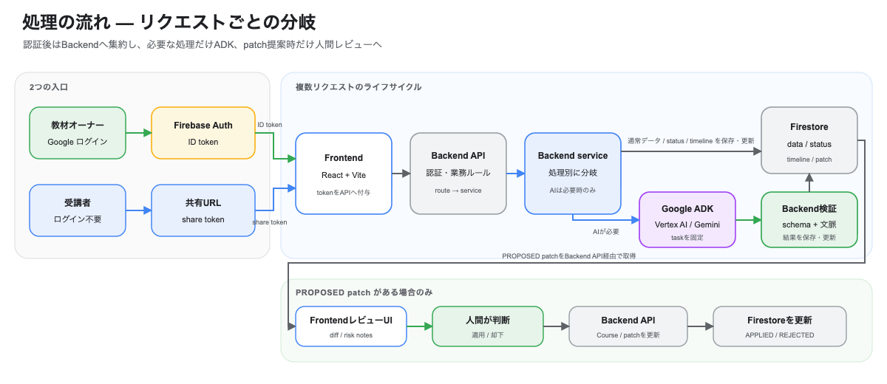
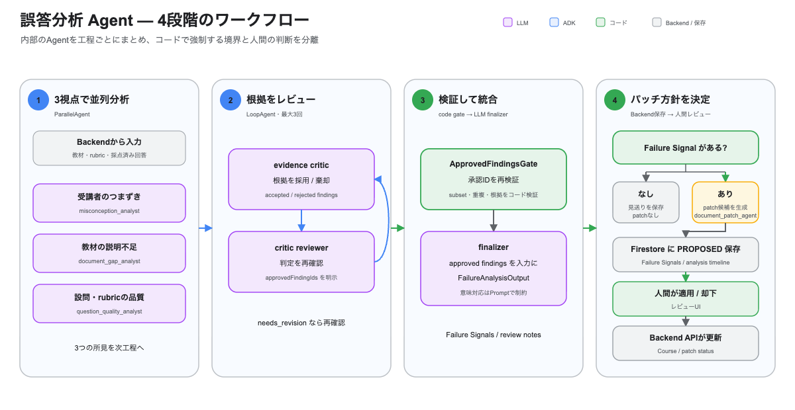

# システム構成

Knowledge Drills の本番環境は、React で構築した Frontend と FastAPI Backend を Cloud Run で配信し、Firebase Authentication、Firestore、Google ADK、Vertex AI を組み合わせています。
設計の中心にあるのは、**AI に判断させること**と、**AI にデータを直接変更させないこと**の両立です。

- 編集元: [`protopedia-system-architecture.drawio`](../protopedia-system-architecture.drawio)

## 使用技術

アプリケーション、Agent、インフラを同じリポジトリで管理し、GitHub Actions でテストとデプロイを自動化しています。
主な構成要素は次のとおりです。

- Frontend: React + Vite / Cloud Run（Nginx で build 成果物を配信）
- Backend: FastAPI / Cloud Run
- 認証: Firebase Authentication
- データストア: Firestore
- AI: Google ADK の in-process Runner + Vertex AI
- CI/CD: GitHub Actions + Workload Identity Federation
- インフラ: Terraform
- 可観測性: Cloud Logging + Cloud Trace + Cloud Monitoring

## 処理の流れ

オーナーは Firebase Authentication の ID token、受講者は共有 URL の share token を使います。
入口は異なりますが、業務データの操作は Backend API に集約し、AI が必要な処理だけが ADK を呼び出します。
次の図は複数の API リクエストをまとめたライフサイクルであり、status や分析タイムラインは Agent の実行前・途中にも保存されます。人間レビューへ進むのは `PROPOSED` patch がある場合だけです。

- 編集元: [`protopedia-request-flow.drawio`](../protopedia-request-flow.drawio)

**Agent は Firestore を直接更新しません。** 検証・保存・パッチ適用は Backend が担当します。

## Agent の役割と保証範囲

生成・採点・分析・パッチ作成を分離し、Backend が task 名から実行する Runner を固定しています。
制約には、schema や Backend が機械的に強制するものと、Prompt と Agent Eval で品質を評価するものがあります。

| Agent | 役割 | 機械的に検証する内容 | Prompt / Eval で評価する内容 |
|---|---|---|---|
| drill generator | 教材からドリルを生成 | 3問固定、rubric 合計、sourceEvidence の教材内存在 | 問題・模範解答が教材の内容に基づくこと |
| grading | 回答を採点 | questionId、スコア範囲・上限 | rubric 外の基準で加点・減点しないこと |
| failure analysis | 誤答の原因を分析 | 回答総数と sampleSize、affectedCount の範囲、承認 ID の整合性 | 教材根拠、採否理由、3視点の分析品質 |
| document patch | 教材の修正案を作成 | 入出力の型、適用時の所有者・stale 状態 | 承認所見に基づく必要最小限の変更であること |

Pydantic schema は出力の形や数値制約を保証しますが、根拠の妥当性やパッチの最小性といった意味上の品質を単独では保証しません。
そのため、Prompt、Agent 内のレビュー、Backend の処理別検証、Agent Eval を重ねています。

## 誤答分析 Agent

本番既定の composed mode では、単発の分析結果をそのまま採用せず、3つの視点と2段階のレビューを組み合わせています。

- 編集元: [`protopedia-failure-analysis-agent.drawio`](../protopedia-failure-analysis-agent.drawio)

1. 受講者・教材・設問の3視点を `ParallelAgent` で並列分析
2. evidence critic が入力データに基づく根拠かを確認
3. critic reviewer が判定を再確認し、採用可能な finding ID を明示
4. 決定論的な gate が承認 ID の整合性を検証
5. finalizer に承認済み finding だけから Failure Signal を生成するよう制約

critic と reviewer の反復は最大3回です。
承認できる所見がなければ Backend はパッチを作らず、分析タイムラインに「直さない」という判断を記録します。

承認 ID の絞り込みと所見が0件の場合の見送りはコードで強制しています。
承認済み finding から最終 Failure Signal への意味上の対応は finalizer の Prompt で制約し、Agent Eval では最終出力と入力データの整合性を評価します。

## 設計で重視したこと

AI の自由度を広げることよりも、どこで判断させ、どこから先をシステムと人間が担うかを明確にしました。
そのための設計原則は次の4つです。

- **AI に任せる範囲を限定:** AI が必要な処理と実行する Agent は Backend が決めます。
- **検証を重ねる:** schema 検証に加え、処理別の文脈検証、Agent 内レビュー、Agent Eval を組み合わせます。
- **人間が最終判断:** AI はパッチを提案するだけで、教材を勝手に変更しません。
- **Agent も継続的に検証:** PR では変更範囲に応じて lint・typecheck・test・E2E・`adk eval` を実行します。main 反映後の CD workflow は、該当する Cloud Run サービスをデプロイします。

通常の Playwright E2E は、認証なし・ローカル Agent の構成で主要画面と API の接続を確認します。
Vertex AI を使う実 LLM E2E は、認証済みのローカル環境から `E2E_LLM=1` を指定する opt-in 実行です。
この E2E の誤答分析は single mode で実行するため、本番既定の composed mode は Agent の契約テストと Agent Eval で別に検証します。

## 実装と検証の証拠

Agent のコードや Prompt を変更した PR では、通常の CI に加えて実モデルを使う Agent Eval を実行します。
次のリンクには evalset、意図的に採点 Prompt を劣化させた例、成功・失敗した実行結果を記録しています。

> 現在 GitHub repository は private のため、リンクの閲覧には repository のアクセス権が必要です。

- [4 Agent の evalset](https://github.com/tomomj/knowledge-drills/tree/main/agent/evals)
- [採点プロンプトの劣化を Agent Eval が検出した PR #66](https://github.com/tomomj/knowledge-drills/pull/66)
- [Agent Eval が失敗した実行](https://github.com/tomomj/knowledge-drills/actions/runs/29082680790)
- [通常時の Agent Eval 成功例](https://github.com/tomomj/knowledge-drills/actions/runs/29068390062)

Agent Eval は、Agent ごとに統合 rubric と合格閾値を設定し、LLM judge で次の品質を評価します。

- 採点が回答と rubric に基づいているか
- 問題と模範解答が教材に基づいているか
- 誤答分析が入力された回答・採点結果と矛盾していないか
- パッチが必要最小限で、存在しないルールを追加していないか

Eval は品質の回帰を検出する仕組みであり、すべての実行結果の正しさを証明するものではありません。
