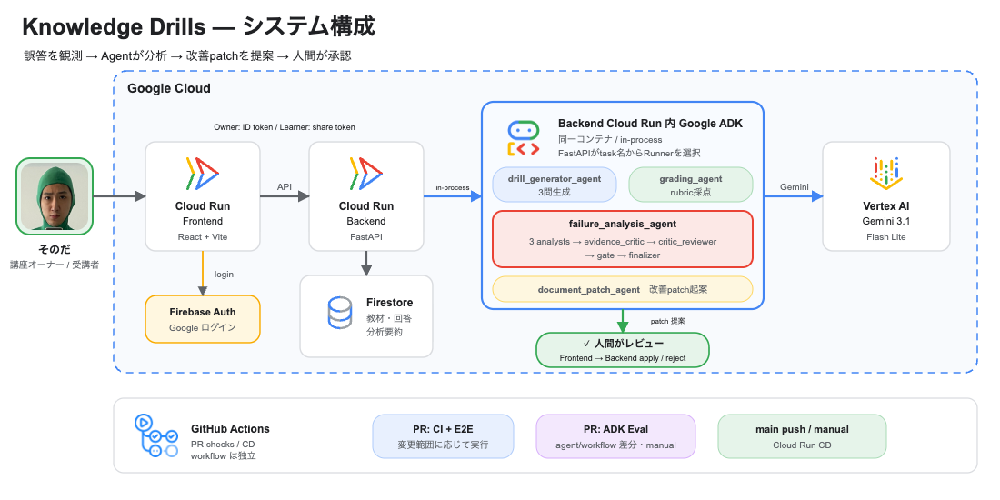
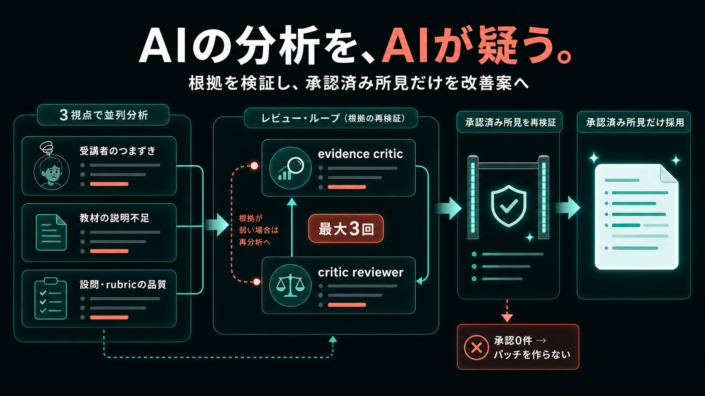

# システム構成

Knowledge Drills は、Cloud Run 上の React Frontend と FastAPI Backend を中心に、Firestore、Google ADK、Vertex AI を組み合わせています。
設計の中心にあるのは、**AI に判断させること**と、**AI にデータを直接変更させないこと**の両立です。

- 編集元: [`protopedia-system-architecture.drawio`](../protopedia-system-architecture.drawio)

## 使用技術

アプリケーション、Agent、インフラを同じリポジトリで管理し、GitHub Actions からテストとデプロイを行います。
主な構成要素は次のとおりです。

- Frontend: React + Vite / Cloud Run
- Backend: FastAPI / Cloud Run
- データストア: Firestore
- AI: Google ADK + Vertex AI
- CI/CD: GitHub Actions + Workload Identity Federation
- インフラ: Terraform

## 処理の流れ

ユーザー操作は必ず Backend を通り、Backend が用途に合う Agent を選びます。
Agent の出力は、保存や適用の前にもう一度検証されます。

1. Frontend が教材・ドリル・回答を Backend へ送信
2. Backend が処理に対応する Agent を選択
3. Agent が Vertex AI を使って判断結果を生成
4. Backend が Pydantic schema と教材本文に照らして検証
5. Firestore に結果と判断ログを保存
6. 教材オーナーの承認後にパッチを適用

**Agent はデータを直接更新しません。** 検証・保存・パッチ適用は Backend が担当します。

## Agent の役割

1つの Agent にすべてを任せず、生成・採点・分析・パッチ作成を分離しています。
それぞれが判断する範囲と、守るべき制約を明確にするためです。

| Agent | 役割 | 主な制約 |
|---|---|---|
| drill generator | 教材からドリルを生成 | 3問固定、教材に実在する根拠が必要 |
| grading | 回答を採点 | rubric にない基準を使わない |
| failure analysis | 誤答の原因を分析 | 回答件数・教材根拠・採否理由を記録 |
| document patch | 教材の修正案を作成 | 承認済みの分析から最小パッチを作る |

Backend が実行経路を固定し、Agent には分析や根拠の採否だけを任せます。

## 誤答分析 Agent

もっとも複雑な判断が必要になるのが、誤答の原因分析です。
単発の回答をそのまま採用せず、3つの視点と2段階のレビューを組み合わせています。

1. 受講者・教材・設問の3視点で並列分析
2. evidence critic が根拠を確認
3. critic reviewer が判定を再確認
4. 承認された所見だけをパッチ生成へ渡す

このレビューを最大3回実行します。承認できる所見がなければ、パッチを作らず「直さない」という判断も記録します。

## 設計で重視したこと

AI の自由度を広げることよりも、どこで判断させ、どこから先をシステムと人間が担うかを明確にしました。
そのための設計原則は次の4つです。

- **AI に任せる範囲を限定:** 実行する Agent は Backend が決めます。
- **Schema で検証:** 問題数、スコア上限、教材根拠などを Backend でも確認します。
- **人間が最終判断:** AI はパッチを提案するだけで、教材を勝手に変更しません。
- **Agent にも CI/CD を適用:** lint・typecheck・test・E2E・`adk eval` を通過した main だけをデプロイします。

## 実装と検証の証拠

Agent の品質も通常のコードと同じように、変更のたびに検証します。
プロンプトの劣化を意図的に起こした例を含め、実際の eval と CI の結果を公開しています。

- [4 Agent の evalset](https://github.com/tomomj/knowledge-drills/tree/main/agent/evals)
- [採点プロンプトの劣化を Agent Eval が検出した PR #66](https://github.com/tomomj/knowledge-drills/pull/66)
- [Agent Eval が失敗した実行](https://github.com/tomomj/knowledge-drills/actions/runs/29082680790)
- [通常時の Agent Eval 成功例](https://github.com/tomomj/knowledge-drills/actions/runs/29068390062)

eval では、次を確認しています。

- 採点が回答と rubric に基づいているか
- 問題と模範解答が教材に基づいているか
- 誤答分析が実データと矛盾していないか
- パッチが必要最小限で、存在しないルールを追加していないか
